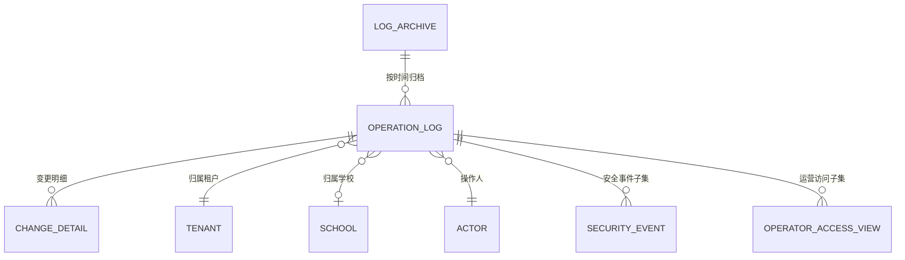

# 审计与操作日志 PRD

| 项 | 值 |
|---|---|
| 模块 | 审计与操作日志（`audit`） |
| 文档路径 | `docs/10-prd/modules/audit/PRD.md` |
| 版本 | 1.0.1-draft |
| 状态 | `frozen`（2026-09-30 需求验收通过，见 D-049） |
| 批次 | 1-4 |
| 上游依赖 | 见 1.4 |

## 变更记录

| 版本 | 日期 | 变更 | 作者 |
|---|---|---|---|
| 1.0.0-draft | 2026-09-30 | 首版。覆盖操作日志记录范围、敏感数据访问日志、平台运营留痕、查询与导出、不可篡改与保留、写入可靠性 | Codex |
| 1.0.1-draft | 2026-10-01 | 按 `CR-018` 补登记同页浮层片段 `DIALOG-AUD-EXPORT`（日志导出配置，挂在 `PAGE-AUDIT-LOG-LIST` 下）：6.3 已把「点击导出」定义为打开导出配置弹窗，6.1 未登记该片段 | Codex |

## 0. 怎么读这份文档

本文件只定义**审计与操作日志模块特有的需求**。
角色、业务规则、权限矩阵、字段定义、非功能指标一律**引用公共前置的编号**，不复制正文。
引用格式：`BR-AUDIT-001`（业务规则）、`SCN-AUDIT-02`（场景）、`PER-SCHOOL-LEADER`（角色）、
`DS-DENY-04`（数据范围规则）、`NFR-AUDIT-05`（非功能需求）、`FD-action_type`（字段字典条目）。

需求编号规则 `REQ-AUD-xxx`，一经发布不得重排；删除的需求保留编号并标注 `已废弃`。

本模块与其它模块的分工：**业务模块负责"发生什么"**（例如学生学号被改），
**本模块负责"谁在什么时候改的、改前改后是什么、谁能查到"**。
业务模块不再各自实现日志表，统一调用本模块。

---

## 1. 模块定位与范围

### 1.1 解决什么问题

1. 学校与集团对"谁改了学籍状态、谁看了学生证件号"没有可查的记录，出问题只能靠回忆
2. 平台运营协助排查时的访问没有留痕，租户无法确认自己的数据被谁看过
3. 日志散落在各模块，字段口径不一致，无法按对象串起完整的变更时间线
4. 日志可以被修改或删除，"有日志"不等于"日志可信"

### 1.2 范围内

| 能力 | 说明 |
|---|---|
| 操作日志记录 | 新增、修改、删除、导入、执行、审批、授权、状态变更的统一留痕 |
| 变更明细 | 只记录发生变化的字段，含变更前后值与差异 |
| 敏感数据访问日志 | 证件号、手机号等敏感字段"查看全量"的留痕 |
| 运营访问留痕 | 平台运营对租户数据的访问记录，租户侧可查可导出 |
| 日志查询与检索 | 按时间、操作人、对象、操作类型、批次号检索，按对象看时间线 |
| 日志导出 | 按筛选条件与数据范围导出，导出自身留痕 |
| 不可篡改与保留 | 只追加、不修改不删除，保留不少于 3 年，归档可查 |
| 写入可靠性 | 同事务或补偿 + 告警，禁止业务成功而日志静默丢失 |

### 1.3 范围外

| 不做 | 归属 |
|---|---|
| 业务数据的变更规则 | 各业务模块 PRD |
| 系统运行日志（应用日志、慢 SQL、GC） | 运维与可观测范畴（`NFR-OPS-03`） |
| 安全态势分析与告警平台 | 后续阶段 |
| 日志的异地容灾 | 首轮为单机房私有化部署 |
| 面向家长的"操作记录"展示 | 后续小程序阶段 |

### 1.4 上游依赖

| 依赖 | 用途 | 缺失后果 |
|---|---|---|
| `docs/10-prd/04-business-rules.md` | `BR-AUDIT-001` ~ `BR-AUDIT-012` | 记录范围与保留期限无依据 |
| `docs/10-prd/05-permission-matrix.yaml` | `audit.log` 的功能权限与可见范围 | 无法判定谁能查、能查哪一段 |
| `docs/10-prd/06-field-dictionary.yaml` | 日志字段、操作类型枚举 | 字段名与枚举会漂移 |
| `docs/10-prd/08-data-scope-model.md` | 日志查询与导出的范围复查 | 越权查询日志无法防止 |
| `docs/10-prd/10-data-permission-schema.md` | 权限表结构与缓存失效 | 可见范围无法解析 |
| 各业务模块 PRD | 需要留痕的事件清单 | 记录范围会漏项 |

---

## 2. 角色与场景

### 2.1 涉及角色

角色定义见 `02-personas-and-scenarios.md`，此处只标注本模块的差异点。

| 角色 | 本模块可见范围 | 本模块关键限制 |
|---|---|---|
| `PER-PLATFORM-OPS` 平台运营 | 全平台（`DS-01`） | 可查全部日志；**自身访问也被记录**，且可被租户侧导出 |
| `PER-TENANT-ADMIN` 租户管理员 | 本租户被平台运营访问的记录（`DS-02`） | 只看运营访问记录，不看教学数据操作日志 |
| `PER-SCHOOL-LEADER` 校领导 | 本校（`DS-04`） | 可查本校全部日志，可导出 |
| `PER-ACADEMIC-DIRECTOR` 教务主任 | 本校（`DS-04`） | 可查本校日志，可导出 |
| `PER-GRADE-LEADER` 年级主任 | 所负责年级（`DS-05`） | 只读，不可导出 |
| `PER-HOMEROOM` 班主任 | 所负责班级（`DS-06`） | 只读，不可导出 |
| `PER-SUBJECT-TEACHER` 任课教师 | 无 | **不可查日志** |
| `PER-GROUP-EXPERT` / `PER-GROUP-LEADER` | 集团自有数据（`DS-03`） | 首轮不含下属学校教学数据日志 |

### 2.2 场景

| 场景 | 名称 | 主要角色 |
|---|---|---|
| `SCN-AUDIT-01` | 教务主任查询本校数据变更记录 | 教务主任 |
| `SCN-AUDIT-02` | 平台运营协助排查并留痕 | 平台运营 |
| `SCN-AUDIT-03` | 租户侧导出运营访问记录 | 租户管理员、校领导 |

关联场景（在本模块有页面或状态，但主导模块不是审计）：

| 场景 | 关联点 |
|---|---|
| `SCN-STU-02` | 班主任修改监护人信息，产生变更日志 |
| `SCN-IMP-02` | 批量导入，产生批次号与导入日志 |
| `SCN-PROMO-02` | 学籍异动，产生状态变更日志 |

### 2.3 场景覆盖矩阵

| 场景 | 平台运营 | 租户管理员 | 校领导 | 教务主任 | 年级主任 | 班主任 |
|---|---|---|---|---|---|---|
| SCN-AUDIT-01 | — | — | 查看 | 主 | 查看 | 查看 |
| SCN-AUDIT-02 | 主 | 查看 | 查看 | — | — | — |
| SCN-AUDIT-03 | — | 主 | 查看 | 查看 | — | — |

---

## 3. 术语与逻辑实体

### 3.1 术语

审计日志、操作日志、变更明细的定义见 `03-glossary.md`。本模块需要额外强调三个区分：

| 区分 | 说明 |
|---|---|
| 操作日志 vs 审计日志 | 首轮**合并为一张日志表**，用 `action_type` 区分；不分别建两套 |
| 变更前后值 vs 全量快照 | 只记录发生变化的字段（`BR-AUDIT-001` 的延伸），不做全量快照，避免日志膨胀与敏感数据堆积 |
| 业务日志 vs 运营访问记录 | 运营访问记录是操作日志中"操作人属于平台租户"的子集，需单独视图给租户侧查询 |

**操作日志与审计日志到底差在哪**（回答 `RV-AUD-02` 的提问）

| 维度 | 操作日志 | 审计日志 |
|---|---|---|
| 回答的问题 | 谁在什么时候把什么改成了什么 | 谁碰过敏感数据、谁把数据带出去了、平台方看过谁的 |
| 典型事件 | 改学生姓名、调班、编班、批量导入 100 人 | 查看证件号全量、导出明文名单、平台运营访问某校数据、登录失败与账号锁定 |
| 主要读者 | 教务主任、班主任、业务方 | 校领导、租户管理员、合规与安全审计 |
| 数据量 | 大，随业务操作线性增长 | 相对小，只覆盖合规关注的动作 |
| 保留要求 | 满足业务追溯即可 | 不少于 3 年；归档后仍可查（`BR-AUDIT-004`、`BR-AUDIT-011`） |
| 写入约束 | 与业务操作在同一事务 | 同样在同一事务，且**只追加、不可改、不可删**（`BR-AUDIT-003`），数据库账号层面回收更新与删除权限 |
| 格式稳定性 | 可随业务演进增减字段 | 字段与语义尽量冻结，变更需评估合规影响 |

**两者是"同一批数据的两种看法"，不是两件事。** 物理上合并为一张日志表、用 `action_type` 区分，
再用视图与权限切出"审计"这一面：写入路径唯一，不会出现"业务日志有、审计日志没有"的双写不一致。
代价是若监管明确要求审计日志物理隔离，需要拆表并做双写（见第 12 节 `AUD-Q-01`）。

### 3.2 逻辑实体

以下为**逻辑实体**，物理表与字段类型在阶段 5 定稿。

| 实体 | 含义 | 权威来源 |
|---|---|---|
| 操作日志 | 一次业务操作的完整记录 | 本模块 |
| 变更明细 | 该次操作中每个字段的变更前后值 | 本模块 |
| 运营访问记录 | 平台运营访问租户数据的记录（操作日志的视图） | 本模块 |
| 安全事件记录 | 登录失败、锁定、激活码重置等事件 | 本模块 |
| 日志归档批次 | 一次归档的范围与结果 | 本模块 |

### 3.3 实体关系

---

## 4. 功能需求

### 4.1 记录范围

| 编号 | 需求 | 规则依据 | 权限依据 |
|---|---|---|---|
| `REQ-AUD-001` | 记录所有写操作：新增、修改、删除、导入、执行、审批、授权、状态变更 | `BR-AUDIT-001`、`BR-AUDIT-006` | 系统内部写入 |
| `REQ-AUD-002` | 每条日志包含：操作人、操作人角色快照、租户、学校、对象类型、对象标识、操作类型、时间、来源 IP、请求标识、执行结果 | `BR-AUDIT-001`、`FD-operator_role` | 同上 |
| `REQ-AUD-003` | 变更明细只记录**发生变化的字段**，含变更前值与变更后值 | `BR-AUDIT-001`、`FD-change_diff` | 同上 |
| `REQ-AUD-004` | 批量操作按对象逐条记录，同一次批量使用同一批次号 | `BR-AUDIT-006`、`FD-batch_no` | 同上 |
| `REQ-AUD-005` | 导入与执行类操作额外记录批次号、总行数、成功数、失败数 | `BR-IMP-014` | 同上 |
| `REQ-AUD-006` | 审批与授权类操作记录审批人、审批结论、审批意见与授权范围 | `BR-DATA-012` | 同上 |
| `REQ-AUD-007` | 登录与安全事件记录：登录失败、账号锁定、激活码查看与重置、学号变更、权限变更 | `BR-AUDIT-012`、`BR-STU-021` | 同上 |

### 4.2 敏感数据访问日志

| 编号 | 需求 | 规则依据 | 权限依据 |
|---|---|---|---|
| `REQ-AUD-008` | 敏感字段"查看全量"记录访问日志：查看人、对象、字段、时间、用途说明 | `BR-AUDIT-002`、`NFR-AUDIT-02` | `read_sensitive` |
| `REQ-AUD-009` | 掩码展示**不记录**日志；只有揭示全量或申请明文导出时才记录 | `BR-AUDIT-002` | 同上 |
| `REQ-AUD-010` | 日志本身不得包含敏感字段明文，只记录字段名与掩码后的值 | `BR-AUDIT-007` | 系统内部写入 |
| `REQ-AUD-011` | 日志查询操作不记录（避免噪声），但日志**导出**必须记录 | `BR-AUDIT-006`、`NFR-AUDIT-03` | 同上 |
| `REQ-AUD-012` | 敏感数据访问日志对租户侧可见，租户可据此核查学校内部人员的查看行为 | `BR-AUDIT-009` | `audit.log` 的 `read` |

### 4.3 运营访问留痕

| 编号 | 需求 | 规则依据 | 权限依据 |
|---|---|---|---|
| `REQ-AUD-013` | 平台运营的任何数据访问形成"运营访问记录"，归属到**被访问的租户** | `BR-AUDIT-005`、`BR-AUDIT-009` | 系统内部写入 |
| `REQ-AUD-014` | 运营访问记录包含：运营账号、访问时间、对象类型与标识、访问动作（查看 / 导出）、用途说明 | `BR-AUDIT-009` | 同上 |
| `REQ-AUD-015` | 租户侧提供"运营访问记录"页面，无需向平台发工单即可自助查询 | `BR-AUDIT-009`、`SCN-AUDIT-02` | `audit.log` 的 `read` |
| `REQ-AUD-016` | 租户侧可导出运营访问记录，导出内容只含本租户数据 | `BR-AUDIT-009`、`SCN-AUDIT-03` | `audit.log` 的 `export` |
| `REQ-AUD-017` | 运营访问记录的保留期与审计日志一致（不少于 3 年） | `BR-AUDIT-004` | — |

### 4.4 查询与检索

| 编号 | 需求 | 规则依据 | 权限依据 |
|---|---|---|---|
| `REQ-AUD-018` | 提供操作日志列表，支持按时间范围、操作人、对象类型、对象标识、操作类型、批次号筛选 | `BR-AUDIT-008` | `audit.log` 的 `read` |
| `REQ-AUD-019` | 支持关键字检索：对象标识、操作人、请求标识 | `BR-AUDIT-008` | 同上 |
| `REQ-AUD-020` | 列表默认按时间倒序，默认时间范围为最近 7 天 | — | 同上 |
| `REQ-AUD-021` | 单次查询的时间跨度上限可配置，默认不超过 90 天；超出时提示收窄范围 | `NFR-PERF-02` | 同上 |
| `REQ-AUD-022` | 详情展示完整字段，并以 diff 形式展示变更前后值 | `BR-AUDIT-001` | 同上 |
| `REQ-AUD-023` | 支持按对象查看"该对象的全部变更记录"，以时间线形式展示 | `BR-AUDIT-008`、`BR-PROMO-012` | 同上 |
| `REQ-AUD-024` | 日志查询受数据范围约束；范围为空时返回空列表，不退化为全量 | `DS-DENY-03`、`DS-DENY-08` | 同上 |
| `REQ-AUD-025` | 列表与详情**不提供**修改与删除入口；数据库层同样不授予更新与删除权限 | `BR-AUDIT-003`、`NFR-AUDIT-05` | 同上 |

### 4.5 导出

| 编号 | 需求 | 规则依据 | 权限依据 |
|---|---|---|---|
| `REQ-AUD-026` | 日志导出按当前筛选条件与数据范围生成，支持 `xlsx` 与 `csv` | `BR-IMP-004`、`BR-AUDIT-008` | `audit.log` 的 `export` |
| `REQ-AUD-027` | 导出重新解析数据范围，不复用列表页的判定结果 | `DS-DENY-04` | 同上 |
| `REQ-AUD-028` | 单次导出行数上限默认 50000 行；超出时提示收窄时间范围或转异步任务 | `NFR-PERF-05` | 同上 |
| `REQ-AUD-029` | 导出文件含有效期（默认 7 天），到期清理；导出行为本身写入审计 | `BR-IMP-013`、`NFR-AUDIT-03` | 同上 |

### 4.6 不可篡改与保留

| 编号 | 需求 | 规则依据 | 权限依据 |
|---|---|---|---|
| `REQ-AUD-030` | 日志表只允许追加写入，任何业务代码不得对其执行更新或删除 | `BR-AUDIT-003`、`NFR-AUDIT-05` | 系统内部 |
| `REQ-AUD-031` | 数据库账号层面回收日志表的更新与删除权限，防止绕过应用直接改库 | `BR-AUDIT-003` | 运维 |
| `REQ-AUD-032` | 日志保留不少于 3 年；保留期内不得清理 | `BR-AUDIT-004`、`NFR-AUDIT-06` | 运维 |
| `REQ-AUD-033` | 超过在线保留窗口的日志按时间归档；归档后仍可按时间范围检索 | `BR-AUDIT-011` | 同上 |
| `REQ-AUD-034` | 归档与归档检索动作本身写入日志，记录归档批次、范围与操作人 | `BR-AUDIT-011` | 同上 |

### 4.7 写入可靠性与降级

| 编号 | 需求 | 规则依据 | 权限依据 |
|---|---|---|---|
| `REQ-AUD-035` | 关键写操作与其日志在同一事务内提交，避免业务成功而日志缺失 | `BR-AUDIT-010` | 系统内部 |
| `REQ-AUD-036` | 异步场景（导入、升班、消息消费）的日志写入必须可补偿：失败重试 + 告警，重试幂等 | `BR-AUDIT-010`、`NFR-MQ-01` | 同上 |
| `REQ-AUD-037` | 日志写入持续失败并超过阈值时，业务侧进入只读降级并告警，不允许"无日志继续写" | `BR-AUDIT-010` | 运维 |
| `REQ-AUD-038` | 日志写入失败事件本身登记到系统告警记录，并可在运维页面查看 | `NFR-OPS-05` | 平台运营 |

### 4.8 日志自身的访问控制

| 编号 | 需求 | 规则依据 | 权限依据 |
|---|---|---|---|
| `REQ-AUD-039` | 平台运营的系统级日志入口只对运营开放；运营自身的查询与导出同样写入日志 | `BR-ORG-005`、`BR-AUDIT-009` | `audit.log` 的 `read` / `export` |
| `REQ-AUD-040` | 校领导、教务主任、年级主任、班主任的日志可见范围分别限定在本校、本校、本年级、本班 | `BR-DATA-002` ~ `BR-DATA-005` | `audit.log` 的 `read` |

---

## 5. 权限需求

### 5.1 功能权限

权威来源为 `05-permission-matrix.yaml`。本模块涉及的资源与操作：

| 资源 | 操作 | 说明 |
|---|---|---|
| `audit.log` | read | 查询操作日志与运营访问记录 |
| `audit.log` | export | 导出日志 |
| `data.async_task` | read | 查看日志归档任务 |

### 5.2 数据范围

| 角色 | 范围编号 | 本模块落地方式 |
|---|---|---|
| 平台运营 | `DS-01` | 全平台日志；自身访问也被记录 |
| 租户管理员 | `DS-02` | 仅本租户的运营访问记录 |
| 校领导 / 教务主任 | `DS-04` | 本校日志 |
| 年级主任 | `DS-05` | 本年级日志，只读 |
| 班主任 | `DS-06` | 本班日志，只读 |
| 任课教师 | `DS-07` | 无日志权限 |

### 5.3 敏感字段与掩码

| 字段 | 展示规则 | 依据 |
|---|---|---|
| 变更前 / 后值中的证件号 | 掩码，仅显示首尾 | `BR-AUDIT-007`、`NFR-SEC-06` |
| 变更前 / 后值中的手机号 | 掩码（中间 4 位） | 同上 |
| 来源 IP | 完整展示，但仅对 `audit.log` 的 `read` 持有者可见 | — |
| 操作人 | 姓名与账号，不做掩码 | — |

### 5.4 拒绝规则

| 规则 | 本模块的落地要求 |
|---|---|
| `DS-DENY-01` | 缺少租户上下文一律拒绝查询日志 |
| `DS-DENY-02` | 学校级日志缺少学校上下文且范围不是 `platform` 时拒绝 |
| `DS-DENY-03` | 范围为空返回空列表，不退化为全量 |
| `DS-DENY-04` | 日志导出与归档检索重新解析范围 |
| `DS-DENY-05` | 不继承系统租户管理员的放行逻辑 |
| `DS-DENY-06` | 批量删除或批量导出日志时逐条校验，任一条越权则整体拒绝 |
| `DS-DENY-07` | 按日志 ID 查详情时先过滤范围再取数 |
| `DS-DENY-08` | 日志统计与计数同样受范围约束 |
| `DS-DENY-09` | 日志涉及学生主体标识时，主体字段本身不参与隔离，取数仍走两段式 |

---

## 6. 界面需求（阶段 2 原型输入）

### 6.1 页面清单

| 页面 ID | 页面名 | 类型 | 主要角色 | 说明 |
|---|---|---|---|---|
| `PAGE-AUDIT-LOG-LIST` | 操作日志 | 列表页 | 校领导、教务主任、年级主任、班主任 | 本模块主入口 |
| `PAGE-AUDIT-LOG-DETAIL` | 日志详情 | 详情抽屉 | 同上 | 含变更前后值 diff |
| `PAGE-AUDIT-OBJECT-TIMELINE` | 对象变更时间线 | 详情区块 | 同上 | 按对象串联全部变更 |
| `PAGE-AUDIT-OPS-ACCESS` | 运营访问记录 | 列表页 | 租户管理员、校领导 | 租户侧自助查询 |
| `PAGE-AUDIT-SENSITIVE-ACCESS` | 敏感数据访问记录 | 列表页 | 校领导、教务主任 | 查看谁看过证件号 |
| `PAGE-AUDIT-SECURITY-EVENT` | 登录与安全事件 | 列表页 | 校领导、平台运营 | 登录失败、锁定、激活码重置 |
| `PAGE-AUDIT-ARCHIVE` | 归档管理 | 列表页（运维） | 平台运营 | 归档批次与检索 |

> **同页浮层片段（`CR-018` 补登记）**：`DIALOG-AUD-EXPORT`（日志导出配置），挂在 `PAGE-AUDIT-LOG-LIST` 下，
> 对应 6.3 的「点击‘导出’→ 打开导出配置弹窗」：格式 xlsx / csv、单次上限 50000 行、用途说明必填，
> 导出前重新解析数据范围（`REQ-AUD-026` ~ `029` / `DS-DENY-04`）；导出行为本身写入审计（`NFR-AUDIT-03`）。

### 6.2 列表页要素

操作日志列表自上而下：

1. 面包屑与页面标题
2. 筛选区（两行，可折叠）：时间范围、操作人、对象类型、操作类型、批次号；关键字
3. 操作栏（左）：导出、列配置；右侧：刷新
4. 表格：时间、操作人、角色、操作类型、对象类型、对象标识、结果、来源 IP、操作（详情）
5. 分页器：总条数、每页条数、跳页

### 6.3 交互与跳转

| 触发 | 结果 | 备注 |
|---|---|---|
| 点击行 | 打开详情抽屉 | 不跳页，保留筛选条件 |
| 点击"对象标识" | 打开该对象的变更时间线 | 时间线只含当前用户可见范围 |
| 点击"导出" | 打开导出配置弹窗 | 超过 50000 行时提示收窄范围 |
| 从学生详情跳入 | 带入对象类型与对象标识 | 保留返回路径 |
| 点击"运营访问记录" | 进入租户侧运营访问视图 | 仅租户管理员与校领导可见 |
| 尝试删除日志 | 无入口 | 直接调用接口也被拒绝 |

### 6.4 页面状态

| 状态 | 表现 |
|---|---|
| 加载中 | 骨架屏，不使用全屏遮罩 |
| 空数据 | 插画 + 说明 + 调整筛选条件入口 |
| 无权限 | 说明 + 返回入口，不显示空白页 |
| 时间范围超限 | 明确提示上限天数并给出建议区间 |
| 查询超时 | 错误提示 + 请求 ID + 重试按钮 |
| 归档区间查询 | 提示"该区间已归档，查询耗时较长"并给出进度 |

---

## 7. 数据需求

### 7.1 逻辑实体与字段

字段命名以 `06-field-dictionary.yaml` 为准。本模块新增使用的字段已在字典登记：
`action_type`、`object_type`、`object_id`、`client_ip`、`request_id`、`operator_role`、`change_diff`。

| 实体 | 关键字段 | 唯一性要求 |
|---|---|---|
| 操作日志 | `action_type`、`object_type`、`object_id`、`operator_id`、`operator_role`、`tenant_id`、`school_id`、`client_ip`、`request_id`、`batch_no` | `(request_id, object_id, action_type)` 用于幂等写入 |
| 变更明细 | `log_id`、`field_name`、`before_value`、`after_value` | `(log_id, field_name)` 唯一 |
| 运营访问记录 | `log_id`、`visitor_tenant_id`、`target_tenant_id`、`purpose` | 由操作日志派生视图，不单独建主表 |
| 安全事件记录 | `event_type`、`operator_id`、`client_ip`、`result` | 由操作日志派生，`action_type = login` |
| 日志归档批次 | `archive_no`、`range_start`、`range_end`、`file_id` | `archive_no` 唯一 |

### 7.2 索引需求

| 查询场景 | 需要的索引前缀 |
|---|---|
| 按租户 + 时间范围列日志 | `tenant_id` + `create_time` |
| 按对象查时间线 | `tenant_id` + `object_type` + `object_id` + `create_time` |
| 按操作人查 | `tenant_id` + `operator_id` + `create_time` |
| 按批次号查 | `batch_no` |
| 运营访问视图 | `visitor_tenant_id` + `target_tenant_id` + `create_time` |

日志表是增量最快的表，索引数量需在阶段 5 结合写入量评估，遵循 `NFR-DATA-01` 与 `index_conventions`。

### 7.3 审计要求

本模块自身也需要被审计：

| 事件 | 记录内容 |
|---|---|
| 日志查询 | 不记录（避免噪声） |
| 日志导出 | 筛选条件、行数、导出人、时间 |
| 运营访问记录导出 | 时间范围、行数、导出人 |
| 归档执行 | 归档批次、范围、行数、操作人、耗时 |
| 归档检索 | 时间范围、操作人 |
| 日志写入失败 | 失败原因、发生次数、业务对象 |

---

## 8. 接口需求（阶段 4 概要设计输入）

本模块预计接口（`operationId` 为建议值，阶段 4 定稿）：

| 建议 operationId | 方法 | 路径 | 说明 |
|---|---|---|---|
| `listOperationLog` | GET | `/edu/audit/log/list` | 日志分页查询 |
| `getOperationLog` | GET | `/edu/audit/log/{id}` | 日志详情（含变更明细） |
| `listObjectChangeLog` | GET | `/edu/audit/object/{objectType}/{objectId}/timeline` | 对象变更时间线 |
| `exportOperationLog` | POST | `/edu/audit/log/export` | 日志导出 |
| `listOperatorAccess` | GET | `/edu/audit/operator-access/list` | 运营访问记录（租户侧） |
| `exportOperatorAccess` | POST | `/edu/audit/operator-access/export` | 运营访问记录导出 |
| `listSensitiveAccess` | GET | `/edu/audit/sensitive-access/list` | 敏感数据访问记录 |
| `listSecurityEvent` | GET | `/edu/audit/security-event/list` | 登录与安全事件 |
| `listArchiveBatch` | GET | `/edu/audit/archive/list` | 归档批次列表 |
| `searchArchivedLog` | POST | `/edu/audit/archive/search` | 归档区间检索 |

接口层要求：

1. 所有接口声明其数据范围与所需功能权限（`document-map.yaml`：`prd.permission → dd.openapi`）
2. 请求与响应字段名必须能在 `06-field-dictionary.yaml` 中找到
3. 主键 `id` 序列化为字符串，前端按 string 处理
4. 接口层不提供日志的更新与删除方法
5. 错误码在阶段 5 的 `error-codes.yaml` 中统一定义

---

## 9. 非功能需求

本模块直接受以下公共非功能需求约束，不在模块内重复定义：

| 域 | 编号 |
|---|---|
| 性能 | `NFR-PERF-01` ~ `NFR-PERF-08` |
| 安全 | `NFR-SEC-01` ~ `NFR-SEC-10` |
| 审计 | `NFR-AUDIT-01` ~ `NFR-AUDIT-06` |
| 数据 | `NFR-DATA-01` ~ `NFR-DATA-07` |
| 缓存 | `NFR-CACHE-01` ~ `NFR-CACHE-03` |
| 消息 | `NFR-MQ-01` ~ `NFR-MQ-04` |
| 兼容 | `NFR-COMPAT-01` ~ `NFR-COMPAT-03` |
| 可访问性 | `NFR-A11Y-01` ~ `NFR-A11Y-04` |
| 工程质量 | `NFR-CODE-01` ~ `NFR-CODE-05` |
| 运维 | `NFR-OPS-01` ~ `NFR-OPS-05` |

模块级补充：

| 指标 | 对应需求或规则 | 目标 |
|---|---|---|
| 日志查询响应 | `REQ-AUD-018`、`NFR-PERF-02` | 90 天范围内 P95 ≤ 1 秒 |
| 日志写入开销 | `REQ-AUD-035` | 单次业务写操作的日志开销 P95 ≤ 50 毫秒（同事务） |
| 归档区间检索 | `REQ-AUD-033` | 单次检索 P95 ≤ 30 秒，超出转异步 |

---

## 10. 需求追踪矩阵

原型、接口、表、测试的映射在阶段 2 / 4 / 5 / 8 逐列补全。
当前只固定"需求 → 场景 → 规则 → 验收用例"。

| 需求组 | 场景 | 主要规则 | 验收用例 |
|---|---|---|---|
| `REQ-AUD-001` ~ `REQ-AUD-007` 记录范围 | `SCN-AUDIT-01` | `BR-AUDIT-001`、`BR-AUDIT-006`、`BR-AUDIT-012` | `AC-AUD-001` ~ `AC-AUD-007` |
| `REQ-AUD-008` ~ `REQ-AUD-012` 敏感数据访问日志 | `SCN-AUDIT-01` | `BR-AUDIT-002`、`BR-AUDIT-007` | `AC-AUD-008` ~ `AC-AUD-012` |
| `REQ-AUD-013` ~ `REQ-AUD-017` 运营访问留痕 | `SCN-AUDIT-02`、`SCN-AUDIT-03` | `BR-AUDIT-005`、`BR-AUDIT-009` | `AC-AUD-013` ~ `AC-AUD-017` |
| `REQ-AUD-018` ~ `REQ-AUD-025` 查询与检索 | `SCN-AUDIT-01` | `BR-AUDIT-008`、`DS-DENY-03` | `AC-AUD-018` ~ `AC-AUD-025` |
| `REQ-AUD-026` ~ `REQ-AUD-029` 导出 | `SCN-AUDIT-03` | `BR-IMP-004`、`DS-DENY-04` | `AC-AUD-026` ~ `AC-AUD-029` |
| `REQ-AUD-030` ~ `REQ-AUD-034` 不可篡改与保留 | — | `BR-AUDIT-003`、`BR-AUDIT-004`、`BR-AUDIT-011` | `AC-AUD-030` ~ `AC-AUD-034` |
| `REQ-AUD-035` ~ `REQ-AUD-038` 写入可靠性 | — | `BR-AUDIT-010`、`NFR-MQ-01` | `AC-AUD-035` ~ `AC-AUD-038` |
| `REQ-AUD-039` ~ `REQ-AUD-040` 日志自身的访问控制 | `SCN-AUDIT-02` | `BR-ORG-005`、`BR-DATA-002` ~ `BR-DATA-005` | `AC-AUD-039` ~ `AC-AUD-040` |
| 权限与数据范围 | `SCN-AUDIT-01` | `DS-DENY-01` ~ `DS-DENY-09` | `AC-AUD-101` ~ `AC-AUD-108` |
| 本模块自身的审计 | `SCN-AUDIT-03` | `NFR-AUDIT-03`、`BR-AUDIT-009` | `AC-AUD-201` ~ `AC-AUD-205` |
| 性能与可靠性 | — | `NFR-PERF-02`、`NFR-MQ-02` | `AC-AUD-301` ~ `AC-AUD-304` |
| 兼容与可访问性 | — | `NFR-COMPAT-01` ~ `NFR-COMPAT-03` | `AC-AUD-401` ~ `AC-AUD-402` |

验收用例的可执行步骤见 `acceptance.md`。

---

## 11. 术语使用声明

本模块文档中出现的以下编号均引用公共前置，不在本文件重复定义：

`CTX-GOAL-*`、`PER-*`、`SCN-*`、`BR-*`、`FD-*`、`DS-*`、`NFR-*`。

权限不单独编号引用，统一以 `05-permission-matrix.yaml` 中的「角色 / 资源 / 操作」三元组表达，
例如「`school_leader` / `audit.log` / `read`」。

如果发现某个编号在本文件中被赋予了与公共前置不同的含义，以公共前置为准，并登记为文档缺陷。

---

## 12. 待裁决事项

### `AUD-Q-01` 日志是否合并为一张表

| 项 | 内容 |
|---|---|
| 现状 | 第 3.1 节定为"操作日志与审计日志合并为一张表，用 `action_type` 区分" |
| 两者区别 | 见第 3.1 节「操作日志与审计日志到底差在哪」对比表。一句话：操作日志回答"改了什么"，审计日志回答"谁碰了敏感数据、谁带走了数据"；首轮不建两套写入路径 |
| 不选会怎样 | 若要求物理拆表而首轮合了表，阶段 5 需要拆表并补双写与对账，等于把一次写入改成两次并引入一致性风险 |
| 可选项 | **A 合并一张表 + 视图区分**（当前假设）：写入路径唯一、实现最省，租户侧与合规侧靠 `action_type` 与权限区分； **B 物理拆两张表 + 双写**：审计日志单独一库或单独表，合规隔离清晰，但要处理双写失败、对账与两套归档； **C 合并一张表，但审计相关的行写入独立的归档分区**：折中，仍是一张逻辑表 |
| 推荐方案与理由 | 推荐 **A**：本次日志字段由平台自己定义，`BR-AUDIT-003` / `BR-AUDIT-004`（只追加、≥3 年）已经覆盖合规底线；合并能保证"业务成功必有日志"。若后续监管或客户合同明确要求审计日志物理隔离，再升级到 B，升级代价集中在写入层 |
| 影响 | 表数量、查询性能、归档策略、租户侧视图的实现方式 |
| 待确认 | 是否接受 A；是否存在"审计日志必须物理隔离"的合同或监管要求 |
| 阻塞 | 阶段 5 建表（已解除） |
| 裁决 | **已确认**（2026-09-30）：用户选定 **A**——操作日志与审计日志合并为一张表，用 `action_type` 区分，再用视图与权限切出"审计"这一面；不拆两张表、不做双写。对应 `RV-AUD-02` |

### `AUD-Q-02` 变更明细的粒度

| 项 | 内容 |
|---|---|
| 现状 | `REQ-AUD-003` 定为"只记录发生变化的字段"（依据 `BR-AUDIT-001`） |
| 影响 | 日志体积、能否还原历史某一时点的完整快照 |
| 当前工作假设 | 只记变化字段；需要完整快照时由业务表的历史表承担 |
| 待确认 | 是否接受；若有"任意时点全量还原"需求，需要改为全量快照或引入历史表 |
| 阻塞 | 阶段 5 建表 |
| 裁决 | **已确认**（2026-09-30）：用户答复"接受"；`RV-AUD-03` |

### `AUD-Q-03` 租户侧可见的运营访问记录范围

| 项 | 内容 |
|---|---|
| 现状 | `REQ-AUD-013` ~ `REQ-AUD-016` 定为"运营全部访问记录对租户可见，含用途说明" |
| 影响 | 平台侧的排障透明度与工单流程；用途说明由谁填写 |
| 当前工作假设 | 全部可见，用途说明由运营在访问时填写（必填） |
| 待确认 | 是否接受；用途说明是必填还是选填；是否需要按工单号关联 |
| 阻塞 | 阶段 6 界面与阶段 7 实现 |
| 裁决 | **已确认**（2026-09-30）：用户答复"符合"；`RV-AUD-04` |

### `AUD-Q-04` 日志在线保留窗口与归档方式

| 项 | 内容 |
|---|---|
| 现状 | `REQ-AUD-032` ~ `REQ-AUD-034` 定为"保留 ≥ 3 年，超过在线窗口归档，归档后可检索" |
| 归档是什么 | 把数据从"在线热表"搬到"冷存"（历史表或文件），**不删除**。归档不等于清理，保留期内仍必须可查（`BR-AUDIT-011`） |
| 归档与不归档的本质区别 | ① **查询能力**：在线表可按任意条件组合秒级查；归档后通常只能按时间范围做批量检索（转异步、慢），不支持任意条件与排序 ② **性能**：在线表只保留窗口内数据，索引不膨胀、备份不变大；不归档则主库持续增长，最终必须靠分区或拆表，等于把问题推后 ③ **运维**：归档数据可单独备份与单独存储，不占用主库备份窗口 ④ **合规**：两者都不能删，区别只在"好不好查"，不在"能不能查" |
| 不归档的代价 | 65 校 / 10 万学生规模下，一年日志易到千万行量级，主库备份窗口、索引维护与查询 P95 都会受影响；到阶段 8 压测时才会暴露 |
| 可选项 | **A 在线 12 个月，之后按月归档到同库历史表**：仍是 SQL，可按时间范围检索，实现最简单； **B 在线 12 个月，之后归档到文件（Parquet/CSV）**：存储便宜，但检索必须离线或异步，实现复杂； **C 不归档，全部留在线表**：实现最省，但 2—3 年内必然要补分区或拆表； **D 在线只留 6 个月**：最省空间，业务方查一年前的记录会变慢 |
| 推荐方案与理由 | 推荐 **A**：保留 SQL 检索能力，成本最低，且不改变接口形态（`searchArchivedLog` 仍走 SQL）；等真实数据量证明不够时再升级到 B |
| 影响 | 在线库体积、归档存储方案、归档检索的实现成本 |
| 待确认 | 是否接受 **A**（在线 12 个月 + 归档到同库历史表）；或选择 B / C / D |
| 阻塞 | 阶段 5 与阶段 7（已解除） |
| 裁决 | **已确认**（2026-09-30）：用户选定 **A**——在线保留 12 个月，之后**按月归档到同库历史表**（不落文件），归档后仍可按时间范围检索；归档与检索动作本身写入日志（`REQ-AUD-034`）。对应 `RV-AUD-05` |

### `AUD-Q-05` 日志写入失败时的业务降级策略

| 项 | 内容 |
|---|---|
| 现状 | `REQ-AUD-037` 定为"日志写入持续失败时业务进入只读降级并告警" |
| 影响 | 极端故障下的可用性取舍：宁可停写，还是宁可无日志继续 |
| 当前工作假设 | 关键写操作停写（只读降级），普通查询不受影响 |
| 待确认 | 是否接受；是否需要区分"关键写操作"与"一般写操作"两档 |
| 阻塞 | 阶段 7 实现 |
| 裁决 | **已确认**（2026-09-30）：用户答复"符合"；`RV-AUD-06` |

### `AUD-Q-06` 日志查询与导出的上限

| 项 | 内容 |
|---|---|
| 现状 | `REQ-AUD-021` 定为单次查询 ≤ 90 天，`REQ-AUD-028` 定为单次导出 ≤ 50000 行 |
| 影响 | 合规取证的便利程度与数据库压力 |
| 当前工作假设 | 90 天 / 5 万行，均可配置 |
| 待确认 | 是否接受；审计取证场景是否需要放开到 1 年 |
| 阻塞 | 阶段 6 界面与阶段 7 实现 |
| 裁决 | **已确认**（2026-09-30）：用户答复"接受"；`RV-AUD-07` |
