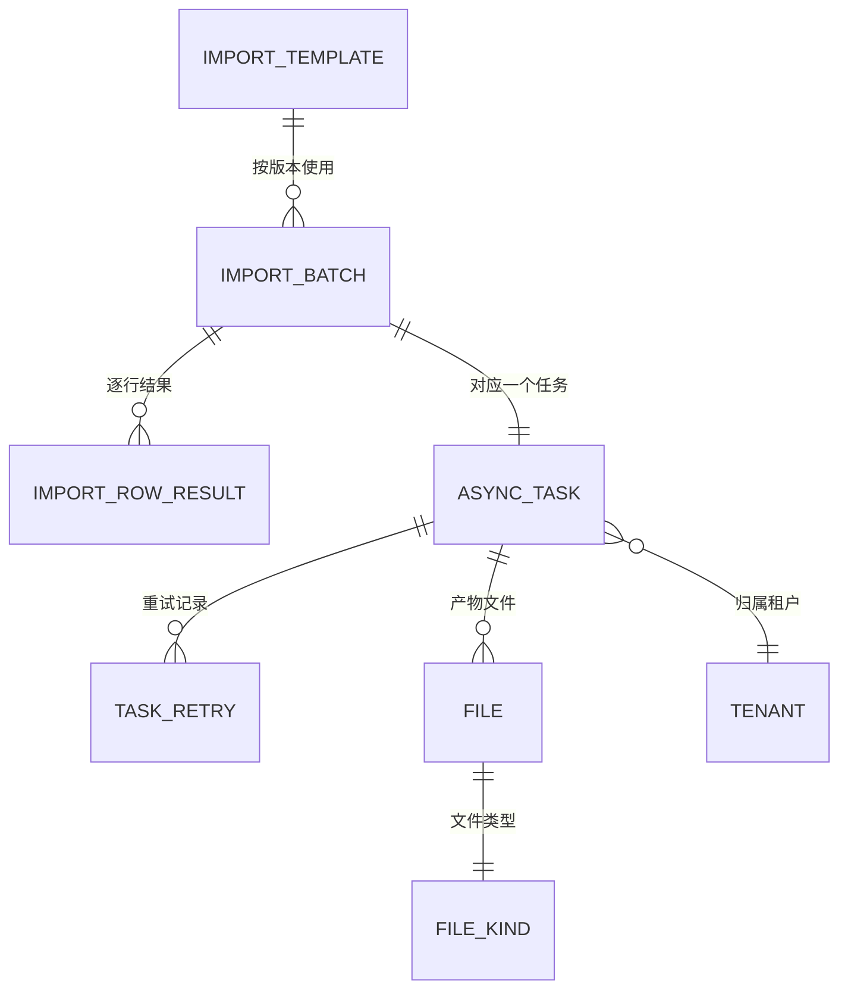

# 导入导出与异步任务 PRD

| 项 | 值 |
|---|---|
| 模块 | 导入导出与异步任务（`import-export`） |
| 文档路径 | `docs/10-prd/modules/import-export/PRD.md` |
| 版本 | 1.0.1-draft |
| 状态 | `frozen`（2026-09-30 需求验收通过，见 D-049） |
| 批次 | 1-4 |
| 上游依赖 | 见 1.4 |

## 变更记录

| 版本 | 日期 | 变更 | 作者 |
|---|---|---|---|
| 1.0.0-draft | 2026-09-30 | 首版。覆盖通用导入向导、校验、幂等执行、导出、异步任务中心、文件下载安全与并发配额 | Codex |
| 1.0.1-draft | 2026-10-01 | 按 `CR-019` 补登记同页浮层片段 `DIALOG-DLQ-REPLAY`（死信重放确认，挂在 `PAGE-IMP-DEADLETTER` 下）：`REQ-IMP-038` 要求重放写审计，`layout-spec` 要求危险动作二次确认，6.1 原本没有该片段 | Codex |

## 0. 怎么读这份文档

本文件只定义**导入导出与异步任务模块特有的需求**。
角色、业务规则、权限矩阵、字段定义、非功能指标一律**引用公共前置的编号**，不复制正文。
引用格式：`BR-IMP-001`（业务规则）、`SCN-IMP-02`（场景）、`PER-ACADEMIC-DIRECTOR`（角色）、
`DS-DENY-03`（数据范围规则）、`NFR-MQ-01`（非功能需求）、`FD-batch_no`（字段字典条目）。

需求编号规则 `REQ-IMP-xxx`，一经发布不得重排；删除的需求保留编号并标注 `已废弃`。

本模块是**支撑能力**，不是业务模块：它不定义"学生有哪些字段""班级怎么建"，
只定义"任何模块要导入、导出、跑长任务时，必须遵守同一套流程与约束"。

---

## 1. 模块定位与范围

### 1.1 解决什么问题

首轮四个业务模块（班级、年级、教师、学生）都依赖批量数据进出系统，痛点集中且同类：

1. 每个模块各写一套导入，校验口径、错误提示、幂等策略各不相同，用户要学四遍
2. 导出没有统一的数据范围复查，越权导出无法系统性防止
3. 5000 行以上的操作把页面卡死，没有任务编号、进度与失败明细，出错只能重来
4. 结果文件长期留在服务器上，谁下载过、下载了什么，事后无法回溯

因此本模块把"导入、导出、长任务"三件事收敛成一套公共能力，供其它模块调用。

### 1.2 范围内

| 能力 | 说明 |
|---|---|
| 通用导入向导 | 四步流程：下载模板 → 上传 → 校验结果 → 确认执行 |
| 导入模板管理 | 模板声明与版本号、版本过期提示、模板下载留痕 |
| 导入校验 | 结构校验、格式校验、引用完整性、唯一性、数据范围、跨行依赖 |
| 导入执行 | 异步执行、批次号幂等、逐行结果、失败行下载、重试 |
| 导出 | 按筛选条件与数据范围导出，掩码与明文授权区分，同步与异步分流 |
| 异步任务中心 | 任务列表、详情、进度、结果文件、重试、死信查看与重放 |
| 文件服务 | 上传与结果文件统一存放、短时签名下载、有效期与清理 |
| 并发与配额 | 单用户与单学校的导入并发、排队、可观测的配额配置 |

### 1.3 范围外

| 不做 | 归属 |
|---|---|
| 各业务模块的字段与校验口径 | 各模块 PRD（学生 `REQ-STU-052` ~ `062`、班级、教师等） |
| 学年升级的编排与规则 | 升班模块（`docs/10-prd/modules/promotion/PRD.md`） |
| 报表、统计口径与可视化 | 后续阶段 |
| 数据同步、开放 API、与第三方学籍系统对接 | 后续阶段 |
| 定时调度平台（如分布式任务调度中心） | 首轮用应用内任务表 + MQ 实现 |
| 对象存储的运维与容量规划 | 部署与运维范畴 |

### 1.4 上游依赖

| 依赖 | 用途 | 缺失后果 |
|---|---|---|
| `docs/10-prd/04-business-rules.md` | `BR-IMP-001` ~ `BR-IMP-016` | 导入导出行为无硬约束 |
| `docs/10-prd/05-permission-matrix.yaml` | `data.import`、`data.export`、`data.async_task` 的功能权限 | 无法判定谁能导入、谁能导出 |
| `docs/10-prd/06-field-dictionary.yaml` | 模板列、任务字段、文件字段 | 模板与任务表的字段名会漂移 |
| `docs/10-prd/08-data-scope-model.md` | 导出与任务结果的范围复查 | 越权导出与越权下载无法防止 |
| `docs/10-prd/07-non-functional-requirements.md` | `NFR-MQ-01` ~ `NFR-MQ-04`、`NFR-PERF-06` | 异步、幂等、重试无标准 |
| 学生 / 教师 / 班级 / 年级模块 PRD | 模板列与校验口径 | 模板无法定义 |

---

## 2. 角色与场景

### 2.1 涉及角色

角色定义见 `02-personas-and-scenarios.md`，此处只标注本模块的差异点。

| 角色 | 本模块数据范围 | 本模块关键限制 |
|---|---|---|
| `PER-PLATFORM-OPS` 平台运营 | 全平台（`DS-01`） | 可查看任务与结果，**不发起**业务导入；导出需显式授权并留痕 |
| `PER-ACADEMIC-DIRECTOR` 教务主任 | 本校（`DS-04`） | 导入导出的主要操作者 |
| `PER-SCHOOL-LEADER` 校领导 | 本校（`DS-04`） | 可查看任务、可导出 |
| `PER-GRADE-LEADER` 年级主任 | 所负责年级（`DS-05`） | 可导出本年级数据；任务中心只能看自己发起的任务 |
| `PER-HOMEROOM` 班主任 | 所负责班级（`DS-06`） | 可导出本班受限字段；不提供导入入口 |
| `PER-SUBJECT-TEACHER` 任课教师 | 任教班级（`DS-07`） | **禁止任何导入与导出** |
| `PER-TENANT-ADMIN` 租户管理员 | 本租户组织配置（`DS-02`） | 无教学数据导入导出权限 |
| `PER-GROUP-EXPERT` / `PER-GROUP-LEADER` | 集团自有数据（`DS-03`） | 首轮只读，不含下属学校教学数据 |

### 2.2 场景

| 场景 | 名称 | 主要角色 |
|---|---|---|
| `SCN-IMP-02` | 通用批量导入向导 | 教务主任 |
| `SCN-IMP-03` | 异步任务查看与失败重试 | 教务主任、年级主任、班主任 |

关联场景（在本模块有页面或状态，但主导模块不是导入导出）：

| 场景 | 关联点 |
|---|---|
| `SCN-STU-03` | 学生批量导入，使用本模块的向导与校验能力 |
| `SCN-IMP-01` | 导出名单，使用本模块的导出与留痕能力 |
| `SCN-PROMO-01` | 学年升级的预览与执行走本模块的异步任务能力 |

### 2.3 场景覆盖矩阵

| 场景 | 平台运营 | 校领导 | 教务主任 | 年级主任 | 班主任 |
|---|---|---|---|---|---|
| SCN-IMP-02 | — | 查看 | 主 | 查看 | — |
| SCN-IMP-03 | 查看 | 查看 | 主 | 查看 | 查看 |

---

## 3. 术语与逻辑实体

### 3.1 术语

导入、导出、异步任务、幂等键的定义见 `03-glossary.md`。本模块需要额外强调三个区分：

| 区分 | 说明 |
|---|---|
| 校验阶段 vs 执行阶段 | 校验阶段只读库、不写库；执行阶段才落业务数据（`BR-IMP-008`） |
| 批次号 vs 任务编号 | 批次号是**业务幂等键**，任务编号是**调度与查询标识**；一个批次对应一个任务 |
| 结果文件 vs 业务数据 | 结果文件是过程产物，有有效期（`BR-IMP-013`）；业务数据长期保留 |

### 3.2 逻辑实体

以下为**逻辑实体**，物理表与字段类型在阶段 5 定稿。

| 实体 | 含义 | 权威来源 |
|---|---|---|
| 导入模板 | 某模块某版本的列定义与说明 | 本模块 |
| 导入批次 | 一次导入的业务幂等单元 | 本模块 |
| 导入行结果 | 批次的逐行结果与失败原因 | 本模块 |
| 异步任务 | 长任务的调度、进度与结果记录 | 本模块 |
| 文件 | 上传文件与结果文件的引用与有效期 | 本模块 |
| 任务重试记录 | 每次重试的时间、发起人与结果 | 本模块 |

### 3.3 实体关系

---

## 4. 功能需求

### 4.1 导入向导与模板

| 编号 | 需求 | 规则依据 | 权限依据 |
|---|---|---|---|
| `REQ-IMP-001` | 提供统一的导入向导入口，固定四步：下载模板 → 上传文件 → 校验结果 → 确认执行 | `BR-IMP-001`、`SCN-IMP-02` | `data.import` 的 `import` |
| `REQ-IMP-002` | 模板由各业务模块声明，包含列名、是否必填、格式说明与至少一行示例数据 | `BR-IMP-007` | 同上 |
| `REQ-IMP-003` | 模板携带版本号；字段字典变更必须升版本，旧版本模板仍可下载但页面标注"已过期"并提示重新下载 | `BR-IMP-007` | 同上 |
| `REQ-IMP-004` | 上传限制：单个文件 ≤ 10 MB、行数 ≤ 5000、仅支持 `xlsx` 与 `csv`；超出时在上传阶段直接拒绝 | `BR-IMP-010` | 同上 |
| `REQ-IMP-005` | 上传后先做结构校验：表头列名与顺序、文件编码、是否存在数据行 | `BR-IMP-007` | 同上 |
| `REQ-IMP-006` | 校验结果分页展示，区分成功行与失败行，失败行给出**原始行号**与失败原因 | `BR-IMP-006`、`BR-IMP-016` | 同上 |
| `REQ-IMP-007` | 校验结果提供"按失败原因分组"的统计视图，便于一次性修正同类问题 | `BR-IMP-016` | 同上 |
| `REQ-IMP-008` | 失败行可下载为 CSV，包含原始行号、原始内容与失败原因；修正后可重新上传为新批次 | `BR-IMP-006` | 同上 |

### 4.2 校验规则

| 编号 | 需求 | 规则依据 | 权限依据 |
|---|---|---|---|
| `REQ-IMP-009` | 通用校验：必填缺失、长度、格式（日期、手机号、证件号）、枚举取值、数值范围 | `BR-IMP-011` | `data.import` 的 `import` |
| `REQ-IMP-010` | 引用完整性校验：模板引用的学年学期、年级、班级、学科必须已存在，**不自动创建** | `BR-IMP-011` | 同上 |
| `REQ-IMP-011` | 唯一性校验：模板声明的唯一键需同时校验"库内已存在"与"同文件内重复"两种情况，两者区分提示 | `BR-IMP-009` | 同上 |
| `REQ-IMP-012` | 数据范围校验：每一行的目标归属必须落在操作者数据范围内；任一行越权时整批拒绝执行并列出越权行号 | `DS-DENY-06` | 同上 |
| `REQ-IMP-013` | 跨行依赖校验：同一文件内存在父子关系的行（如学生与监护人）必须能解析出父子引用，无法解析时判为失败行 | `BR-IMP-016` | 同上 |
| `REQ-IMP-014` | 校验阶段不写业务数据；校验结果保留有效期（默认 24 小时），过期后需重新上传 | `BR-IMP-008` | 同上 |

### 4.3 执行与幂等

| 编号 | 需求 | 规则依据 | 权限依据 |
|---|---|---|---|
| `REQ-IMP-015` | 用户确认执行后返回任务编号，执行阶段异步进行，界面不阻塞 | `BR-IMP-003`、`NFR-MQ-04` | `data.import` 的 `import` |
| `REQ-IMP-016` | 每个批次生成全局唯一的批次号，作为幂等键 | `BR-IMP-009` | 同上 |
| `REQ-IMP-017` | 同一批次号重复提交不得重复写入业务数据；第二次提交直接返回第一次的结果 | `BR-IMP-002`、`BR-IMP-009` | 同上 |
| `REQ-IMP-018` | 执行阶段按行记录结果：成功、失败、跳过（如已存在且策略为跳过），三类分别可下载 | `BR-IMP-016` | 同上 |
| `REQ-IMP-019` | 部分失败时保留已成功行，不整体回滚；失败行可下载后作为新批次重新导入 | `BR-IMP-016`、`NFR-MQ-01` | 同上 |
| `REQ-IMP-020` | 导入完成后展示结果摘要：总行数、成功数、失败数、跳过数、耗时；摘要可导出 | `BR-IMP-014` | 同上 |

### 4.4 学号对照表与回填

| 编号 | 需求 | 规则依据 | 权限依据 |
|---|---|---|---|
| `REQ-IMP-021` | 学生导入忽略源文件中的学号列；导入完成后提供"学号对照表"下载 | `BR-STU-019` | `data.import` 的 `import` |
| `REQ-IMP-022` | 学号对照表包含：原始行号、姓名、系统学号、处理结果四列 | `BR-STU-019` | 同上 |
| `REQ-IMP-023` | 学号对照表作为异步结果文件管理，受有效期与数据范围约束；下载动作写入审计 | `BR-IMP-013`、`BR-IMP-015` | 同上 |

### 4.5 导出

| 编号 | 需求 | 规则依据 | 权限依据 |
|---|---|---|---|
| `REQ-IMP-024` | 导出按当前筛选条件与当前用户数据范围生成文件 | `BR-IMP-004`、`SCN-IMP-01` | `data.export` 的 `export` |
| `REQ-IMP-025` | 导出前重新解析数据范围，不复用列表页的判定结果 | `DS-DENY-04`、`BR-IMP-015` | 同上 |
| `REQ-IMP-026` | 导出格式支持 `xlsx` 与 `csv`，默认 `xlsx` | — | 同上 |
| `REQ-IMP-027` | 导出列可选，默认列与列表页默认列一致；列选择按用户维度记忆 | — | 同上 |
| `REQ-IMP-028` | 敏感字段默认掩码；只有具备敏感字段读取权限的角色才能选择"导出明文"，且该选项逐次写审计 | `BR-IMP-012`、`NFR-SEC-06` | 需 `read_sensitive` |
| `REQ-IMP-029` | 导出行数 ≤ 2000 时同步下载；超过 2000 行转异步任务，返回任务编号 | `NFR-PERF-05` | 同上 |
| `REQ-IMP-030` | 导出写入审计日志：筛选条件、行数、耗时、导出人、是否含明文 | `BR-IMP-005`、`NFR-AUDIT-03` | 同上 |
| `REQ-IMP-031` | 导出文件设置有效期（默认 7 天），到期自动清理并留记录 | `BR-IMP-013` | 同上 |

### 4.6 异步任务中心

| 编号 | 需求 | 规则依据 | 权限依据 |
|---|---|---|---|
| `REQ-IMP-032` | 提供"异步任务"页面，可按任务类型、状态、时间范围筛选；默认只显示**本人发起**的任务 | `BR-IMP-014` | `data.async_task` 的 `read` |
| `REQ-IMP-033` | 任务详情展示：任务类型、参数摘要、状态、进度、耗时、结果文件与失败明细入口 | `BR-IMP-014` | 同上 |
| `REQ-IMP-034` | 任务状态按 `queued → running → succeeded / partial_failed / failed` 推进；`queued` 状态可取消 | `FD-async_task_status` | 同上 |
| `REQ-IMP-035` | 页面提供进度自动刷新，刷新失败时降级为手动刷新并给出提示 | `NFR-PERF-08` | 同上 |
| `REQ-IMP-036` | 任务结果的查询与下载都重新解析数据范围，不复用发起时的判定 | `BR-IMP-015`、`DS-DENY-04` | 同上 |
| `REQ-IMP-037` | 失败与部分失败的任务可重试；重试沿用原批次号与幂等键，不产生重复数据 | `BR-IMP-009`、`NFR-MQ-02` | 同上 |
| `REQ-IMP-038` | 超过最大重试次数的任务进入死信，提供运维查看与重放；重放动作写入审计 | `NFR-MQ-03` | 运维 + 审计 |
| `REQ-IMP-039` | 重试次数、退避间隔与最大并发可配置，配置项对外可观测 | `NFR-MQ-02` | 运维 |
| `REQ-IMP-040` | 任务记录保留期默认 90 天，到期归档；归档后任务元数据仍可查询，结果文件按有效期清理 | `BR-IMP-013` | — |

### 4.7 文件服务与下载安全

| 编号 | 需求 | 规则依据 | 权限依据 |
|---|---|---|---|
| `REQ-IMP-041` | 上传文件与结果文件统一存放文件服务，数据库只保存文件引用，不保存二进制 | `NFR-DATA-03` | — |
| `REQ-IMP-042` | 下载走短时签名链接，链接与当前登录态绑定，链接过期或跨账号访问一律拒绝 | `NFR-SEC-04` | 按所属资源判定 |
| `REQ-IMP-043` | 每次下载写入审计日志：文件、对象、下载人、时间、来源 IP | `NFR-AUDIT-03` | 同上 |
| `REQ-IMP-044` | 服务端做文件类型与大小校验，拒绝可执行文件与伪装扩展名 | `NFR-SEC-04` | — |
| `REQ-IMP-045` | 上传与下载不落地到应用服务器本地临时目录，避免多实例部署时丢失或串读 | `NFR-OPS-01` | — |
| `REQ-IMP-046` | 文件引用带租户与学校前缀；相关缓存键必须包含租户前缀，禁止跨租户复用 | `NFR-CACHE-01` | — |

### 4.8 并发与配额

| 编号 | 需求 | 规则依据 | 权限依据 |
|---|---|---|---|
| `REQ-IMP-047` | 同一用户在同一模块同时只允许一个进行中的导入 | `NFR-PERF-06` | — |
| `REQ-IMP-048` | 同一学校的导入任务并发上限可配置，默认 3 | `NFR-PERF-06` | 运维配置 |
| `REQ-IMP-049` | 超出并发配额的导入任务进入排队，不直接失败，并给出排队位置提示 | `NFR-MQ-04` | — |
| `REQ-IMP-050` | 导入与导出的发起请求响应时间 P95 ≤ 2 秒（不含文件处理） | `NFR-PERF-03` | — |
| `REQ-IMP-051` | 超过 5000 行的导入由用户拆分为多个批次，系统在模板说明与校验结果中给出拆分指引 | `BR-IMP-010` | — |
| `REQ-IMP-052` | 配额与并发配置对租户可观测：租户管理员可查看本租户当前占用与排队情况 | `NFR-OPS-05` | `data.async_task` 的 `read` |

---

## 5. 权限需求

### 5.1 功能权限

权威来源为 `05-permission-matrix.yaml`。本模块涉及的资源与操作：

| 资源 | 操作 | 说明 |
|---|---|---|
| `data.import` | import | 发起导入 |
| `data.export` | export | 发起导出 |
| `data.async_task` | read | 查看任务与结果 |
| `audit.log` | read | 查看导入导出相关日志 |

### 5.2 数据范围

解析方式见 `08-data-scope-model.md` 第 3 节，落地表见 `10-data-permission-schema.md`。

| 角色 | 范围编号 | 本模块落地方式 |
|---|---|---|
| 平台运营 | `DS-01` | 可查看全平台任务；导出需独立授权 |
| 教务主任 / 校领导 | `DS-04` | 本校数据的导入导出 |
| 年级主任 | `DS-05` | 本年级数据的导出；任务中心仅本人任务 |
| 班主任 | `DS-06` | 本班受限字段导出；无导入入口 |
| 任课教师 | `DS-07` | 无导入导出权限 |
| 集团用户 | `DS-03` | 首轮只读，不含下属学校教学数据 |

### 5.3 敏感字段与掩码

| 字段 | 导出默认 | 明文条件 | 依据 |
|---|---|---|---|
| 证件号 | 掩码（前 6 位与后 4 位之外掩码） | `read_sensitive` + 明文导出授权 | `BR-IMP-012`、`NFR-SEC-06` |
| 学生 / 监护人手机号 | 掩码（中间 4 位） | `read_contact` + 明文导出授权 | 同上 |
| 出生日期 | 掩码（只显示年月） | `read_sensitive` | 同上 |
| 学号、姓名 | 全量 | — | 学号是对外标识 |

### 5.4 拒绝规则

严格遵守 `08-data-scope-model.md` 第 5 节：

| 规则 | 本模块的落地要求 |
|---|---|
| `DS-DENY-01` | 缺少租户上下文一律拒绝（学生主体的两段式取数见 `DS-DENY-09`） |
| `DS-DENY-02` | 学校级资源缺少学校上下文且范围不是 `platform` 时拒绝 |
| `DS-DENY-03` | 范围为空时导出为空文件并提示，不退化为全量 |
| `DS-DENY-04` | 导出、文件下载、任务结果查询必须重新解析范围 |
| `DS-DENY-05` | 不继承系统租户管理员的放行逻辑 |
| `DS-DENY-06` | 导入逐行校验范围，任一行越权则整批拒绝 |
| `DS-DENY-07` | 按任务编号或文件标识查询时先过滤范围再取数 |
| `DS-DENY-08` | 计数与统计（如"已导出 N 行"）同样受范围约束 |
| `DS-DENY-09` | 涉及学生主体的导入导出必须经在校记录 / 班级关系两段式取数 |

---

## 6. 界面需求（阶段 2 原型输入）

### 6.1 页面清单

| 页面 ID | 页面名 | 类型 | 主要角色 | 说明 |
|---|---|---|---|---|
| `PAGE-IMP-WIZARD` | 导入向导 | 独立页（四步） | 教务主任 | 本模块主入口 |
| `PAGE-IMP-TEMPLATE` | 模板下载与说明 | 向导内区块 | 教务主任 | 含版本号与过期提示 |
| `PAGE-IMP-VALIDATE` | 校验结果 | 向导内区块 | 教务主任 | 成功 / 失败分列，可下载失败行 |
| `PAGE-IMP-EXECUTE` | 执行与进度 | 向导内区块 | 教务主任 | 任务编号 + 进度 |
| `PAGE-IMP-TASK-LIST` | 异步任务列表 | 列表页 | 教务主任、年级主任、班主任 | 默认只看本人任务 |
| `PAGE-IMP-TASK-DETAIL` | 任务详情 | 详情抽屉 | 同上 | 含结果文件与失败明细 |
| `PAGE-IMP-EXPORT` | 导出配置 | 弹窗 | 教务主任、校领导、年级主任、班主任 | 列选择 + 明文开关 |
| `PAGE-IMP-DEADLETTER` | 死信任务 | 列表页（运维） | 平台运营 | 查看与重放 |

> **同页浮层片段（`CR-019` 补登记）**：`DIALOG-DLQ-REPLAY`（死信重放确认），挂在 `PAGE-IMP-DEADLETTER` 下：
> 重放会复用原批次号与幂等键重新入队（已成功的行不会重复写入，`REQ-IMP-037`），
> **重放原因必填**且写入审计（`REQ-IMP-038`）；按 `layout-spec.yaml` 的 `state_rules`，危险动作必须二次确认并写清影响范围。

### 6.2 列表页要素

异步任务列表自上而下：

1. 面包屑与页面标题
2. 筛选区（一行）：任务类型、状态、时间范围、关键字（任务编号）
3. 操作栏（左）：刷新、自动刷新开关、导出任务清单
4. 表格：任务编号、类型、状态、进度、发起人、发起时间、耗时、操作（详情 / 重试 / 取消 / 下载）
5. 分页器：总条数、每页条数、跳页

### 6.3 交互与跳转

| 触发 | 结果 | 备注 |
|---|---|---|
| 点击"导入" | 打开导入向导 | 独立页，保留来源列表的筛选条件 |
| 下载模板 | 直接下载并记录版本号 | 模板过期时给出重新下载提示 |
| 上传文件 | 就地校验并跳到第三步 | 失败时停留并展示原因 |
| 点击"确认执行" | 返回任务编号并跳到进度区 | 不阻塞界面，可关闭窗口 |
| 点击"下载失败行" | 下载 CSV | 失败明细同样受数据范围约束 |
| 点击"导出" | 打开导出配置弹窗 | 行数 > 2000 时提示转异步 |
| 点击任务行 | 打开任务详情抽屉 | 页面不跳转 |
| 点击"重试" | 二次确认后重新入队 | 沿用原批次号 |
| 任务完成后 | 页面给出通知与下载入口 | 通知不跨租户、不跨用户 |

### 6.4 页面状态

| 状态 | 表现 |
|---|---|
| 加载中 | 骨架屏，不使用全屏遮罩 |
| 空数据 | 插画 + 说明 + 主行动按钮 |
| 无权限 | 说明 + 返回入口，不显示空白页 |
| 文件过大 / 行数超限 | 明确提示上限值与拆分建议 |
| 校验有失败行 | 顶部汇总 + 分页列表，失败行高亮 |
| 排队中 | 显示排队位置与预计等待提示 |
| 执行部分失败 | 成功 / 失败分列，失败明细可下载 |
| 任务超时无响应 | 错误提示 + 请求 ID + 重试按钮 |

---

## 7. 数据需求

### 7.1 逻辑实体与字段

字段命名以 `06-field-dictionary.yaml` 为准。本模块新增使用的字段已在字典登记：
`task_no`、`task_type`、`task_status`、`progress_percent`、`batch_no`、`template_version`、
`file_id`、`file_kind`、`file_expire_time`。

| 实体 | 关键字段 | 唯一性要求 |
|---|---|---|
| 导入模板 | `module_code`、`template_version`、`file_id` | `(module_code, template_version)` 唯一 |
| 导入批次 | `batch_no`、`template_version`、`task_id`、`row_total` | `batch_no` 全局唯一 |
| 导入行结果 | `batch_no`、`row_no`、`result`、`fail_reason` | `(batch_no, row_no)` 唯一 |
| 异步任务 | `task_no`、`task_type`、`task_status`、`progress_percent`、`owner_id`、`tenant_id` | `task_no` 全局唯一 |
| 文件 | `file_id`、`file_kind`、`file_expire_time`、`tenant_id` | `file_id` 唯一 |
| 任务重试 | `task_no`、`retry_no`、`result` | `(task_no, retry_no)` 唯一 |

### 7.2 索引需求

| 查询场景 | 需要的索引前缀 |
|---|---|
| 按租户 + 发起人 + 状态列任务 | `tenant_id` + `owner_id` + `task_status` |
| 按任务编号精确查 | `task_no` |
| 按批次号查逐行结果 | `batch_no` + `row_no` |
| 按有效期清理文件 | `file_expire_time` |
| 按时间范围查询任务 | `tenant_id` + `create_time` |

详细索引在阶段 5 与实际查询场景共同确定，遵循 `NFR-DATA-01` 与 `06-field-dictionary.yaml` 的 `index_conventions`。

### 7.3 审计要求

| 事件 | 记录内容 |
|---|---|
| 模板下载 | 模块、模板版本、下载人、时间 |
| 导入发起 | 批次号、模块、总行数、校验通过数、失败数、操作人 |
| 导入执行完成 | 成功数、失败数、跳过数、耗时 |
| 导入重试 | 批次号、重试次数、发起人、结果 |
| 导出 | 筛选条件、行数、耗时、导出人、是否含明文 |
| 文件下载 | 文件、对象、下载人、时间、来源 IP |
| 死信重放 | 任务编号、操作人、时间、结果 |

---

## 8. 接口需求（阶段 4 概要设计输入）

本模块预计接口（`operationId` 为建议值，阶段 4 定稿）：

| 建议 operationId | 方法 | 路径 | 说明 |
|---|---|---|---|
| `listImportTemplate` | GET | `/edu/import/template` | 模板清单与当前版本 |
| `downloadImportTemplate` | GET | `/edu/import/template/{module}` | 模板下载 |
| `validateImportFile` | POST | `/edu/import/validate` | 上传并同步校验 |
| `executeImport` | POST | `/edu/import/execute` | 确认执行（异步） |
| `downloadImportFailedRows` | GET | `/edu/import/{batchNo}/failed-rows` | 失败行下载 |
| `downloadImportResult` | GET | `/edu/import/{batchNo}/result` | 结果摘要与对照表 |
| `exportData` | POST | `/edu/export` | 导出（同步或异步） |
| `listAsyncTask` | GET | `/edu/async-task/list` | 任务列表 |
| `getAsyncTask` | GET | `/edu/async-task/{taskNo}` | 任务详情 |
| `cancelAsyncTask` | POST | `/edu/async-task/{taskNo}/cancel` | 取消排队中的任务 |
| `retryAsyncTask` | POST | `/edu/async-task/{taskNo}/retry` | 重试 |
| `downloadTaskResult` | GET | `/edu/async-task/{taskNo}/file/{fileId}` | 结果文件下载（短时签名） |
| `listDeadLetterTask` | GET | `/edu/async-task/dead-letter` | 死信任务列表 |
| `replayDeadLetterTask` | POST | `/edu/async-task/dead-letter/{taskNo}/replay` | 死信重放 |

接口层要求：

1. 所有接口声明其数据范围与所需功能权限（`document-map.yaml`：`prd.permission → dd.openapi`）
2. 请求与响应字段名必须能在 `06-field-dictionary.yaml` 中找到
3. 主键 `id` 序列化为字符串，前端按 string 处理
4. 下载类接口返回短时签名链接，链接不得长期有效
5. 错误码在阶段 5 的 `error-codes.yaml` 中统一定义

---

## 9. 非功能需求

本模块直接受以下公共非功能需求约束，不在模块内重复定义：

| 域 | 编号 |
|---|---|
| 性能 | `NFR-PERF-01` ~ `NFR-PERF-08` |
| 安全 | `NFR-SEC-01` ~ `NFR-SEC-10` |
| 审计 | `NFR-AUDIT-01` ~ `NFR-AUDIT-06` |
| 数据 | `NFR-DATA-01` ~ `NFR-DATA-07` |
| 缓存 | `NFR-CACHE-01` ~ `NFR-CACHE-03` |
| 消息 | `NFR-MQ-01` ~ `NFR-MQ-04` |
| 兼容 | `NFR-COMPAT-01` ~ `NFR-COMPAT-03` |
| 可访问性 | `NFR-A11Y-01` ~ `NFR-A11Y-04` |
| 工程质量 | `NFR-CODE-01` ~ `NFR-CODE-05` |
| 运维 | `NFR-OPS-01` ~ `NFR-OPS-05` |

模块级补充：

| 指标 | 对应需求或规则 | 目标 |
|---|---|---|
| 导入 / 导出发起响应 | `REQ-IMP-050`、`NFR-PERF-03` | P95 ≤ 2 秒 |
| 5000 行以内校验 | `NFR-PERF-06` | ≤ 30 秒 |
| 任务中心首屏可交互 | `REQ-IMP-052`、`NFR-PERF-08` | ≤ 3 秒 |

---

## 10. 需求追踪矩阵

原型、接口、表、测试的映射在阶段 2 / 4 / 5 / 8 逐列补全。
当前只固定"需求 → 场景 → 规则 → 验收用例"。

| 需求组 | 场景 | 主要规则 | 验收用例 |
|---|---|---|---|
| `REQ-IMP-001` ~ `REQ-IMP-008` 导入向导与模板 | `SCN-IMP-02`、`SCN-STU-03` | `BR-IMP-001`、`BR-IMP-007` | `AC-IMP-001` ~ `AC-IMP-008` |
| `REQ-IMP-009` ~ `REQ-IMP-014` 校验规则 | `SCN-IMP-02` | `BR-IMP-008`、`BR-IMP-011` | `AC-IMP-009` ~ `AC-IMP-014` |
| `REQ-IMP-015` ~ `REQ-IMP-020` 执行与幂等 | `SCN-IMP-02` | `BR-IMP-002`、`BR-IMP-009` | `AC-IMP-015` ~ `AC-IMP-020` |
| `REQ-IMP-021` ~ `REQ-IMP-023` 学号对照表 | `SCN-STU-03` | `BR-STU-019` | `AC-IMP-021` ~ `AC-IMP-023` |
| `REQ-IMP-024` ~ `REQ-IMP-031` 导出 | `SCN-IMP-01` | `BR-IMP-004`、`BR-IMP-012` | `AC-IMP-024` ~ `AC-IMP-031` |
| `REQ-IMP-032` ~ `REQ-IMP-040` 异步任务中心 | `SCN-IMP-03` | `BR-IMP-014`、`NFR-MQ-03` | `AC-IMP-032` ~ `AC-IMP-040` |
| `REQ-IMP-041` ~ `REQ-IMP-046` 文件服务与下载安全 | `SCN-IMP-03` | `BR-IMP-013`、`NFR-SEC-04` | `AC-IMP-041` ~ `AC-IMP-046` |
| `REQ-IMP-047` ~ `REQ-IMP-052` 并发与配额 | `SCN-IMP-02` | `NFR-PERF-06`、`NFR-MQ-04` | `AC-IMP-047` ~ `AC-IMP-052` |
| 权限与数据范围 | `SCN-IMP-01`、`SCN-IMP-02` | `BR-DATA-007`、`DS-DENY-01` ~ `DS-DENY-09` | `AC-IMP-101` ~ `AC-IMP-110` |
| 审计 | `SCN-IMP-01`、`SCN-IMP-02` | `BR-AUDIT-005`、`BR-IMP-005` | `AC-IMP-201` ~ `AC-IMP-206` |
| 性能与可靠性 | — | `NFR-PERF-03`、`NFR-PERF-06`、`NFR-MQ-01` | `AC-IMP-301` ~ `AC-IMP-306` |
| 兼容与可访问性 | — | `NFR-COMPAT-01` ~ `NFR-COMPAT-03`、`NFR-A11Y-01` ~ `NFR-A11Y-04` | `AC-IMP-401` ~ `AC-IMP-404` |

验收用例的可执行步骤见 `acceptance.md`。

---

## 11. 术语使用声明

本模块文档中出现的以下编号均引用公共前置，不在本文件重复定义：

`CTX-GOAL-*`、`PER-*`、`SCN-*`、`BR-*`、`FD-*`、`DS-*`、`NFR-*`。

权限不单独编号引用，统一以 `05-permission-matrix.yaml` 中的「角色 / 资源 / 操作」三元组表达，
例如「`academic_director` / `data.import` / `import`」。

如果发现某个编号在本文件中被赋予了与公共前置不同的含义，以公共前置为准，并登记为文档缺陷。

---

## 12. 待裁决事项

以下事项在撰写本模块 PRD 时被发现，属于**需要用户拍板的业务口径**。
未裁决前，本 PRD 的相关章节按"当前工作假设"书写，裁决后按结论修正。

### `IMP-Q-01` 导入上限与同步校验耗时

| 项 | 内容 |
|---|---|
| 现状 | `BR-IMP-003` 与 `BR-IMP-010` 定为"单次 5000 行、单文件 10 MB、校验 30 秒内返回" |
| 影响 | 模板拆分指引、同步校验链路的资源规格、超限提示文案 |
| 当前工作假设 | 5000 行 / 10 MB / 30 秒；超出拆分为多批次 |
| 待确认 | 是否接受该上限；若学校实际名单更大（如 1 万行），是否放宽到 1 万行 |
| 阻塞 | 阶段 3 原型与阶段 5 建表 |
| 裁决 | **已确认**（2026-09-30）：用户答复"接受"，按当前工作假设执行；`RV-IMP-02` |

### `IMP-Q-02` 结果文件有效期

| 项 | 内容 |
|---|---|
| 现状 | `BR-IMP-013` 定为默认 7 天，`REQ-IMP-031` 与 `REQ-IMP-040` 分别约束导出文件与任务记录 |
| 影响 | 文件清理策略、用户"文件不见了"的解释成本 |
| 当前工作假设 | 导出与结果文件 7 天，任务元数据 90 天 |
| 待确认 | 是否接受 7 天；个别学校是否需要更长（如 30 天） |
| 阻塞 | 阶段 5 建表与阶段 7 实现 |
| 裁决 | **已确认**（2026-09-30）：用户答复"接受"；`RV-IMP-03` |

### `IMP-Q-03` 任务并发配额

| 项 | 内容 |
|---|---|
| 现状 | `REQ-IMP-047` ~ `REQ-IMP-049` 定为"同一用户 1 个、同一学校 3 个、超出排队" |
| 影响 | 大校高峰期排队时长；运维可调参数 |
| 当前工作假设 | 用户 1 / 学校 3，均可配置 |
| 待确认 | 是否接受；是否需要按租户套餐区分档位 |
| 阻塞 | 阶段 7 实现 |
| 裁决 | **已确认**（2026-09-30）：用户答复"接受"；`RV-IMP-04` |

### `IMP-Q-04` 平台运营能否发起导出

| 项 | 内容 |
|---|---|
| 现状 | `05-permission-matrix.yaml` 中平台运营的 `data.export` 标注"需显式授予导出权限" |
| 影响 | 平台侧协助排查的工作量；租户对"平台能导出什么"的信任 |
| 当前工作假设 | 默认不可导出；需要时逐次授权并留痕，且租户侧可查 |
| 待确认 | 是否维持"默认不可导出"；若维持，授权入口放在运营侧还是租户侧 |
| 阻塞 | 阶段 6 界面与阶段 7 实现 |
| 裁决 | **已确认**（2026-09-30）：维持默认不可导出，用户答复"接受"；`RV-IMP-05` |

### `IMP-Q-05` 模板版本过期后的下载行为

| 项 | 内容 |
|---|---|
| 现状 | `REQ-IMP-003` 定为"旧版本模板仍可下载但标注已过期" |
| 影响 | 学校用旧模板填的数据会被校验拒绝，产生返工 |
| 当前工作假设 | 保留下载并强提示；校验时按版本给出明确错误 |
| 待确认 | 是否改为"过期模板直接禁止下载"，只保留新版本 |
| 阻塞 | 阶段 6 界面 |
| 裁决 | **已确认**（2026-09-30）：保留可下载 + 强提示，用户答复"接受"；`RV-IMP-06` |
