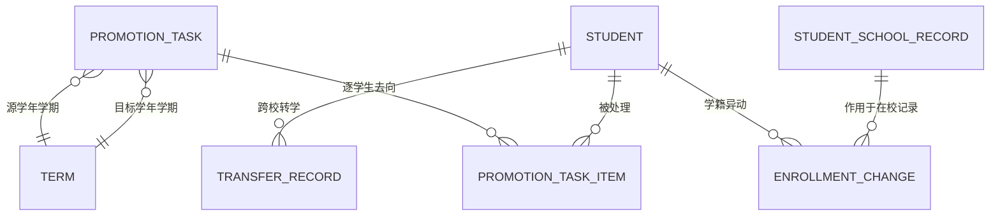

# 升班与学籍异动 PRD

| 项 | 值 |
|---|---|
| 模块 | 升班与学籍异动（`promotion`） |
| 文档路径 | `docs/10-prd/modules/promotion/PRD.md` |
| 版本 | 1.0.3-draft |
| 状态 | `frozen`（2026-09-30 冻结，见 D-045、CR-001） |
| 批次 | 1-3（按学生管理 PRD 样板结构产出） |
| 上游依赖 | 见 1.4 |

## 变更记录

| 版本 | 日期 | 变更 | 作者 |
|---|---|---|---|
| 1.0.0-draft | 2026-09-30 | 首版。结构与粒度对齐 `modules/student/PRD.md` v1.0.2 | Codex |
| 1.0.1-draft | 2026-09-30 | 按 `CR-009` 补登记 6.1 的「调整学生去向」弹窗（`PAGE-PRM-ADJUST`）；依据为第 352 行 6.3 与 `REQ-PRM-017` / `018`，属"PRD 已要求但页面注册表遗漏"的补齐，不新增业务规则 | Codex |
| 1.0.2-draft | 2026-09-30 | 按 `CR-012` / `D-069` 收敛升班任务的权限动作：校领导对升班任务只读（升班无审批环节）、教务主任补 `update` 承载预览 / 执行 / 重试 / 取消、年级主任补 `read` + `DS-05` 只读参与；不新增权限动作、不改状态机 | Codex |
| 1.0.3-draft | 2026-10-01 | 按 `CR-013` / `D-071` 补齐两项公共前置：6.1 补登记取消确认片段 `DIALOG-PRM-CANCEL`（同页浮层片段），6.3 补「列表行内点击取消」的交互行；升班任务的 6 个业务字段同步登记进 `06-field-dictionary.yaml`。不新增业务规则 | Codex |

## 0. 怎么读这份文档

需求编号 `REQ-PRM-xxx`。公共前置的编号只引用不复制。

本模块是**唯一执行升班的模块**，也是学籍状态的唯一变更通道
（`AGENTS.md` 第 7 节的模块边界，`D-042`）。

| 内容 | 归属 |
|---|---|
| 升班任务的创建、预览、执行、重试 | 本模块（唯一执行入口） |
| 学籍状态变更（休学 / 复学 / 退学 / 转出 / 毕业 / 开除 / 死亡 等） | 本模块 |
| 跨校转学 | 本模块 |
| 年级推进视图（序号 +1） | 年级管理模块提供只读视图，本模块消费 |
| 班级与学生的基础维护 | 班级 / 学生管理模块 |
| 调班（同一学年学期内换班） | 班级管理模块（`BR-PROMO-007`）；本模块只在转学时联动 |

---

## 1. 模块定位与范围

### 1.1 解决什么问题

学年切换是学校最集中、最容易出错的一次数据操作。三个历史顽疾：

1. **覆盖历史**：把班级关系直接改写，往年花名册消失
2. **重复执行**：手滑点两次产生两套班级关系，事后无法分辨哪套是对的
3. **中途放弃**：执行到一半失败，既没有回滚也没有续跑，名册处于半成品状态

本模块的三条硬规则正是针对它们：`BR-PROMO-001`（按学年追加、不改写历史）、
`BR-PROMO-003`（幂等）、`BR-PROMO-002`（预览 / 校验 / 确认 / 异步 / 结果 / 重试六段式）。

### 1.2 范围内

| 能力 | 说明 |
|---|---|
| 升班任务列表与检索 | 按源学年、目标学年、状态筛选 |
| 创建升班任务 | 指定源学年学期与目标学年学期 |
| 升班预览 | 逐学生展示去向，支持逐条调整（留级 / 转班 / 毕业） |
| 升班校验 | 目标年级与班级是否存在、容量提示、冲突检查 |
| 升班执行 | 异步、幂等、可查看进度、失败可重试 |
| 学籍异动 | 休学、复学、退学、转出、毕业、开除、死亡登记、失踪、出国 |
| 跨校转学 | 转出校释放 + 转入校接收，转学期间状态为"转入未报到" |
| 异动历史 | 状态变更全量留痕，可回溯 |
| 审计 | 关键操作留痕 |

### 1.3 范围外

| 不做 | 归属 |
|---|---|
| 自动编班、智能分班 | 首轮不做 |
| 班级的创建与班主任指定 | 班级管理模块（升班前需先建好目标班级） |
| 年级的创建 | 年级管理模块（升班前需先建好目标年级） |
| 学年学期的创建 | 学年学期模块（升班前需先建好目标学年学期） |
| 学分认定、成绩结转、综合素质评价结转 | 后续阶段 |
| 调班界面 | 班级管理模块（本模块只在跨校转学时释放原班级关系） |

### 1.4 上游依赖

| 依赖 | 用途 | 缺失后果 |
|---|---|---|
| `docs/10-prd/04-business-rules.md` | `BR-PROMO-*`、`BR-STU-005` / `012` / `023` | 无法判定幂等、终态与转学口径 |
| `docs/10-prd/05-permission-matrix.yaml` | 功能权限 | 按钮显隐无依据 |
| `docs/10-prd/06-field-dictionary.yaml` | `promotion_task_status`、`async_task_status`、`enrollment_status` | 状态机无权威定义 |
| `docs/10-prd/07-non-functional-requirements.md` | `NFR-MQ-01` ~ `04` | 异步与幂等要求无依据 |
| 学年学期、年级、班级、学生模块 | 升班与异动的四个维度 | 任务无法执行 |
| `docs/10-prd/10-data-permission-schema.md` | 权限缓存失效要求 | 升班后权限不更新 |

---

## 2. 角色与场景

### 2.1 涉及角色

| 角色 | 本模块数据范围 | 本模块关键限制 |
|---|---|---|
| `PER-PLATFORM-OPS` 平台运营 | 全平台（`DS-01`） | 只读，用于排查 |
| `PER-SCHOOL-LEADER` 校领导 | 本校（`DS-04`） | 审批学籍异动；升班任务只读（升班无审批环节，`CR-012`） |
| `PER-ACADEMIC-DIRECTOR` 教务主任 | 本校（`DS-04`） | 本模块主要操作者 |
| `PER-GRADE-LEADER` 年级主任 | 所负责年级（`DS-05`） | 可发起本年级的异动；升班任务只读，可参与预览核对但不可调整去向（`CR-012`） |
| `PER-HOMEROOM` 班主任 | 所负责班级（`DS-06`） | 可发起本班学生的异动（休学、复学、转出），需上级审批 |
| `PER-TENANT-ADMIN` 租户管理员 | 本租户组织配置（`DS-02`） | 无教学数据范围 |

### 2.2 场景

| 场景 | 名称 | 主要角色 |
|---|---|---|
| `SCN-PROMO-01` | 学年升级 | 教务主任（主导本模块） |
| `SCN-PROMO-02` | 学籍异动 | 教务主任、年级主任、班主任 |
| `SCN-GRADE-01` | 年级推进视图 | 年级管理模块提供 |
| `SCN-STU-02` | 异动后的学生详情展示 | 学生管理模块 |

### 2.3 场景覆盖矩阵

| 场景 | 平台运营 | 校领导 | 教务主任 | 年级主任 | 班主任 |
|---|---|---|---|---|---|
| SCN-PROMO-01 | 查看 | 查看 | 主 | 查看 | 查看 |
| SCN-PROMO-02 | — | 审批 | 主 | 发起 | 发起 |

---

## 3. 术语与逻辑实体

### 3.1 术语

升班、留级、调班、毕业、休学 / 复学、退学、跨校转学的定义见 `03-glossary.md`。

本模块必须强调三个区分：

| 区分 | 说明 |
|---|---|
| 升班 vs 调班 | 升班是跨学年新增关系（`BR-PROMO-001`）；调班是同一学年学期内换班（`BR-PROMO-007`）。两者不共用入口 |
| 留级 vs 休学 | 留级是"在本学年继续读原年级"，仍计入在读；休学是学籍暂停，不计入在读名单（`BR-STU-012`） |
| 转出 vs 转入未报到 | 转出是原校的终态；转入未报到是目标校的初始非终态（`BR-STU-023`）。一次跨校转学会同时产生这两者 |

### 3.2 逻辑实体

| 实体 | 含义 | 权威来源 |
|---|---|---|
| 升班任务 | 一次学年升级的批次记录 | 本模块（`edu_promotion_task`） |
| 升班明细 | 每个学生在本次升班中的去向 | 本模块（`edu_promotion_task_item`） |
| 学籍异动记录 | 一次状态变更的类型、生效日期、原因、前后状态 | 本模块（`edu_enrollment_change`） |
| 跨校转学单 | 转出校与转入校的双边记录 | 本模块（`edu_transfer_record`） |

### 3.3 实体关系

---

## 4. 功能需求

### 4.1 升班任务列表与检索

| 编号 | 需求 | 规则依据 | 权限依据 |
|---|---|---|---|
| `REQ-PRM-001` | 提供升班任务列表，列：源学年学期、目标学年学期、状态、学生总数、成功数、失败数、创建人、创建时间 | `FD-promotion_task_status` | 各角色 `promotion.batch` 的 `read` |
| `REQ-PRM-002` | 支持按源学年、目标学年、状态筛选 | — | 受数据范围约束 |
| `REQ-PRM-003` | 任务状态按 `promotion_task_status` 枚举展示：草稿 / 已预览待确认 / 校验中 / 执行中 / 已完成 / 部分失败 / 失败 / 已取消 | `FD-promotion_task_status` | — |
| `REQ-PRM-004` | 列表逐行通过数据范围过滤 | `DS-DENY-03` | — |
| `REQ-PRM-005` | 同一源学年学期到同一目标学年学期，同一时间只允许一个未结束的任务 | `BR-PROMO-003` | — |
| `REQ-PRM-006` | "新建任务""预览""执行""重试""取消"按钮按功能权限与任务状态动态显示 | `NFR-SEC-05` | `promotion.batch`：`read` 决定列表可见性；新建任务 = `create`；预览 / 执行 / 重试 / 取消 = `update`（`CR-012`） |

### 4.2 创建升班任务

| 编号 | 需求 | 规则依据 |
|---|---|---|
| `REQ-PRM-007` | 新建升班任务必填：源学年学期、目标学年学期 | `BR-PROMO-001` |
| `REQ-PRM-008` | 目标学年学期的起始日期必须晚于源学年学期的起始日期，且两者不能相同 | `BR-TERM-005` |
| `REQ-PRM-009` | 创建前校验目标学年学期下已存在对应年级与班级；缺失时给出清单并阻止创建 | `BR-PROMO-004` |
| `REQ-PRM-010` | 创建前校验源学年学期的在读学生数，超过阈值（默认 10000）时提示耗时预估 | `NFR-PERF-07` |
| `REQ-PRM-011` | 任务创建后状态为草稿，允许修改范围后重新生成预览 | `FD-promotion_task_status` |
| `REQ-PRM-012` | 创建写入审计日志 | `BR-AUDIT-001` |

### 4.3 升班预览

| 编号 | 需求 | 规则依据 |
|---|---|---|
| `REQ-PRM-013` | 预览按"源班级 → 目标班级"分组，逐学生展示去向与升班结果 | `BR-PROMO-002` |
| `REQ-PRM-014` | 默认规则：学生升入同学段内序号 +1 的年级，并保持班级序号对应关系 | `BR-PROMO-004` |
| `REQ-PRM-015` | 毕业年级（学段内序号最大值）的学生升班结果为"毕业"，不生成下一学年班级关系 | `BR-PROMO-005` |
| `REQ-PRM-016` | 留级学生不参与默认升级，必须在预览阶段显式指定 | `BR-PROMO-006` |
| `REQ-PRM-017` | 预览支持逐条调整：留级、转班、毕业、跳过（暂不处理） | `BR-PROMO-002` |
| `REQ-PRM-018` | 预览支持批量调整：按源班级整体指定目标班级 | `SCN-PROMO-01` |
| `REQ-PRM-019` | 预览结果必须可导出，供教务主任线下核对后再确认 | `SCN-PROMO-01` |
| `REQ-PRM-020` | 预览不写入任何学生数据，只生成任务明细 | `BR-PROMO-001` |
| `REQ-PRM-021` | 预览完成后任务状态转为"已预览待确认"，可重新生成预览覆盖旧明细 | `FD-promotion_task_status` |

### 4.4 升班校验

| 编号 | 需求 | 规则依据 |
|---|---|---|
| `REQ-PRM-022` | 校验维度：目标年级存在、目标班级存在、目标班级属于目标学年学期、学生当前在读、学生无重复去向 | `BR-PROMO-002` |
| `REQ-PRM-023` | 校验结果分三类：通过、警告（如目标班级超容量）、错误（阻塞执行） | `BR-CLASS-005` |
| `REQ-PRM-024` | 容量超限只产生警告，不阻塞执行 | `BR-CLASS-005` |
| `REQ-PRM-025` | 存在错误项时必须先修正或标记跳过，否则不允许执行 | `BR-PROMO-002` |
| `REQ-PRM-026` | 校验结果可下钻到具体学生清单 | `BR-PROMO-002` |

### 4.5 升班执行

| 编号 | 需求 | 规则依据 |
|---|---|---|
| `REQ-PRM-027` | 执行必须异步进行，立即返回任务编号，界面不阻塞 | `BR-PROMO-002`、`NFR-MQ-04` |
| `REQ-PRM-028` | 执行必须幂等：重复提交同一任务不产生重复的班级关系 | `BR-PROMO-003`、`NFR-MQ-01` |
| `REQ-PRM-029` | 幂等键为"任务编号 + 学生 + 目标学年学期"，重复写入时跳过并记录 | `BR-PROMO-003` |
| `REQ-PRM-030` | 执行必须新增下一学年的班级与学生关系，**不改写源学年的任何记录** | `BR-PROMO-001` |
| `REQ-PRM-031` | 执行过程中展示进度（已处理 / 总数） | `BR-PROMO-002` |
| `REQ-PRM-032` | 执行失败或部分失败时，逐条记录失败原因，支持只重试失败项 | `BR-PROMO-002`、`NFR-MQ-02` |
| `REQ-PRM-033` | 执行完成后按 2.5 节规则更新相关学生的数据范围缓存 | `DP-06` |
| `REQ-PRM-034` | 执行完成后提供结果报告下载（成功清单、失败清单、留级清单、毕业清单） | `SCN-PROMO-01` |
| `REQ-PRM-035` | 执行未完成前不允许对同一源学年学期创建第二个任务 | `REQ-PRM-005` |
| `REQ-PRM-036` | 执行与重试全部写入审计日志 | `BR-AUDIT-001` |

### 4.6 学籍异动

| 编号 | 需求 | 规则依据 |
|---|---|---|
| `REQ-PRM-037` | 提供异动入口，支持的异动类型见下表 | `BR-PROMO-008`、`BR-STU-023` ~ `BR-STU-028` |
| `REQ-PRM-038` | 异动必须记录：类型、生效日期、原因、操作人、原状态、新状态 | `BR-PROMO-012` |
| `REQ-PRM-039` | 异动提交前校验状态流转合法性，非法流转直接拒绝并说明原因 | `FD-enrollment_status.transitions`、`BR-PROMO-010` |
| `REQ-PRM-040` | 休学期间保留行政班关系，但不计入在读名单 | `BR-STU-012`、`BR-PROMO-008` |
| `REQ-PRM-041` | 复学需校验当前状态为休学，并指定复学后的班级 | `BR-PROMO-009` |
| `REQ-PRM-042` | 终态（已转出、毕业、结业、肄业、开除、退学、死亡）无任何异动出口，接口层同样拒绝 | `BR-PROMO-010` |
| `REQ-PRM-043` | 开除操作：义务教育阶段入口不可用且后端拒绝；高中阶段需校级管理员审批 | `BR-STU-024` |
| `REQ-PRM-044` | 死亡登记需校级管理员权限并留存证明材料；登记后从常规在读数与名单中排除 | `BR-STU-028` |
| `REQ-PRM-045` | 出国登记为"保留学籍"的非终态，回国后办理复学 | `BR-STU-025` |
| `REQ-PRM-046` | 失踪登记为非终态，寻回后复学；按口径可转退学或死亡 | `BR-STU-026` |
| `REQ-PRM-047` | 结业与肄业仅高中阶段可用，义务教育阶段入口不可用 | `BR-STU-027` |
| `REQ-PRM-048` | 异动历史在学生在校记录上可查，且不可删除 | `BR-PROMO-012`、`BR-AUDIT-003` |
| `REQ-PRM-049` | 异动生效后立即更新相关学生与新班级的权限缓存 | `DP-06` |

**异动类型与前置条件**

| 异动类型 | 允许的来源状态 | 目标状态 | 额外约束 |
|---|---|---|---|
| 报到 | 转入未报到 | 在读 | 需指定班级 |
| 休学 | 在读 | 休学 | 需生效日期与原因 |
| 复学 | 休学 | 在读 | 需指定班级 |
| 出国 | 在读 | 出国 | 保留学籍 |
| 回国复学 | 出国 | 在读 | 需指定班级 |
| 登记失踪 | 在读 | 失踪 | 需原因 |
| 寻回 | 失踪 | 在读 | 需指定班级 |
| 按口径注销 | 失踪 | 退学 | 需校级管理员审批 |
| 转出 | 在读 | 已转出 | 需转出目标学校 |
| 毕业 | 在读 | 毕业 | 学段内序号为最大值的年级 |
| 结业 | 在读 | 结业 | 仅高中 |
| 肄业 | 在读 | 肄业 | 仅高中 |
| 退学 | 在读 / 休学 | 退学 | 需校级管理员审批 |
| 开除 | 在读 / 休学 | 开除 | 仅高中，需校级管理员审批 |
| 死亡登记 | 在读 / 休学 / 转入未报到 | 死亡 | 需校级管理员权限与证明材料 |

### 4.7 跨校转学

| 编号 | 需求 | 规则依据 |
|---|---|---|
| `REQ-PRM-050` | 跨校转学在同一平台内跨学校租户执行，需同时具备转出校与转入校的操作权限 | `BR-STU-005`、`BR-PROMO-011` |
| `REQ-PRM-051` | 转学流程：转出校发起 → 释放行政班关系并把原在校记录置为已转出 → 转入校接收并新建在校记录（状态为转入未报到） → 学生报到后转为在读 | `BR-PROMO-011`、`BR-STU-023` |
| `REQ-PRM-052` | 转学过程中学号**保持不变**，学生主体不迁移 | `BR-STU-020`、`D-037` |
| `REQ-PRM-053` | 转入校接收前，学生不会被计入转入校的任何在读数与花名册 | `BR-STU-023` |
| `REQ-PRM-054` | 转入校可撤销接收（记录逻辑删除并留痕），此时不产生转出记录 | `BR-STU-023` |
| `REQ-PRM-055` | 转学单只向转入校暴露必要字段（学号、姓名、性别、原学校、原年级），不暴露证件号与监护人信息 | `BR-STU-009`、`NFR-SEC-06` |
| `REQ-PRM-056` | 跨校转学的两侧操作都写入审计，且可被任一侧租户导出 | `BR-AUDIT-005` |
| `REQ-PRM-057` | 存在未完成的转学单时，该学生不允许再次发起转学 | `BR-PROMO-011` |

### 4.8 审计

| 编号 | 需求 | 规则依据 |
|---|---|---|
| `REQ-PRM-058` | 升班任务的创建、预览、执行、重试、取消全部写审计 | `BR-AUDIT-001` |
| `REQ-PRM-059` | 学籍异动与跨校转学的每一步写审计，含原状态、新状态、生效日期、原因 | `BR-PROMO-012`、`NFR-AUDIT-01` |
| `REQ-PRM-060` | 审计记录包含操作人、角色、租户、学校、对象类型与 ID、变更前后值、时间、来源 IP | `NFR-AUDIT-01` |

---

## 5. 权限需求

### 5.1 功能权限

| 资源 | 操作 | 说明 |
|---|---|---|
| `promotion.batch` | read / create / update | 升班任务；预览 / 执行 / 重试 / 取消统一映射到 `update`，升班无审批环节（`CR-012`） |
| `enrollment.status` | read / update | 学籍状态 |
| `enrollment.transfer` | read / create / approve | 学籍异动与跨校转学 |
| `person.student` | read | 预览与异动需要读学生 |
| `org.class` | read | 目标班级校验 |
| `org.grade` | read | 目标年级校验 |
| `org.term` | read | 源与目标学年学期 |
| `data.export` | export | 预览结果与结果报告导出 |
| `data.async_task` | read | 异步进度 |
| `audit.log` | read | 变更记录 |

### 5.2 数据范围

| 角色 | 范围编号 | 落地方式 |
|---|---|---|
| 平台运营 | `DS-01` | 全平台只读 |
| 校领导 / 教务主任 | `DS-04` | 本校全部 |
| 年级主任 | `DS-05` | 通过 `edu_grade_leader` 解析负责年级 |
| 班主任 | `DS-06` | 通过 `edu_class.head_teacher_id` 解析负责班级 |

**跨校转学的范围特殊性**：转学涉及两个学校租户，属于"跨校可见"的一种。
与共享授权不同，转学是**双边业务操作**，两侧各自在自己的范围内执行，
中间通过转学单传递必要字段（`REQ-PRM-055`），不通过共享授权放开整校可见性。

### 5.3 拒绝规则

严格遵守 `DS-DENY-01` ~ `DS-DENY-09`。本模块特别需要落实：

| 规则 | 落地要求 |
|---|---|
| `DS-DENY-06` | 升班明细与批量异动逐条校验，任一条越权则整体拒绝 |
| `DS-DENY-08` | 升班任务的成功数、失败数、毕业数等统计受范围约束 |
| `DS-DENY-04` | 结果报告下载重新解析范围，不复用任务创建时的判定 |

---

## 6. 界面需求（阶段 2 原型输入）

### 6.1 页面清单

| 页面 ID | 页面名 | 类型 | 主要角色 |
|---|---|---|---|
| `PAGE-PRM-LIST` | 升班任务列表 | 列表页 | 教务主任、校领导、年级主任（只读） |
| `PAGE-PRM-CREATE` | 新建升班任务 | 独立页（向导第一步） | 教务主任 |
| `PAGE-PRM-PREVIEW` | 升班预览与调整 | 独立页（向导第二步，双栏） | 教务主任；年级主任（只读） |
| `PAGE-PRM-ADJUST` | 调整学生去向（留级 / 转班 / 毕业 / 跳过） | 弹窗（md） | 教务主任 |
| `PAGE-PRM-VALIDATE` | 升班校验结果 | 独立页（向导第三步） | 教务主任 |
| `PAGE-PRM-EXECUTE` | 执行与进度 | 独立页（向导第四步） | 教务主任 |
| `PAGE-PRM-RESULT` | 执行结果与重试 | 独立页 | 教务主任 |
| `PAGE-PRM-CHANGE` | 学籍异动登记 | 弹窗 | 教务主任、年级主任、班主任 |
| `PAGE-PRM-TRANSFER` | 跨校转学 | 独立页（向导） | 教务主任 |
| `PAGE-PRM-HISTORY` | 异动历史 | 详情页内区块 | 同上 |
| `DIALOG-PRM-CANCEL` | 取消升班任务确认 | 同页浮层片段（不单独占页面编号） | 教务主任 |

> **载体口径（2026-10-01，`CR-013`）**：升班任务的列表页用**独立页**；
> 列表页内的取消二次确认按 `markup-contract.md` 登记为**同页浮层片段**（`DIALOG-PRM-CANCEL`），
> 不单独占用页面编号，与班级模块的 `DIALOG-CLS-DISABLE` / `DIALOG-CLS-DELETE` 同口径。
> 片段内原因必填，并写明「取消后保留已完成部分、不做整批回滚」（第 12 节已确认 4）。

### 6.2 升班向导四步

| 步骤 | 内容 | 可否返回 |
|---|---|---|
| 1 选择学年学期 | 源与目标学年学期，校验目标年级班级是否齐备 | 是 |
| 2 预览与调整 | 按源班级分组，逐学生或批量调整去向 | 是 |
| 3 校验 | 展示通过 / 警告 / 错误，错误必须处理 | 是 |
| 4 执行与结果 | 异步执行、进度、结果报告、失败重试 | 执行后不可返回前两步 |

### 6.3 交互与跳转

| 触发 | 结果 |
|---|---|
| 点击"新建任务" | 进入四步向导 |
| 预览中点击某学生 | 打开调整弹窗，可选留级 / 转班 / 毕业 / 跳过 |
| 批量调整 | 按源班级整体指定目标班级 |
| 执行中离开页面 | 任务继续，可从列表回到进度页 |
| 部分失败 | 结果页提供"只重试失败项" |
| 从学生详情发起异动 | 跳转到异动登记弹窗，预填学生 |
| 列表行内点击"取消" | 打开取消确认片段 `DIALOG-PRM-CANCEL`，原因必填；取消后保留已完成部分，可继续执行剩余项或逐条回滚（已确认 4 / `REQ-PRM-036`） |
| 年级主任打开预览页 | 只读形态：可只看不能改，调整弹窗入口不渲染（`CR-012` / `GAP-053`） |

### 6.4 页面状态

加载中骨架屏；预览空态提示"该学年无可升班学生"；执行中显示进度与已耗时；
无权限给说明与返回；执行失败给失败原因与重试入口。

---

## 7. 数据需求

### 7.1 逻辑实体与字段

| 实体 | 关键字段 | 唯一性要求 |
|---|---|---|
| 升班任务 | `tenant_id`、`school_id`、`source_term_id`、`target_term_id`、`status`、`total_count`、`success_count`、`failed_count`、`task_no` | `task_no` 唯一；同源同目标未结束任务唯一（`REQ-PRM-005`） |
| 升班明细 | `task_id`、`student_id`、`source_class_id`、`target_class_id`、`result_type`（升班 / 留级 / 毕业 / 跳过）、`status`、`error_msg` | `(task_id, student_id)` 唯一；幂等键见 `REQ-PRM-029` |
| 学籍异动记录 | `tenant_id`、`school_id`、`student_id`、`school_record_id`、`change_type`、`before_status`、`after_status`、`effective_date`、`reason` | 追加式，不更新不删除（`BR-PROMO-012`） |
| 跨校转学单 | `transfer_no`、`student_id`、`from_tenant_id`、`from_school_id`、`to_tenant_id`、`to_school_id`、`status`、`apply_time`、`accept_time`、`check_in_time` | `transfer_no` 唯一；同一学生未完成转学单唯一（`REQ-PRM-057`） |

### 7.2 索引需求

| 查询场景 | 需要的索引前缀 |
|---|---|
| 升班任务按源 / 目标学年查 | `(school_id, source_term_id)`、`(school_id, target_term_id)` |
| 升班明细按任务分页 | `(task_id, status)` |
| 学生异动历史 | `(student_id, effective_date)` |
| 转学单按学生查 | `(student_id, status)` |
| 转学单按转入校待办查 | `(to_school_id, status)` |

### 7.3 审计要求

| 事件 | 记录内容 |
|---|---|
| 升班任务创建 / 预览 / 执行 / 重试 / 取消 | 操作人、时间、源与目标学年学期、范围 |
| 预览调整 | 学生、原去向、新去向、操作人 |
| 执行结果 | 成功数、失败数、留级数、毕业数、耗时 |
| 学籍异动 | 类型、原状态、新状态、生效日期、原因、操作人 |
| 跨校转学 | 转出校、转入校、两侧操作人、时间、状态流转 |
| 结果报告导出 | 条件、行数、耗时、导出人 |

---

## 8. 接口需求（阶段 4 概要设计输入）

| 建议 operationId | 方法 | 路径 | 说明 |
|---|---|---|---|
| `listPromotionTask` | GET | `/edu/promotion/task/list` | 任务列表 |
| `getPromotionTask` | GET | `/edu/promotion/task/{id}` | 任务详情 |
| `addPromotionTask` | POST | `/edu/promotion/task` | 创建任务 |
| `previewPromotionTask` | POST | `/edu/promotion/task/{id}/preview` | 生成预览 |
| `updatePromotionItem` | PUT | `/edu/promotion/task/{id}/item` | 调整单条去向 |
| `batchUpdatePromotionItem` | PUT | `/edu/promotion/task/{id}/item/batch` | 批量调整 |
| `validatePromotionTask` | POST | `/edu/promotion/task/{id}/validate` | 校验 |
| `executePromotionTask` | POST | `/edu/promotion/task/{id}/execute` | 执行（异步） |
| `retryPromotionTask` | POST | `/edu/promotion/task/{id}/retry` | 只重试失败项 |
| `cancelPromotionTask` | POST | `/edu/promotion/task/{id}/cancel` | 取消 |
| `exportPromotionPreview` | POST | `/edu/promotion/task/{id}/preview/export` | 预览导出 |
| `exportPromotionResult` | POST | `/edu/promotion/task/{id}/result/export` | 结果报告导出 |
| `listEnrollmentChange` | GET | `/edu/enrollment/change/list` | 异动记录 |
| `addEnrollmentChange` | POST | `/edu/enrollment/change` | 发起异动 |
| `approveEnrollmentChange` | POST | `/edu/enrollment/change/{id}/approve` | 审批异动 |
| `listTransfer` | GET | `/edu/enrollment/transfer/list` | 转学单列表 |
| `addTransfer` | POST | `/edu/enrollment/transfer` | 发起转出 |
| `acceptTransfer` | POST | `/edu/enrollment/transfer/{id}/accept` | 转入校接收 |
| `checkInTransfer` | POST | `/edu/enrollment/transfer/{id}/check-in` | 报到 |
| `cancelTransfer` | POST | `/edu/enrollment/transfer/{id}/cancel` | 撤销接收 |

---

## 9. 非功能需求

受公共非功能需求约束（`NFR-PERF-*`、`NFR-SEC-*`、`NFR-AUDIT-*`、`NFR-DATA-*`、
`NFR-CACHE-*`、`NFR-MQ-*`、`NFR-COMPAT-*`、`NFR-A11Y-*`、`NFR-CODE-*`、`NFR-OPS-*`）。

模块级补充：

| 编号 | 需求 | 目标 |
|---|---|---|
| `REQ-PRM-061` | 升班预览 1 万名学生 ≤ 60 秒，异步生成 | `NFR-PERF-07` |
| `REQ-PRM-062` | 升班执行 1 万名学生 ≤ 5 分钟，异步不阻塞界面 | `NFR-PERF-07` |
| `REQ-PRM-063` | 单条学籍异动 P95 ≤ 2 秒 | `NFR-PERF-03` |
| `REQ-PRM-064` | 跨校转学的接收与报到操作 P95 ≤ 2 秒 | `NFR-PERF-03` |
| `REQ-PRM-065` | 升班与异动完成后，相关权限缓存失效延迟 ≤ 1 秒 | `DP-06` |
| `REQ-PRM-066` | 升班执行必须支持断点续跑，进程重启后可从失败项继续 | `NFR-MQ-02`、`NFR-MQ-03` |

---

## 10. 需求追踪矩阵

| 需求组 | 场景 | 主要规则 | 验收用例 |
|---|---|---|---|
| `REQ-PRM-001` ~ `REQ-PRM-006` 任务列表 | `SCN-PROMO-01` | `BR-PROMO-002`、`BR-PROMO-003` | `AC-PRM-001` ~ `AC-PRM-006` |
| `REQ-PRM-007` ~ `REQ-PRM-012` 创建任务 | `SCN-PROMO-01` | `BR-PROMO-001`、`BR-PROMO-004` | `AC-PRM-007` ~ `AC-PRM-012` |
| `REQ-PRM-013` ~ `REQ-PRM-021` 预览 | `SCN-PROMO-01` | `BR-PROMO-004` ~ `BR-PROMO-006` | `AC-PRM-013` ~ `AC-PRM-021` |
| `REQ-PRM-022` ~ `REQ-PRM-026` 校验 | `SCN-PROMO-01` | `BR-PROMO-002`、`BR-CLASS-005` | `AC-PRM-022` ~ `AC-PRM-026` |
| `REQ-PRM-027` ~ `REQ-PRM-036` 执行 | `SCN-PROMO-01` | `BR-PROMO-001` ~ `BR-PROMO-003` | `AC-PRM-027` ~ `AC-PRM-036` |
| `REQ-PRM-037` ~ `REQ-PRM-049` 学籍异动 | `SCN-PROMO-02` | `BR-PROMO-008` ~ `BR-PROMO-012`、`BR-STU-023` ~ `BR-STU-028` | `AC-PRM-037` ~ `AC-PRM-049` |
| `REQ-PRM-050` ~ `REQ-PRM-057` 跨校转学 | `SCN-PROMO-02` | `BR-STU-005`、`BR-STU-020`、`BR-PROMO-011` | `AC-PRM-050` ~ `AC-PRM-057` |
| `REQ-PRM-058` ~ `REQ-PRM-060` 审计 | — | `BR-AUDIT-001`、`BR-AUDIT-005` | `AC-PRM-058` ~ `AC-PRM-060` |
| `REQ-PRM-061` ~ `REQ-PRM-066` 性能与可靠性 | — | `NFR-PERF-07`、`NFR-MQ-02` | `AC-PRM-301` ~ `AC-PRM-306` |
| 权限与数据范围 | `SCN-PROMO-01`、`SCN-PROMO-02` | `BR-DATA-001` ~ `BR-DATA-017`、`DS-DENY-01` ~ `DS-DENY-09` | `AC-PRM-101` ~ `AC-PRM-112` |
| 兼容与可访问性 | — | `NFR-COMPAT-01` ~ `NFR-COMPAT-03`、`NFR-A11Y-01` ~ `NFR-A11Y-04` | `AC-PRM-401` ~ `AC-PRM-404` |

---

## 11. 术语使用声明

`CTX-GOAL-*`、`PER-*`、`SCN-*`、`BR-*`、`FD-*`、`DS-*`、`NFR-*` 均为引用，不重复定义。

---

## 12. 待确认事项

以下事项已于 2026-09-30 经用户整体确认（`RV-PRM-03` ~ `RV-PRM-06`），结论如下。

### 已确认 1：留级学生不默认参与升班预览，由系统按上一学年留级记录预判

| 项 | 内容 |
|---|---|
| 这是什么 | `BR-PROMO-006` 规定留级学生不参与默认升级，必须在预览阶段显式指定。问题是"显式指定"的入口形式 |
| 不选会怎样 | 每个留级学生都要教务主任手工找出来逐条设置，人数多时极易漏掉，漏掉的会被错误升级 |
| 可选项 | A 预览中自动识别"上一学年已留级一次"的学生并默认标记为留级，人工只需确认；B 全部靠人工逐条指定 |
| 推荐 | **A**。留级本身在校内是有记录的行政决定，系统按"该生上一学年是否有留级记录"自动预判，人工只需复核，漏判风险最低 |
| 位置 | 本文件 4.3 节（`REQ-PRM-016`） |
| 结论（2026-09-30） | **采用 A**：系统按"该生上一学年是否有留级记录"自动预判留级并默认不参与升级，人工只需复核 |

### 已确认 2：升班允许跨学段，但仅当学校同时开设相邻两个学段

| 项 | 内容 |
|---|---|
| 这是什么 | 小学 6 年级毕业后应升入初中 1 年级。当前 `REQ-PRM-014` 只写了"同学段内序号 +1"，没有覆盖跨学段 |
| 不选会怎样 | 九年一贯制或完全中学的学校，六年级学生无法在升班中自动进入初一，需要人工逐个调整，容易漏 |
| 可选项 | A 允许跨学段：学段内序号达到最大值时，若该生下一学段存在，则升入下一学段 1 年级；B 跨学段一律视为毕业，由人工另行入学 |
| 推荐 | **A**，但仅当学校同时开设相邻两个学段时启用；若学校只开设小学，则六年级仍按毕业处理 |
| 位置 | 本文件 4.3 节（`REQ-PRM-014`）；学段开设情况见 `docs/10-prd/modules/school/PRD.md` 4.6 节 |
| 结论（2026-09-30） | **采用 A**：学校同时开设相邻两学段时允许跨学段升级；只开设小学时六年级仍按毕业处理 |

### 已确认 3：跨校转学不设独立审批，接收动作本身即审批

| 项 | 内容 |
|---|---|
| 这是什么 | `BR-PROMO-011` 要求"转入校接收后才生效"，但没说接收前是否需要一道审批环节 |
| 不选会怎样 | 若不设审批，转出校可单方面把学生推向任意学校，转入校被动承接；若审批过重，转学流程会变慢 |
| 可选项 | A 无独立审批：转入校教务主任执行"接收"动作即生效，该动作本身即审批与留痕；B 增加独立审批单，先申请后审批再接收 |
| 推荐 | **A**。接收动作本身已是人工确认，再加一层审批只是流程空转，与 `D-036`（共享授权不设审批）的处理思路一致 |
| 位置 | 本文件 4.7 节（`REQ-PRM-051`） |
| 结论（2026-09-30） | **采用 A**：不设独立审批单，转入校教务主任执行"接收"即生效并留痕，与 `D-036` 处理思路一致 |

### 已确认 4：升班任务取消后保留已完成项，可续跑、可逐条回滚

| 项 | 内容 |
|---|---|
| 这是什么 | 执行到一半时允许"取消"意味着部分学生已升班、部分未升班，任务处于半成品状态，需要明确后续处理 |
| 不选会怎样 | 半成品状态若无明确出口，教务主任只能手工收拾，名册会出现部分学生已在下一学年、部分仍在原学年 |
| 可选项 | A 取消后保留已完成部分，提供"继续执行剩余项"与"逐条回滚已完成项"两个动作；B 不允许取消，只能执行完成或失败后重试；C 取消后整体回滚 |
| 推荐 | **A**。整批回滚在 1 万学生规模下代价过高且可能误删已完成的人工调整；保留已完成 + 可续跑 + 可逐条回滚最贴合真实操作 |
| 位置 | 本文件 4.5 节（`REQ-PRM-032`、`REQ-PRM-036`） |
| 结论（2026-09-30） | **采用 A**：取消后保留已完成部分，提供"继续执行剩余项"与"逐条回滚已完成项"，不做整批回滚 |
