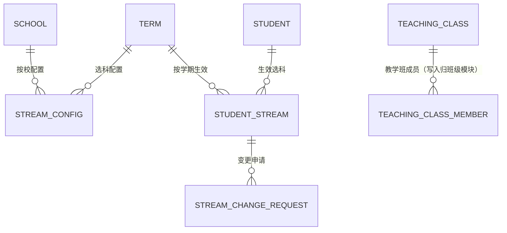
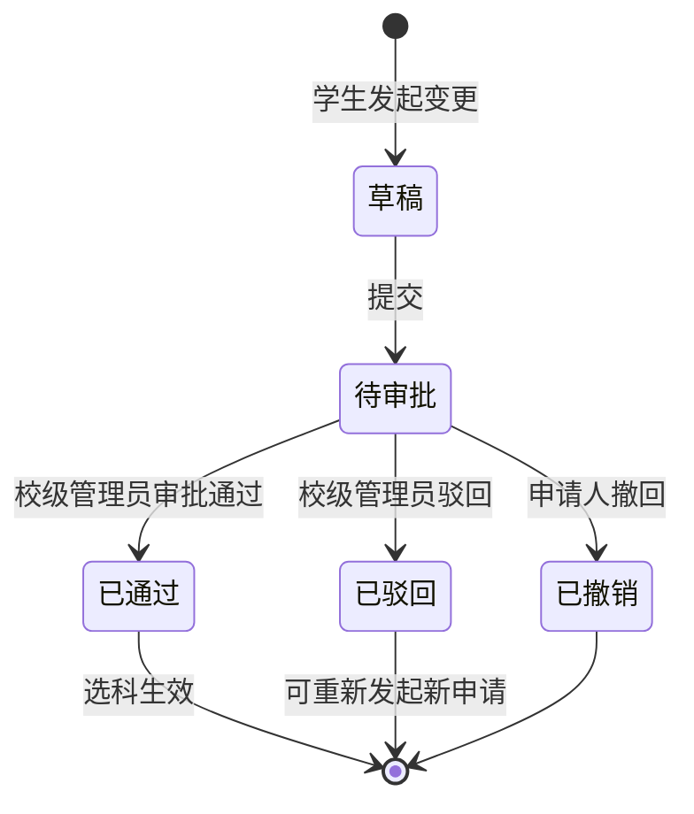

# 3+1+2 选科与教学班 PRD

| 项 | 值 |
|---|---|
| 模块 | 3+1+2 选科与教学班（`stream`） |
| 文档路径 | `docs/10-prd/modules/stream/PRD.md` |
| 版本 | 1.0.0-draft |
| 状态 | `frozen`（2026-09-30 冻结，见 D-045、CR-001） |
| 批次 | 1-3（按学生管理 PRD 样板结构产出） |
| 上游依赖 | 见 1.4 |

## 变更记录

| 版本 | 日期 | 变更 | 作者 |
|---|---|---|---|
| 1.0.0-draft | 2026-09-30 | 首版。结构与粒度对齐 `modules/student/PRD.md` v1.0.2；范围按 `GAP-023` 选 A（选科与教学班均属首轮） | Codex |

## 0. 怎么读这份文档

需求编号 `REQ-STR-xxx`。公共前置的编号只引用不复制。

**模块边界先说清楚**（`DP-01`：每个字段只有一个写入入口）：

| 内容 | 归属 |
|---|---|
| 选科开放期与截止日期配置 | 本模块 |
| 学生选科、选科变更、逾期变更审批 | 本模块 |
| 选科历史、生效期、组合分布统计 | 本模块 |
| **教学班主体与成员关系的写入** | **班级管理模块**（`modules/class/PRD.md` 4.6 节，唯一写入入口） |
| 由选科结果驱动生成教学班 | 本模块触发，班级管理模块执行写入 |
| 学科的首选 / 再选角色 | 学科与学科配置模块（本模块只消费） |
| 行政班归属 | 班级管理模块 |

教学班之所以不放在本模块写，是因为它的成员既可能来自选科结果，也可能由教务主任手工调整。
两个写入路径会导致同一张表被两套规则修改，出问题时无法判断是谁改的。

---

## 1. 模块定位与范围

### 1.1 解决什么问题

新高考下学生要在物理 / 历史中二选一、在化学 / 生物 / 思想政治 / 地理中四选二。
这件事对系统的要求有三个：

1. **组合必须合法**：不是任意三科，必须符合 3+1+2 的固定结构（`BR-STREAM-001`、`BR-STREAM-002`）
2. **变更必须留痕**：选科影响分班与后续所有教学安排，改一次就要留下一次记录（`BR-STREAM-008`）
3. **截止后要有闸门**：截止日期之后不能随便改，需要校级管理员审批（`BR-STREAM-005`）

第 3 条是本模块与"简单表单"的最大区别：它是一个**带审批闸门的状态机**。

### 1.2 范围内

| 能力 | 说明 |
|---|---|
| 选科配置 | 按学年学期配置开放期与截止日期 |
| 学生选科 | 首选二选一、再选四选二，提交前校验组合合法性 |
| 选科变更 | 截止前自助变更、截止后发起申请 |
| 逾期变更审批 | 校级管理员审批，通过才生效 |
| 选科历史 | 完整保留每次申请、审批与生效记录 |
| 查询与统计 | 学生自查、班主任本班、年级主任本年级、校领导全校；组合分布统计 |
| 教学班生成协作 | 按选科组合触发教学班生成（写入由班级模块执行） |
| 审计 | 全流程留痕 |

### 1.3 范围外

| 不做 | 归属 |
|---|---|
| 教学班主体的创建、编辑、停用 | 班级管理模块 |
| 教学班成员的手工增删 | 班级管理模块 |
| 学科的首选 / 再选角色配置 | 学科与学科配置模块 |
| 行政班归属与编班 | 班级管理模块 |
| 选科与分班的联动算法（按组合自动分行政班） | 首轮不做（`01-product-context.md` 4.2 节） |
| 走班排课 | 首轮不做 |
| 等级赋分、成绩换算 | 后续阶段 |
| 学生端 Pad / 小程序 | 后续阶段；首轮学生用 PC 端浏览器完成选科 |

### 1.4 上游依赖

| 依赖 | 用途 | 缺失后果 |
|---|---|---|
| `docs/10-prd/04-business-rules.md` | `BR-STREAM-*`、`BR-SUBJECT-002` / `003` | 无法判定组合合法性与截止口径 |
| `docs/10-prd/05-permission-matrix.yaml` | 功能权限（学生 `stream.selection`、校领导 `stream.change_request` 审批） | 按钮显隐无依据 |
| `docs/10-prd/06-field-dictionary.yaml` | `primary_subject_code`、`secondary_subject_codes`、`stream_deadline`、`stream_request_status` | 字段与状态机无权威定义 |
| 学科与学科配置模块 | 可选科目集合由 `stream_role` 决定 | 本模块无法知道哪些科目可选 |
| 学年学期模块 | 选科按学年学期生效 | 生效期无法表达 |
| 学生管理模块 | 学生主体与在校记录 | 无法确定谁能选科 |
| 班级管理模块 | 教学班写入 | 生成教学班无落点 |

---

## 2. 角色与场景

### 2.1 涉及角色

| 角色 | 本模块数据范围 | 本模块关键限制 |
|---|---|---|
| `PER-PLATFORM-OPS` 平台运营 | 全平台（`DS-01`） | 只读 |
| `PER-TENANT-ADMIN` 租户管理员 | 本租户组织配置（`DS-02`） | 无选科教学数据范围 |
| `PER-SCHOOL-LEADER` 校领导 | 本校（`DS-04`） | 逾期变更的**审批人**；全校选科只读 |
| `PER-ACADEMIC-DIRECTOR` 教务主任 | 本校（`DS-04`） | 选科配置的操作者；可代学生录入 |
| `PER-GRADE-LEADER` 年级主任 | 所负责年级（`DS-05`） | 本年级选科只读与统计 |
| `PER-HOMEROOM` 班主任 | 所负责班级（`DS-06`） | 本班选科只读；可代学生**发起**变更申请 |
| `PER-STUDENT` 学生 | 本人（`DS-08`） | 只能在开放期内提交与修改本人选科 |

### 2.2 场景

| 场景 | 名称 | 主要角色 |
|---|---|---|
| `SCN-STREAM-01` | 学生选科 | 学生（主导本模块） |
| `SCN-STREAM-02` | 逾期选科变更审批 | 学生 / 班主任发起，校领导审批 |
| `SCN-ORG-03` | 学科的首选 / 再选角色配置 | 学科模块 |
| `SCN-CLASS-01` | 按选科组合生成教学班 | 教务主任 |
| `SCN-IMP-01` | 导出选科结果 | 教务主任、年级主任 |

### 2.3 场景覆盖矩阵

| 场景 | 校领导 | 教务主任 | 年级主任 | 班主任 | 学生 |
|---|---|---|---|---|---|
| SCN-STREAM-01 | 查看 | 配置 + 代录 | 查看 | 查看 | 主 |
| SCN-STREAM-02 | 审批 | 查看 | 查看 | 发起 | 发起 |

---

## 3. 术语与逻辑实体

### 3.1 术语

3+1+2、首选科目、再选科目、选科组合、选科生效、选科截止日期、选科变更申请的定义见 `03-glossary.md`。

本模块必须强调三个区分：

| 区分 | 说明 |
|---|---|
| 选科组合 vs 行政班 | 一个行政班内可以有多种选科组合（`BR-STREAM-003`）；组合不是分班依据 |
| 截止前变更 vs 截止后变更 | 前者是学生的自助行为，立即生效；后者是申请行为，需审批通过才生效（`BR-STREAM-005`、`BR-STREAM-006`） |
| 未审批 vs 已驳回 | 未审批是待办状态，仍可撤回；已驳回是终态之一，可重新发起新申请，但原申请不再变化 |

### 3.2 逻辑实体

| 实体 | 含义 | 权威来源 |
|---|---|---|
| 选科配置 | 某校某学年学期的开放期与截止日期 | 本模块（`edu_stream_config`） |
| 学生选科 | 学生当前生效的选科组合 | 本模块（`edu_student_stream`） |
| 选科变更申请 | 截止后的变更单，含审批轨迹 | 本模块（`edu_stream_change_request`） |
| 教学班成员 | 学生在教学班中的归属 | 班级管理模块（本模块只触发生成） |

### 3.3 实体关系

### 3.4 状态机

状态取值来自 `FD-stream_request_status`。

---

## 4. 功能需求

### 4.1 选科配置

| 编号 | 需求 | 规则依据 | 权限依据 |
|---|---|---|---|
| `REQ-STR-001` | 提供按学年学期配置选科开放期：开放开始时间与截止时间 | `BR-STREAM-009` | `stream.config` 的 `read` / `update` |
| `REQ-STR-002` | 每所学校可独立配置选科截止日期，不与其他学校共用 | `BR-STREAM-004` | — |
| `REQ-STR-003` | 配置按学年学期生效；切换学年学期时加载对应配置 | `BR-STREAM-009` | — |
| `REQ-STR-004` | 同一学校同一学年学期只允许一份生效配置 | `BR-STREAM-004` | — |
| `REQ-STR-005` | 截止时间的判定**按当前时间实时比较**，不依赖定时任务刷状态，避免延迟造成越权窗口 | `BR-STREAM-005`、`D-036` 同思路 | — |
| `REQ-STR-006` | 配置的新增与修改需教务主任及以上权限，并写入审计 | `BR-AUDIT-001` | `stream.config` 的 `update` |
| `REQ-STR-007` | 开放期开始前，学生进入选科页只能预览规则，不能提交 | `BR-STREAM-009` | — |
| `REQ-STR-008` | 未配置开放期时，学生侧显示"选科尚未开放"，不显示提交按钮 | `BR-STREAM-009` | — |

### 4.2 选科规则

| 编号 | 需求 | 规则依据 |
|---|---|---|
| `REQ-STR-009` | 首选科目在物理、历史中二选一，必须且只能选一个 | `BR-STREAM-001`、`BR-SUBJECT-003` |
| `REQ-STR-010` | 再选科目在化学、生物、思想政治、地理中四选二，必须且只能选两个 | `BR-STREAM-002`、`BR-SUBJECT-003` |
| `REQ-STR-011` | 提交前校验组合合法性；不合法直接拒绝并指出违反哪一条 | `BR-STREAM-001`、`BR-STREAM-002` |
| `REQ-STR-012` | 同一学生同一学年学期只有一条生效选科 | `BR-STREAM-007` |
| `REQ-STR-013` | 选科仅对**高中阶段**学生开放；小学与初中学生无选科入口，接口层同样拒绝 | `BR-STREAM-001` 的适用范围 |
| `REQ-STR-014` | 可选科目集合由学科模块的 `stream_role` 决定，本模块**不硬编码**科目清单 | `BR-SUBJECT-002` |
| `REQ-STR-015` | 当选科列为空（学科未配置任何首选或再选科目）时，明确提示教务主任先配置学科 | `BR-SUBJECT-002` |
| `REQ-STR-016` | 学科角色变更导致已有选科不合法时，本模块提供影响清单；是否阻止变更由学科模块决定 | `BR-SUBJECT-002` |
| `REQ-STR-017` | 组合展示顺序固定：首选在前、再选按学科排序号排列，避免同一组合显示成两种写法 | 便于统计与核对 |

### 4.3 学生选科

| 编号 | 需求 | 规则依据 |
|---|---|---|
| `REQ-STR-018` | 学生进入选科页，展示当前学年学期、开放期与截止时间、可选科目、当前选科（若有） | `SCN-STREAM-01` |
| `REQ-STR-019` | 学生在开放期内可提交选科，提交前展示组合校验结果 | `BR-STREAM-009` |
| `REQ-STR-020` | 提交成功后展示生效时间与"截止前可自行修改"的提示 | `BR-STREAM-005` |
| `REQ-STR-021` | 学生只能提交与查看本人选科；接口层校验学生身份与本人 ID 一致 | `DS-08`、`NFR-SEC-05` |
| `REQ-STR-022` | 学生无选科记录时展示选择表单；已有记录时展示结果与变更入口 | `SCN-STREAM-01` |
| `REQ-STR-023` | 学生提交写入审计，含提交前后的组合 | `BR-AUDIT-001` |
| `REQ-STR-024` | 教务主任可代学生录入（用于线下收集后的补录），操作写入审计并标注代录人 | `BR-AUDIT-001` |

### 4.4 选科变更

| 编号 | 需求 | 规则依据 |
|---|---|---|
| `REQ-STR-025` | 截止时间**之前**，学生可自助修改选科，立即生效，并保留变更历史 | `BR-STREAM-005`、`BR-STREAM-008` |
| `REQ-STR-026` | 截止时间**之后**，学生不能直接修改；只能发起选科变更申请 | `BR-STREAM-005`、`BR-STREAM-006` |
| `REQ-STR-027` | 变更申请必须包含：原组合、新组合、申请原因 | `BR-STREAM-008` |
| `REQ-STR-028` | 班主任可代本班学生发起变更申请 | `SCN-STREAM-02` |
| `REQ-STR-029` | 同一学生同一学年学期**同时只允许一条待审批申请** | `BR-STREAM-008`、与 `BR-ACCOUNT-018` 同口径 |
| `REQ-STR-030` | 申请人在审批完成前可撤回申请，状态转为已撤销 | `FD-stream_request_status` |
| `REQ-STR-031` | 申请被驳回后可重新发起新申请；原申请记录保持不变 | `FD-stream_request_status` |
| `REQ-STR-032` | 未审批通过的变更**不生效**：学生当前选科在审批通过前保持原值 | `BR-STREAM-006` |
| `REQ-STR-033` | 变更申请的所有状态流转写入审计，含操作人、时间、前后状态 | `BR-AUDIT-001` |

### 4.5 逾期变更审批

| 编号 | 需求 | 规则依据 |
|---|---|---|
| `REQ-STR-034` | 审批人为**校级管理员**（校领导），不由教务主任自审 | `BR-STREAM-005` |
| `REQ-STR-035` | 提供审批待办列表，按提交时间升序，支持按年级、班级筛选 | `SCN-STREAM-02` |
| `REQ-STR-036` | 审批通过后，学生选科立即更新为新组合，并记录生效时间与审批人 | `BR-STREAM-006`、`BR-STREAM-008` |
| `REQ-STR-037` | 审批驳回后，学生选科保持原值；驳回意见必填 | `BR-STREAM-006` |
| `REQ-STR-038` | 审批页必须同时展示原组合与新组合，便于判断影响面 | `BR-STREAM-008` |
| `REQ-STR-039` | 审批动作写入审计，含审批人、审批意见、时间 | `BR-AUDIT-001` |
| `REQ-STR-040` | 审批通过后立即失效该学生与相关统计的缓存 | `NFR-CACHE-02` |

### 4.6 选科历史与生效

| 编号 | 需求 | 规则依据 |
|---|---|---|
| `REQ-STR-041` | 保留完整历史：每次申请、审批、生效的时间与操作人 | `BR-STREAM-008` |
| `REQ-STR-042` | 历史按时间倒序展示，可对比任意两次组合的差异 | `BR-STREAM-008` |
| `REQ-STR-043` | 选科历史不可删除、不可修改，只能追加 | `BR-AUDIT-003` |
| `REQ-STR-044` | 生效期与学年学期绑定；跨学年学期时重新选科，历史跨期保留 | `BR-STREAM-007` |

### 4.7 查询与统计

| 编号 | 需求 | 规则依据 |
|---|---|---|
| `REQ-STR-045` | 学生可查本人选科与历史 | `DS-08` |
| `REQ-STR-046` | 班主任可查本班选科清单与未选科学生清单 | `DS-06` |
| `REQ-STR-047` | 年级主任可查本年级选科清单与组合分布 | `DS-05` |
| `REQ-STR-048` | 校领导与教务主任可查全校选科清单与组合分布 | `DS-04` |
| `REQ-STR-049` | 提供组合分布统计：各组合人数、各学科选择人数、未选科人数 | `SCN-STREAM-01` |
| `REQ-STR-050` | 统计口径必须与清单明细一致，不允许两处数字不同 | `CTX-GOAL-01` 同口径 |
| `REQ-STR-051` | 提供未选科学生清单，供班主任催办 | `SCN-STREAM-01` |
| `REQ-STR-052` | 导出选科结果按当前数据范围生成，导出前重新解析范围并写审计 | `BR-IMP-004`、`BR-IMP-005`、`DS-DENY-04` |
| `REQ-STR-053` | 任课教师不可查看学生选科明细，也不可导出 | `05-permission-matrix.yaml` `subject_teacher.forbidden` |

### 4.8 教学班生成协作

| 编号 | 需求 | 规则依据 |
|---|---|---|
| `REQ-STR-054` | 选科生效后，教务主任可触发"按选科组合生成教学班" | `BR-CLASS-007`、`BR-STREAM-003` |
| `REQ-STR-055` | 生成前展示预览：将生成哪些教学班、每个班包含哪些学生、共几人 | `BR-CLASS-007` |
| `REQ-STR-056` | **教学班主体与成员关系的写入由班级管理模块执行**，本模块只负责触发与核对结果 | `DP-01`、`modules/class/PRD.md` 4.6 节 |
| `REQ-STR-057` | 生成必须幂等：同一学年学期同一组合重复生成不产生重复教学班或重复成员 | `BR-PROMO-003` 同口径 |
| `REQ-STR-058` | 支持按**单学科**生成教学班（如全体选物理的学生），也支持按**完整组合**生成 | `BR-CLASS-007` |
| `REQ-STR-059` | 生成后展示核对结果：人数是否与选科统计一致，不一致时给出差异清单 | `REQ-STR-050` |
| `REQ-STR-060` | 已生成教学班后，新的选科变更不会自动同步成员，需人工触发增量生成并展示差异 | 避免审批通过后静默改动教学班名单 |

### 4.9 审计

| 编号 | 需求 | 规则依据 |
|---|---|---|
| `REQ-STR-061` | 配置变更、学生提交、自助变更、变更申请、审批、代录、教学班生成全部写审计 | `BR-AUDIT-001` |
| `REQ-STR-062` | 审计记录包含操作人、角色、租户、学校、对象类型与 ID、变更前后值、时间、来源 IP | `NFR-AUDIT-01` |
| `REQ-STR-063` | 平台运营对选科数据的任何访问留痕，且租户侧可导出该留痕记录 | `BR-AUDIT-005`、`NFR-AUDIT-04` |

---

## 5. 权限需求

### 5.1 功能权限

| 资源 | 操作 | 说明 |
|---|---|---|
| `stream.config` | read / update | 选科开放期与截止日期 |
| `stream.selection` | read / create / update | 学生选科 |
| `stream.change_request` | read / create / approve | 变更申请与审批 |
| `org.subject` | read | 可选科目集合 |
| `org.class` | read | 本班 / 本年级筛选 |
| `org.teaching_class` | read | 教学班核对（写入归班级模块） |
| `person.student` | read | 学生信息 |
| `data.export` | export | 选科结果导出 |
| `audit.log` | read | 变更记录 |

### 5.2 数据范围

| 角色 | 范围编号 | 落地方式 |
|---|---|---|
| 平台运营 | `DS-01` | 全平台只读 |
| 校领导 / 教务主任 | `DS-04` | 本校全部选科 |
| 年级主任 | `DS-05` | 通过 `edu_grade_leader` 解析负责年级 |
| 班主任 | `DS-06` | 通过 `edu_class.head_teacher_id` 解析负责班级 |
| 学生 | `DS-08` | 仅本人 |

**任课教师的特殊处理**：`DS-07` 不含选科明细。任课教师能看到任教班级的学生基本资料，
但**看不到选科组合**，也不可导出（`REQ-STR-053`）。

### 5.3 拒绝规则

严格遵守 `DS-DENY-01` ~ `DS-DENY-09`。本模块特别需要落实：

| 规则 | 落地要求 |
|---|---|
| `DS-DENY-07` | 学生查询本人选科时，先把 `student_id = 当前用户` 拼进条件再查询 |
| `DS-DENY-08` | 组合分布统计受范围约束，各班 / 各年级只能看到自己范围内的统计 |
| `DS-DENY-04` | 导出与统计接口重新解析范围 |

---

## 6. 界面需求（阶段 2 原型输入）

### 6.1 页面清单

| 页面 ID | 页面名 | 类型 | 主要角色 |
|---|---|---|---|
| `PAGE-STR-CONFIG` | 选科配置 | 独立页 | 教务主任、校领导 |
| `PAGE-STR-STUDENT` | 学生选科 | 独立页（学生视角） | 学生 |
| `PAGE-STR-LIST` | 选科清单 | 列表页 | 教务主任、年级主任、班主任 |
| `PAGE-STR-STAT` | 组合分布统计 | 独立页（图表 + 表格） | 教务主任、年级主任、校领导 |
| `PAGE-STR-CHANGE` | 发起变更申请 | 弹窗 | 学生、班主任 |
| `PAGE-STR-APPROVE` | 变更审批待办 | 列表页 + 审批弹窗 | 校领导 |
| `PAGE-STR-HISTORY` | 选科历史 | 详情页内区块 | 学生、班主任、教务主任 |
| `PAGE-STR-GEN-CLASS` | 按组合生成教学班 | 独立页（预览 + 执行 + 核对） | 教务主任 |

### 6.2 学生选科页要素

自上而下：

1. 当前学年学期与开放期状态条（未开始 / 进行中 / 已截止，含倒计时）
2. 首选科目卡片（物理 / 历史，二选一）
3. 再选科目卡片（化学 / 生物 / 思想政治 / 地理，四选二，选满两个后其余置灰）
4. 组合预览（按 `REQ-STR-017` 的固定顺序展示）
5. 操作区：保存 / 提交；已提交后显示"截止前可修改"与变更按钮
6. 截止后：提交按钮替换为"发起变更申请"（并说明需校级管理员审批）

### 6.3 交互与跳转

| 触发 | 结果 |
|---|---|
| 截止前修改组合 | 直接保存生效，历史追加一条 |
| 截止后点击修改 | 提示已逾期，转为发起变更申请 |
| 学校未配置开放期 | 显示"选科尚未开放"，不显示提交按钮 |
| 点击统计中的组合人数 | 下钻到该组合的学生清单 |
| 审批通过 | 学生选科立即更新，页面顶部提示生效 |
| 生成教学班后发现人数不一致 | 展示差异清单，提供重新生成入口 |

### 6.4 页面状态

加载中骨架屏；未开放 / 已截止用不同状态条区分；无选科记录展示选择表单；
无权限给说明与返回；提交失败给字段级提示与请求 ID。

---

## 7. 数据需求

### 7.1 逻辑实体与字段

| 实体 | 关键字段 | 唯一性要求 |
|---|---|---|
| 选科配置 | `tenant_id`、`school_id`、`term_id`、`open_time`、`deadline`、`status` | `(school_id, term_id)` 唯一（`REQ-STR-004`） |
| 学生选科 | `tenant_id`、`school_id`、`term_id`、`student_id`、`primary_subject_code`、`secondary_subject_codes`、`effective_time` | `(term_id, student_id)` 唯一（`BR-STREAM-007`） |
| 选科变更申请 | `request_no`、`student_id`、`term_id`、`before_combination`、`after_combination`、`status`、`apply_by`、`apply_time`、`approve_by`、`approve_time`、`approve_opinion` | `request_no` 唯一；同一学生同一学期仅一条待审批（`REQ-STR-029`） |
| 选科历史 | `student_id`、`term_id`、`combination`、`change_type`、`operator`、`operate_time` | 追加式，不可删除（`REQ-STR-043`） |

`secondary_subject_codes` 的两个编码以逗号分隔并按学科排序号排序，保证同一组合只有一种存储写法。

### 7.2 索引需求

| 查询场景 | 需要的索引前缀 |
|---|---|
| 配置按学校 + 学期查 | `(school_id, term_id)` |
| 学生选科按学期 + 学生查 | `(term_id, student_id)` |
| 组合分布统计 | `(term_id, primary_subject_code, secondary_subject_codes)` |
| 变更申请待办 | `(school_id, status, apply_time)` |
| 选科历史按学生查 | `(student_id, operate_time)` |

### 7.3 审计要求

| 事件 | 记录内容 |
|---|---|
| 选科配置新增 / 修改 | 变更前后值、操作人、时间 |
| 学生提交选科 | 学生、组合、提交时间、来源 IP |
| 截止前自助变更 | 原组合、新组合、操作人 |
| 发起变更申请 | 原组合、新组合、原因、发起人 |
| 审批通过 / 驳回 | 审批人、意见、时间、前后状态 |
| 代录 / 代发起 | 被代理人、代操作人、时间 |
| 教学班生成 | 触发人、组合范围、生成数量、核对结果 |
| 导出选科结果 | 条件、行数、耗时、导出人 |

---

## 8. 接口需求（阶段 4 概要设计输入）

| 建议 operationId | 方法 | 路径 | 说明 |
|---|---|---|---|
| `getStreamConfig` | GET | `/edu/stream/config` | 查询选科配置 |
| `saveStreamConfig` | POST | `/edu/stream/config` | 保存选科配置 |
| `getStreamOption` | GET | `/edu/stream/option` | 可选科目与规则 |
| `getMyStream` | GET | `/edu/stream/my` | 学生查询本人选科 |
| `submitMyStream` | POST | `/edu/stream/my` | 学生提交选科 |
| `updateMyStream` | PUT | `/edu/stream/my` | 截止前自助修改 |
| `listStreamSelection` | GET | `/edu/stream/selection/list` | 选科清单 |
| `getStreamStat` | GET | `/edu/stream/stat` | 组合分布统计 |
| `listUnselectedStudent` | GET | `/edu/stream/unselected` | 未选科学生清单 |
| `listStreamChangeRequest` | GET | `/edu/stream/change/list` | 变更申请列表 |
| `addStreamChangeRequest` | POST | `/edu/stream/change` | 发起变更申请 |
| `cancelStreamChangeRequest` | POST | `/edu/stream/change/{id}/cancel` | 撤回申请 |
| `approveStreamChangeRequest` | POST | `/edu/stream/change/{id}/approve` | 审批 |
| `listStreamHistory` | GET | `/edu/stream/history` | 选科历史 |
| `exportStreamSelection` | POST | `/edu/stream/export` | 导出选科结果 |
| `previewTeachingClassGenerate` | POST | `/edu/stream/teaching-class/preview` | 教学班生成预览 |
| `executeTeachingClassGenerate` | POST | `/edu/stream/teaching-class/generate` | 触发生成（写入由班级模块执行） |

---

## 9. 非功能需求

受公共非功能需求约束（`NFR-PERF-*`、`NFR-SEC-*`、`NFR-AUDIT-*`、`NFR-DATA-*`、
`NFR-CACHE-*`、`NFR-MQ-*`、`NFR-COMPAT-*`、`NFR-A11Y-*`、`NFR-CODE-*`、`NFR-OPS-*`）。

模块级补充：

| 编号 | 需求 | 目标 |
|---|---|---|
| `REQ-STR-064` | 学生选科页加载 P95 ≤ 1 秒 | `NFR-PERF-02` |
| `REQ-STR-065` | 学生提交选科 P95 ≤ 2 秒 | `NFR-PERF-03` |
| `REQ-STR-066` | 组合分布统计（1 万名学生）P95 ≤ 2 秒 | `NFR-PERF-02` |
| `REQ-STR-067` | 教学班生成预览（1 万名学生）≤ 60 秒，异步生成 | `NFR-PERF-07` |
| `REQ-STR-068` | 选科配置变更后，学生侧状态条同步延迟 ≤ 1 秒 | `NFR-CACHE-02` |
| `REQ-STR-069` | 选科截止时刻的高并发提交（200 并发）不产生重复记录 | `NFR-SEC-04`、`REQ-STR-012` |

---

## 10. 需求追踪矩阵

| 需求组 | 场景 | 主要规则 | 验收用例 |
|---|---|---|---|
| `REQ-STR-001` ~ `REQ-STR-008` 选科配置 | `SCN-STREAM-01` | `BR-STREAM-004`、`BR-STREAM-009` | `AC-STR-001` ~ `AC-STR-008` |
| `REQ-STR-009` ~ `REQ-STR-017` 选科规则 | `SCN-STREAM-01` | `BR-STREAM-001` ~ `BR-STREAM-003`、`BR-SUBJECT-002`、`BR-SUBJECT-003` | `AC-STR-009` ~ `AC-STR-017` |
| `REQ-STR-018` ~ `REQ-STR-024` 学生选科 | `SCN-STREAM-01` | `BR-STREAM-009`、`DS-08` | `AC-STR-018` ~ `AC-STR-024` |
| `REQ-STR-025` ~ `REQ-STR-033` 选科变更 | `SCN-STREAM-02` | `BR-STREAM-005`、`BR-STREAM-006`、`BR-STREAM-008` | `AC-STR-025` ~ `AC-STR-033` |
| `REQ-STR-034` ~ `REQ-STR-040` 逾期审批 | `SCN-STREAM-02` | `BR-STREAM-005`、`BR-STREAM-006` | `AC-STR-034` ~ `AC-STR-040` |
| `REQ-STR-041` ~ `REQ-STR-044` 历史与生效 | `SCN-STREAM-01` | `BR-STREAM-007`、`BR-STREAM-008` | `AC-STR-041` ~ `AC-STR-044` |
| `REQ-STR-045` ~ `REQ-STR-053` 查询与统计 | `SCN-STREAM-01`、`SCN-IMP-01` | `BR-IMP-004`、`DS-DENY-08` | `AC-STR-045` ~ `AC-STR-053` |
| `REQ-STR-054` ~ `REQ-STR-060` 教学班生成协作 | `SCN-CLASS-01` | `BR-CLASS-007`、`DP-01` | `AC-STR-054` ~ `AC-STR-060` |
| `REQ-STR-061` ~ `REQ-STR-063` 审计 | — | `BR-AUDIT-001`、`BR-AUDIT-005` | `AC-STR-061` ~ `AC-STR-063` |
| `REQ-STR-064` ~ `REQ-STR-069` 性能与并发 | — | `NFR-PERF-02`、`NFR-PERF-03`、`NFR-PERF-07` | `AC-STR-301` ~ `AC-STR-306` |
| 权限与数据范围 | `SCN-STREAM-01`、`SCN-STREAM-02` | `BR-DATA-001` ~ `BR-DATA-017`、`DS-DENY-01` ~ `DS-DENY-09` | `AC-STR-101` ~ `AC-STR-112` |
| 兼容与可访问性 | — | `NFR-COMPAT-01` ~ `NFR-COMPAT-03`、`NFR-A11Y-01` ~ `NFR-A11Y-04` | `AC-STR-401` ~ `AC-STR-404` |

---

## 11. 术语使用声明

`CTX-GOAL-*`、`PER-*`、`SCN-*`、`BR-*`、`FD-*`、`DS-*`、`NFR-*` 均为引用，不重复定义。

---

## 12. 待确认事项

以下事项已于 2026-09-30 经用户整体确认（`RV-STR-03` ~ `RV-STR-06`），结论如下。

### 已确认 1：教学班成员写入统一归班级管理模块

| 项 | 内容 |
|---|---|
| 这是什么 | 教学班成员既可能来自选科结果自动生成，也可能由教务主任手工调整。若两处都能写，违反"每个字段只有一个写入入口" |
| 不选会怎样 | 手工调整过的名单可能被下一次自动生成覆盖，且出问题时无法判断是哪条路径改的 |
| 可选项 | A 成员写入统一归班级管理模块（本模块只触发与核对），自动生成也走班级模块的能力；B 自动生成归本模块、手工调整归班级模块，两边互相尊重已有记录 |
| 推荐 | **A**。与 `DP-01` 一致，也与你已确认的"班主任唯一写入入口在班级模块"同思路 |
| 位置 | 本文件 4.8 节（`REQ-STR-056`）；对照 `docs/10-prd/modules/class/PRD.md` 4.6 节 |
| 结论（2026-09-30） | **采用 A**：教学班主体与成员关系的写入只出现在班级管理模块，本模块只触发与核对 |

### 已确认 2：截止时间之后教务主任同样不能直接代改

| 项 | 内容 |
|---|---|
| 这是什么 | 教务主任有代录权限（`REQ-STR-024`）。问题是截止之后，他能否绕过审批直接代改 |
| 不选会怎样 | 若能绕过，审批闸门形同虚设——所有逾期变更都会走"找教务主任代改"这条路 |
| 可选项 | A 教务主任同样只能发起申请，由校领导审批；B 教务主任可代改但需留审计并通知校领导 |
| 推荐 | **A**。审批闸门的价值在于"任何逾期变更都要过校级管理员"，留一个后门等于取消闸门 |
| 位置 | 本文件 4.5 节（`REQ-STR-034`）与 4.4 节（`REQ-STR-026`） |
| 结论（2026-09-30） | **采用 A**：截止后任何角色都只能发起申请，由校级管理员审批；审批闸门不设后门 |

### 已确认 3：未选科学生按"逾期提交走审批 + 批量指定默认组合"兜底

| 项 | 内容 |
|---|---|
| 这是什么 | 选科截止时仍有学生未提交，需要明确后续处理方式 |
| 不选会怎样 | 未选科学生无法进入教学班，也无法生成完整的分班名单，开学后需要手工补 |
| 可选项 | A 截止后仍允许提交，但视为逾期变更走审批；B 由教务主任按学校口径统一指定默认组合（如物理 + 化学 + 生物），留审计并通知学生；C 截止后一律冻结，只能逐生审批 |
| 推荐 | **A + B**：先允许逾期提交走审批；临近开学仍空缺的，由教务主任按学校口径批量指定默认组合，批量操作必须留审计并生成通知清单 |
| 位置 | 本文件 4.3 节（`REQ-STR-019`）与 4.7 节（`REQ-STR-051`） |
| 结论（2026-09-30） | **采用 A + B**：先允许逾期提交走审批；临近开学仍空缺的由教务主任按学校口径批量指定默认组合，批量操作留审计并生成通知清单 |

### 已确认 4：选科变更通过后教学班名单不自动同步

| 项 | 内容 |
|---|---|
| 这是什么 | `REQ-STR-060` 规定新变更不自动同步教学班成员，需人工触发增量生成。需要你确认这个取法 |
| 不选会怎样 | 若改为自动同步，审批通过的瞬间会静默改动教学班名单，班主任与任课教师看到的人数会突然变化而不知原因 |
| 可选项 | A 不自动同步，人工触发增量生成并展示差异；B 自动同步并给相关班主任发送变更通知 |
| 推荐 | **A**。教学班名单是老师排课与授课的依据，静默变更比"多一次点击"的代价大得多 |
| 位置 | 本文件 4.8 节（`REQ-STR-060`） |
| 结论（2026-09-30） | **采用 A**：不自动同步，由教务主任人工触发增量生成并展示差异清单 |
