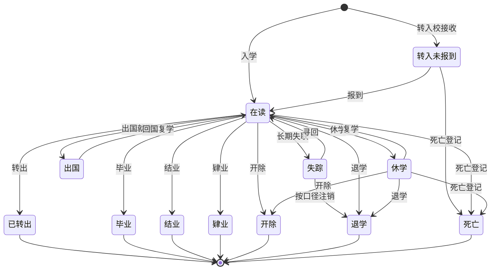
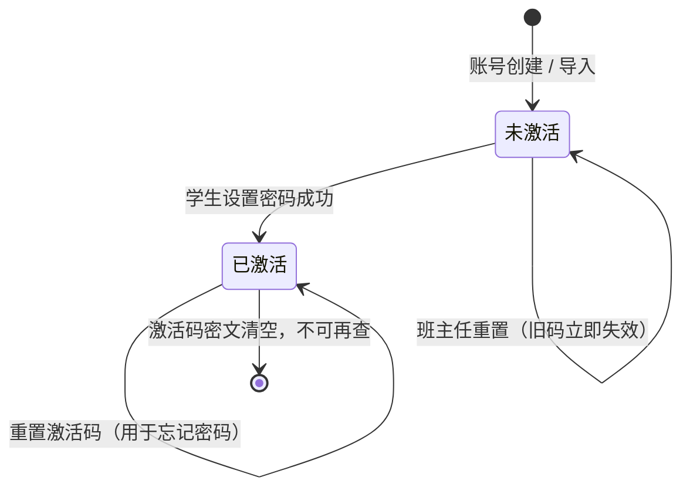

# 学生管理 PRD

| 项 | 值 |
|---|---|
| 模块 | 学生管理（`student`） |
| 文档路径 | `docs/10-prd/modules/student/PRD.md` |
| 版本 | 1.0.2-draft |
| 状态 | `frozen`（2026-09-30 冻结，见 D-045、CR-001） |
| 批次 | 1-1（首轮样板，验收通过后作为其余模块的写作基准） |
| 上游依赖 | 见 1.4 |

## 变更记录

| 版本 | 日期 | 变更 | 作者 |
|---|---|---|---|
| 1.0.0-draft | 2026-09-30 | 首版。作为模块 PRD 样板，供其余模块复用结构与粒度 | Codex |
| 1.0.1-draft | 2026-09-30 | 按验收意见补全学籍状态：新增"转入未报到"与"开除"，终态由 2 个扩为 4 个；新增 `REQ-STU-093` / `094`、`AC-STU-093` / `094`；确认字段级可编辑性矩阵与导入模板列 | Codex |
| 1.0.2-draft | 2026-09-30 | 按验收意见再补 5 个学籍状态（出国、失踪、结业、肄业、死亡），状态总数定稿 12 个、终态 7 个；新增 `BR-STU-025` ~ `028`、`REQ-STU-095` ~ `097`、`AC-STU-095` ~ `097`；`RV-STU-01` ~ `08` 全部确认 | Codex |

## 0. 怎么读这份文档

本文件只定义**学生管理模块特有的需求**。
角色、业务规则、权限矩阵、字段定义、非功能指标一律**引用公共前置的编号**，不复制正文。
引用格式：`BR-STU-001`（业务规则）、`SCN-STU-01`（场景）、`PER-HOMEROOM`（角色）、
`DS-DENY-03`（数据范围规则）、`NFR-SEC-01`（非功能需求）、`FD-student_no`（字段字典条目）。

需求编号规则 `REQ-STU-xxx`，一经发布不得重排；删除的需求保留编号并标注 `已废弃`。

---

## 1. 模块定位与范围

### 1.1 解决什么问题

学生是这套系统的**主数据核心**。所有下游能力（班级花名册、任教关系、升班、选科、后续的作业与考试）
都以"学生是谁、在哪个学校、在哪个班、学籍处于什么状态"为前提。

当前学校侧的三个具体痛点：

1. 学生名单散落在 Excel，同一名学生在不同表格里班级与状态不一致
2. 每年升级、转学、休复学靠人工搬运，历史被覆盖，无法回溯
3. 学生个人信息（证件号、手机号、监护人）谁能看、谁能改没有系统约束

### 1.2 范围内

首轮（批次 1-1）交付：

| 能力 | 说明 |
|---|---|
| 学生列表与检索 | 多条件筛选、关键字检索、排序、分页、列配置 |
| 学生详情 | 基本信息、学籍信息、班级归属、监护人、变更记录 |
| 新增学生 | 单个新增，含必填校验与学号自动发号 |
| 编辑学生 | 字段级权限控制的编辑 |
| 学籍状态管理 | 在读 / 休学 / 复学 / 退学 / 转出 / 毕业 |
| 行政班归属 | 唯一归属校验、调班、历史保留 |
| 监护人信息 | 查看与编辑（受角色约束）、数量上限、变更审核入口 |
| 批量导入 | 模板下载、校验、结果展示、异步执行、学号对照表 |
| 导出 | 按当前数据范围导出，留痕 |
| 学生账号 | 登录名生成、初始密码、与学号联动 |
| 审计 | 关键写操作与敏感字段访问留痕 |

### 1.3 范围外

| 不做 | 归属 |
|---|---|
| 二维码认领与家长端界面 | 首轮只建表，见 `09-guardian-and-onboarding.md` 第 8 节 |
| 学号发号器本身 | 平台级公共能力，在本模块调用，不在本模块实现 |
| 升班批量执行 | 升班模块（`docs/10-prd/modules/promotion/PRD.md`） |
| 选科 | 选科模块（`docs/10-prd/modules/stream/PRD.md`） |
| 自动编班 / 智能分班 | 首轮不做 |
| 学生标签、成长档案、综合素质评价 | 后续阶段 |
| 家校沟通、请假、考勤 | 后续阶段 |

### 1.4 上游依赖

| 依赖 | 用途 | 缺失后果 |
|---|---|---|
| `docs/10-prd/04-business-rules.md` | 学生相关硬规则 | 无法判定唯一性与状态流转 |
| `docs/10-prd/05-permission-matrix.yaml` | 功能权限与字段级权限 | 无法实现按钮与字段的显隐 |
| `docs/10-prd/06-field-dictionary.yaml` | 字段名、类型、枚举 | 前后端字段名会漂移 |
| `docs/10-prd/08-data-scope-model.md` | 数据范围解析 | 无法防止跨校越权 |
| `docs/10-prd/09-guardian-and-onboarding.md` | 监护人模型与绑定流程 | 监护人相关表与流程无依据 |
| `docs/10-prd/10-data-permission-schema.md` | 权限表结构与缓存失效 | 权限实现无表可用 |
| 年级 / 班级 / 学年学期模块 | 归属数据 | 学生的年级与班级无法表达 |

---

## 2. 角色与场景

### 2.1 涉及角色

角色定义见 `02-personas-and-scenarios.md`，此处只标注本模块的差异点。

| 角色 | 本模块数据范围 | 本模块关键限制 |
|---|---|---|
| `PER-PLATFORM-OPS` 平台运营 | 全平台（`DS-01`） | 默认只读；导出需显式授权；任何访问留痕且可被租户侧导出 |
| `PER-SCHOOL-LEADER` 校领导 | 本校（`DS-04`） | 可读全部字段；不直接编辑学生主数据 |
| `PER-ACADEMIC-DIRECTOR` 教务主任 | 本校（`DS-04`） | 本模块主要操作者；可新增、编辑、异动、导入、导出 |
| `PER-GRADE-LEADER` 年级主任 | 所负责年级（`DS-05`） | 可新增与编辑主数据；监护人信息**只读** |
| `PER-HOMEROOM` 班主任 | 所负责班级（`DS-06`） | 学生主数据**只读**；可改监护人信息与联系方式 |
| `PER-SUBJECT-TEACHER` 任课教师 | 任教班级（`DS-07`） | 仅必要基本资料；禁止导出；看不到证件号、出生日期、监护人、联系方式 |
| `PER-TENANT-ADMIN` 租户管理员 | 本租户组织配置（`DS-02`） | **无学生读取权限** |
| `PER-GROUP-EXPERT` / `PER-GROUP-LEADER` | 集团自有数据（`DS-03`） | 首轮只读，且不包含下属学校教学数据 |
| `PER-STUDENT` 学生 | 本人（`DS-08`） | 首轮只读本人班级信息 |
| `PER-GUARDIAN` 家长 | 本人子女（`DS-09`） | 首轮不实现端，仅预留 |

### 2.2 场景

本模块主场景：

| 场景 | 名称 | 主要角色 |
|---|---|---|
| `SCN-STU-01` | 教务主任新增单个学生 | 教务主任 |
| `SCN-STU-02` | 班主任修改学生监护人信息 | 班主任 |
| `SCN-STU-03` | 批量导入学生 | 教务主任 |

关联场景（在本模块有页面或状态，但主导模块不是学生）：

| 场景 | 关联点 |
|---|---|
| `SCN-CLASS-02` | 维护班级花名册时从学生池选人，触发唯一行政班校验 |
| `SCN-IMP-01` | 导出名单，导出内容随当前用户数据范围 |
| `SCN-PROMO-01` | 升班产物落在学生的下一学年班级关系上 |
| `SCN-PROMO-02` | 学籍异动直接修改学生学籍状态 |
| `SCN-GUARDIAN-01` | 监护人与学生的多对多关联 |
| `SCN-GUARDIAN-02` | 学生登录名由学号派生 |

### 2.3 场景覆盖矩阵

| 场景 | 平台运营 | 校领导 | 教务主任 | 年级主任 | 班主任 | 任课教师 |
|---|---|---|---|---|---|---|
| SCN-STU-01 | 查看 | 查看 | 主 | 主 | 查看 | — |
| SCN-STU-02 | — | 查看 | 主 | 只读 | 主 | — |
| SCN-STU-03 | — | 查看 | 主 | 查看 | — | — |

---

## 3. 术语与逻辑实体

### 3.1 术语

学生、学号、行政班、教学班、学籍状态、在校记录、监护人、监护人关联、
班级花名册、升班、调班、留级、休学、复学、跨校转学的定义见 `03-glossary.md`。

本模块需要额外强调两个区分：

| 区分 | 说明 |
|---|---|
| 学生主体 vs 在校记录 | 学生主体是"这个人"，在校记录是"这个人在某所学校的学籍期间"。跨校转学会产生新的在校记录 |
| 学籍状态 vs 班级归属 | 两个独立维度。休学期间保留行政班关系，但不计入在读名单（`BR-STU-012`） |

### 3.2 逻辑实体

以下为**逻辑实体**，物理表与字段类型在阶段 5 定稿。

| 实体 | 含义 | 权威来源 |
|---|---|---|
| 学生主体 | 学生这个人，学号全平台唯一 | 本模块 |
| 在校记录 | 学生在某所学校的学籍期间与学籍状态 | 本模块 |
| 学生与行政班关系 | 学生在某学年学期的行政班归属 | 本模块 + 班级模块 |
| 监护人 | 平台级实体，手机号即登录名 | `09-guardian-and-onboarding.md` |
| 监护人与学生关联 | 多对多关系 | `09-guardian-and-onboarding.md` |
| 学生资料变更申请 | 补充数据的变更审核单据 | `09-guardian-and-onboarding.md` |
| 学生导入任务 | 导入的校验与执行记录 | 导入导出模块 |
| 学生账号 | 登录名与密码状态 | 本模块 + `sys_user` |

### 3.3 实体关系

```mermaid
erDiagram
  STUDENT ||--o{ STUDENT_SCHOOL_RECORD : "在某校的学籍期间"
  STUDENT ||--o{ STUDENT_CLASS : "行政班归属"
  STUDENT ||--o{ GUARDIAN_STUDENT : "被监护"
  GUARDIAN ||--o{ GUARDIAN_STUDENT : "监护"
  STUDENT ||--o{ PROFILE_CHANGE : "资料变更申请"
  STUDENT ||--|| STUDENT_ACCOUNT : "登录账号"
  CLASS ||--o{ STUDENT_CLASS : "花名册"
  GRADE ||--o{ CLASS : "归属"
```

> 学生主体与在校记录是否拆分为两张表，取决于 `GAP-019` 的裁决，见第 12 节。
> 无论裁决结果如何，本模块的**功能需求与验收标准不变**。

---

## 4. 功能需求

### 4.1 学生列表与检索

| 编号 | 需求 | 规则依据 | 权限依据 |
|---|---|---|---|
| `REQ-STU-001` | 提供学生列表分页查询，默认每页 20 条，最大 200 条 | `NFR-PERF-05` | 各角色 `person.student` 的 `read` |
| `REQ-STU-002` | 支持按学校、学年学期、年级、班级、学籍状态、性别、入学年份、学段筛选 | `BR-STU-012` | 筛选项本身受数据范围约束 |
| `REQ-STU-003` | 支持关键字检索，命中范围为学号、姓名、全国学籍号 | `BR-STU-022` | 同上 |
| `REQ-STU-004` | 支持按证件号后四位精确检索，且仅对具备敏感字段读取权限的角色开放 | `NFR-SEC-06` | `read_sensitive` |
| `REQ-STU-005` | 支持按学号、姓名、入学年份、班级名称、更新时间排序 | — | — |
| `REQ-STU-006` | 默认列表列：学号、姓名、性别、学段、年级、班级、学籍状态、入学年份、联系电话（掩码）、更新时间 | `BR-STU-009` | — |
| `REQ-STU-007` | 可选列表列：全国学籍号、出生日期、证件号（掩码）、监护人姓名 | `BR-STU-009` | 可选列的可见性按字段级权限判定 |
| `REQ-STU-008` | 列表结果的每一行都必须通过数据范围过滤，范围为空时返回空列表 | `DS-DENY-03`、`NFR-SEC-03` | — |
| `REQ-STU-009` | 列表页的"新增""编辑""异动""调班""导出""导入"按钮按功能权限显示，且后端二次校验 | `NFR-SEC-05` | `05-permission-matrix.yaml` |
| `REQ-STU-010` | 列表支持记住用户上一次的筛选条件与列配置，按用户维度存储 | — | — |

**筛选控件与行为**

| 筛选项 | 控件 | 默认值 | 约束 |
|---|---|---|---|
| 学校 | 下拉选择 | 当前上下文学校 | 仅平台运营与拥有跨校授权者可选；其他角色锁定为只读显示 |
| 学年学期 | 下拉选择 | 当前学年学期 | 历史学年可选，用于查历史名单 |
| 年级 | 下拉选择（可多选） | 空 | 只列出数据范围内的年级 |
| 班级 | 下拉选择（可多选） | 空 | 只列出数据范围内的班级；选择年级后联动 |
| 学籍状态 | 多选标签 | 在读 | 选项取自 `enrollment_status` 枚举 |
| 性别 | 下拉选择 | 空 | `gender` 枚举 |
| 入学年份 | 年份区间 | 空 | — |
| 关键字 | 单行输入 | 空 | 支持学号 / 姓名 / 全国学籍号，模糊匹配 |
| 证件号后四位 | 单行输入（4 位） | 空 | 需 `read_sensitive`，否则隐藏该控件 |

**异常与边界**

| 情况 | 行为 |
|---|---|
| 用户没有任何数据范围 | 显示"当前账号没有可查看的学生数据"，不显示空表格骨架 |
| 筛选条件无结果 | 显示空态，提供"清空筛选条件" |
| 查询超时 | 显示错误提示与请求 ID，支持重试 |
| 请求缺少租户上下文 | 直接拒绝，返回统一无权限错误码（`DS-DENY-01`） |

### 4.2 学生详情

| 编号 | 需求 | 规则依据 |
|---|---|---|
| `REQ-STU-011` | 提供学生详情页，分区展示：基本信息、学籍信息、班级归属、监护人、变更记录 | `BR-STU-013` |
| `REQ-STU-012` | 详情页字段按字段级权限裁剪，无权字段不返回给前端，而不是前端隐藏 | `NFR-SEC-05` |
| `REQ-STU-013` | 证件号、手机号默认掩码展示；查看全量需独立权限并写入访问日志 | `NFR-SEC-06`、`NFR-AUDIT-02`、`BR-AUDIT-002` |
| `REQ-STU-014` | 按 ID 查询详情时，先把数据范围条件拼进查询再按 ID 取数，禁止先取数再判断 | `DS-DENY-07` |
| `REQ-STU-015` | 详情的"变更记录"展示该学生的关键字段变更与学籍异动历史，按时间倒序 | `BR-AUDIT-001`、`BR-PROMO-012` |

### 4.3 新增学生

| 编号 | 需求 | 规则依据 |
|---|---|---|
| `REQ-STU-016` | 提供单个新增学生入口，按分组表单录入：学籍信息、证件与联系方式、监护人 | `SCN-STU-01` |
| `REQ-STU-017` | 学号由系统统一发号，表单**不提供学号输入**，仅展示发号结果 | `BR-STU-001`、`BR-STU-017` |
| `REQ-STU-018` | 必填字段：姓名、性别、入学年份、学段、年级 | `BR-STU-007` |
| `REQ-STU-019` | 可选字段：全国学籍号、证件类型、证件号、出生日期、学生手机号、地址 | `BR-STU-022`、`BR-STU-013` |
| `REQ-STU-020` | 证件号填写时校验唯一性；全国学籍号填写时校验唯一性 | `BR-STU-008`、`BR-STU-022` |
| `REQ-STU-021` | 可指定行政班；若该学生在同一学年学期已有行政班，拒绝保存并提示冲突 | `BR-STU-003`、`SCN-CLASS-02` |
| `REQ-STU-022` | 可录入监护人信息，数量上限 3；超过时阻止提交并给出提示 | `BR-ACCOUNT-016`、`GB-12` |
| `REQ-STU-023` | 保存成功后自动创建学生登录账号，登录名为 `s` + 学号 | `BR-ACCOUNT-002`、`SCN-GUARDIAN-02` |
| `REQ-STU-024` | 保存成功返回新学号并在页面显著展示，提供"继续新增"与"查看详情"两个后续动作 | `SCN-STU-01` |
| `REQ-STU-025` | 新增操作写入审计日志，包含操作人、对象、时间与来源 IP | `BR-AUDIT-001` |

**新增表单字段清单**

| 分组 | 字段 | 字段标识 | 必填 | 说明 |
|---|---|---|---|---|
| 学籍信息 | 学号 | `FD-student_no` | 系统生成 | 只读展示，保存后回填 |
| 学籍信息 | 全国学籍号 | `FD-national_student_no` | 否 | 官方 `G` / `L` 开头 |
| 学籍信息 | 姓名 | `FD-student_name` | 是 | — |
| 学籍信息 | 性别 | `FD-gender` | 是 | 枚举 |
| 学籍信息 | 入学年份 | `FD-enroll_year` | 是 | 4 位年份 |
| 学籍信息 | 学段 | `FD-stage_code` | 是 | 枚举，决定可选年级 |
| 学籍信息 | 年级 | — | 是 | 受学段与数据范围约束 |
| 学籍信息 | 行政班 | `FD-class_name` | 否 | 受学年学期与数据范围约束 |
| 学籍信息 | 学籍状态 | `FD-enrollment_status` | 默认在读 | 新增时仅允许"在读" |
| 学籍信息 | 入学日期 | — | 否 | 默认取学年开始日期 |
| 证件与联系方式 | 证件类型 | `FD-id_type` | 否 | 枚举 |
| 证件与联系方式 | 证件号码 | `FD-id_card_no` | 否 | 敏感，掩码展示 |
| 证件与联系方式 | 出生日期 | `FD-birth_date` | 否 | 敏感 |
| 证件与联系方式 | 学生手机号 | `FD-student_phone` | 否 | 敏感 |
| 证件与联系方式 | 联系地址 | `FD-address` | 否 | 敏感 |
| 监护人 | 监护人姓名 | `FD-guardian_name` | 否 | 最多 3 条 |
| 监护人 | 与监护人关系 | `FD-relation` | 否 | 枚举 |
| 监护人 | 监护人电话 | `FD-guardian_phone` | 否 | 敏感 |
| 监护人 | 是否主要联系人 | — | 否 | 同一学生最多 1 个 |
| 监护人 | 备注 | — | 否 | — |

**校验规则汇总**

| 字段 | 规则 | 失败提示 |
|---|---|---|
| 姓名 | 长度 2–50，不含首尾空格 | 请输入学生姓名 |
| 性别 | 必须为 `gender` 枚举值 | 请选择性别 |
| 入学年份 | 4 位数字，不早于学校建校年份，不晚于当前年 +1 | 入学年份不合法 |
| 学段 | 必须为 `stage_code` 枚举值 | 请选择学段 |
| 年级 | 必须属于所选学段，且在数据范围内 | 所选年级与学段不匹配 |
| 行政班 | 必须属于所选学年学期与年级，且在数据范围内 | 所选班级不属于该年级 |
| 全国学籍号 | 非空时全平台唯一，格式校验 `G` / `L` 开头 | 全国学籍号已存在 |
| 证件号 | 非空时唯一（唯一范围见 `GAP-020`） | 证件号码已存在 |
| 监护人电话 | 非空时为 11 位手机号 | 手机号格式不正确 |
| 监护人数量 | 不超过上限 | 监护人数量已达上限 |

### 4.4 编辑学生

| 编号 | 需求 | 规则依据 |
|---|---|---|
| `REQ-STU-026` | 编辑按字段级权限控制：无写权限的字段在表单中只读，后端同样拒绝 | `NFR-SEC-05` |
| `REQ-STU-027` | 学号允许修改，但需校级管理员权限，且强制留审计；修改后学生登录名同步变更 | `BR-STU-011`、`BR-STU-021` |
| `REQ-STU-028` | 班主任可修改本班学生的监护人信息与联系方式 | `BR-STU-010`、`SCN-STU-02` |
| `REQ-STU-029` | 班主任不可修改学号、姓名、性别、班级归属、学籍状态 | `05-permission-matrix.yaml` `homeroom.field_rules` |
| `REQ-STU-030` | 年级主任对监护人信息与联系方式**只读** | `05-permission-matrix.yaml` `grade_leader.forbidden` |
| `REQ-STU-031` | 每次编辑写入审计日志，包含变更前后值与操作人 | `BR-AUDIT-001` |
| `REQ-STU-032` | 编辑并发控制：若记录已被他人修改，提交时提示"数据已被更新，请刷新后重试" | `NFR-PERF-03` |

**字段级可编辑性矩阵**

| 字段 | 校领导 | 教务主任 | 年级主任 | 班主任 |
|---|---|---|---|---|
| 学号 | — | — | — | — |
| 全国学籍号 | — | 可改 | 可改 | — |
| 姓名 | — | 可改 | 可改 | — |
| 性别 | — | 可改 | 可改 | — |
| 入学年份 | — | 可改 | 可改 | — |
| 学段 / 年级 | — | 可改 | 可改 | — |
| 行政班 | — | 通过调班修改 | 通过调班修改 | — |
| 学籍状态 | 审批 | 通过异动修改 | 通过异动修改 | 发起 |
| 证件类型 / 号码 | — | 可改 | 可改 | — |
| 出生日期 | — | 可改 | 可改 | — |
| 学生手机号 / 地址 | — | 可改 | 可改 | 可改 |
| 监护人信息 | — | 可改 | 只读 | 可改 |

> 表格中的"可改"指字段级写权限；实际能否提交还取决于数据范围与该记录是否落在范围内。
> 学号修改的入口单独放在"高级操作"中，不与常规编辑混排。

### 4.5 学籍状态管理

| 编号 | 需求 | 规则依据 |
|---|---|---|
| `REQ-STU-033` | 学生详情与列表均展示当前学籍状态 | `FD-enrollment_status` |
| `REQ-STU-034` | 提供异动入口，支持：转入报到、休学、复学、出国、回国复学、登记失踪、寻回复学、按口径注销、转出、毕业、结业、肄业、退学、开除、死亡登记；可选项按当前状态动态计算，非法流转不出现入口 | `SCN-PROMO-02`、`BR-PROMO-008`、`BR-STU-023` ~ `BR-STU-028` |
| `REQ-STU-035` | 异动提交前校验状态流转合法性，非法流转直接拒绝并说明原因 | `FD-enrollment_status.transitions`、`BR-PROMO-010` |
| `REQ-STU-036` | 异动必须记录：类型、生效日期、原因、操作人、原状态、新状态 | `BR-PROMO-012` |
| `REQ-STU-037` | 休学期间保留行政班关系，但不计入在读名单 | `BR-STU-012`、`BR-PROMO-008` |
| `REQ-STU-038` | 复学需校验当前状态为休学，并指定复学后的班级 | `BR-PROMO-009` |
| `REQ-STU-039` | 跨校转学在同一平台内跨学校租户执行；转出校先释放行政班关系，转入校接收后生效 | `BR-STU-005`、`BR-PROMO-011` |
| `REQ-STU-040` | 跨校转学时学号保持不变，学生的登录名不变 | `BR-STU-020`、`BR-ACCOUNT-004` |
| `REQ-STU-041` | 异动历史在详情页"变更记录"中可查，且不可删除 | `NFR-DATA-06`、`BR-AUDIT-003` |

**状态流转**



> 跨校转入不在原记录上复活状态，而是在目标学校新建一条在校记录，初始状态为**转入未报到**，
> 学生实际报到后转为在读。始终不报到的由转入校撤销接收（逻辑删除该在校记录），
> 不产生转出记录，也不产生毕业或开除（`BR-STU-023`）。

| 编号 | 需求 | 规则依据 |
|---|---|---|
| `REQ-STU-093` | 转入校接收学生时先生成"转入未报到"记录：该期间不编入行政班、不计入在读名单；提供"报到"与"撤销接收"两个动作 | `BR-STU-023` |
| `REQ-STU-094` | 开除操作：义务教育阶段（小学、初中）入口不可用且后端拒绝；高中阶段需校级管理员审批并留审计 | `BR-STU-024`、`BR-PROMO-010`、`NFR-AUDIT-01` |
| `REQ-STU-095` | 学籍状态共 12 项，其中终态 7 项（已转出、毕业、结业、肄业、开除、退学、死亡）；终态之间不提供任何异动入口，接口层同样拒绝 | `BR-PROMO-010`、`FD-enrollment_status` |
| `REQ-STU-096` | 结业与肄业仅高中阶段可用；义务教育阶段入口不可用且后端拒绝 | `BR-STU-027` |
| `REQ-STU-097` | 死亡登记需校级管理员权限并留存证明材料；死亡学生从常规在读数、在读名单与在校统计中排除，仅在专门的"离校学生"查询中按权限可见 | `BR-STU-028`、`NFR-AUDIT-01` |

**终态清单**（不可互转，见 `BR-PROMO-010`）：已转出、毕业、结业、肄业、开除、退学、死亡。

### 4.6 行政班归属

| 编号 | 需求 | 规则依据 |
|---|---|---|
| `REQ-STU-042` | 一名学生在同一学年学期内只能属于一个行政班 | `BR-STU-003` |
| `REQ-STU-043` | 提供调班操作，仅限当前学年学期，更换行政班并保留原关系历史 | `BR-PROMO-007` |
| `REQ-STU-044` | 班级容量超限时只提示不拦截 | `BR-CLASS-005` |
| `REQ-STU-045` | 学生可同时属于多个教学班，不受行政班唯一约束影响 | `BR-STU-004` |
| `REQ-STU-046` | 历史学年的班级关系只读，不提供跨学年修改入口 | `BR-CLASS-008` |

### 4.7 监护人信息

| 编号 | 需求 | 规则依据 |
|---|---|---|
| `REQ-STU-047` | 学生详情展示已关联监护人列表，按是否主要联系人排序 | `BR-ACCOUNT-005` |
| `REQ-STU-048` | 监护人信息展示受字段级权限约束，任课教师不可见 | `05-permission-matrix.yaml` `subject_teacher.forbidden` |
| `REQ-STU-049` | 学校侧可代录监护人信息；家长端填报的变更必须走审核 | `BR-STU-015`、`SCN-STU-02` |
| `REQ-STU-050` | 解绑监护人需班主任审核确认，审核未通过可重新提交 | `BR-ACCOUNT-017`、`BR-ACCOUNT-018` |
| `REQ-STU-051` | 首轮不实现家长端界面与二维码认领接口，但表结构与数据关系必须建立 | `BR-ACCOUNT-010`、`D-033` |

### 4.8 批量导入

| 编号 | 需求 | 规则依据 |
|---|---|---|
| `REQ-STU-052` | 提供导入模板下载，模板列顺序固定，含填写说明与示例行 | `SCN-STU-03` |
| `REQ-STU-053` | 上传后同步解析并校验，5000 行以内校验阶段耗时 ≤ 30 秒 | `NFR-PERF-06` |
| `REQ-STU-054` | 校验维度：必填缺失、格式错误、年级或班级不存在、证件号重复、全国学籍号重复、导入文件内自身重复 | `BR-STU-007`、`BR-STU-008`、`BR-STU-022` |
| `REQ-STU-055` | 校验结果分页展示，区分成功行与失败行，失败行给出原始行号与失败原因 | `BR-IMP-006` |
| `REQ-STU-056` | 用户确认后才执行导入，执行阶段异步进行并返回任务编号 | `BR-IMP-001`、`BR-IMP-003` |
| `REQ-STU-057` | 导入时**忽略源文件中的学号列**，由系统统一发号 | `BR-STU-019` |
| `REQ-STU-058` | 导入完成后提供「学号对照表」下载，含原始行号、姓名、系统学号 | `BR-STU-019` |
| `REQ-STU-059` | 导入必须幂等，同一批次重复提交不产生重复数据 | `BR-IMP-002`、`NFR-MQ-01` |
| `REQ-STU-060` | 失败行可下载为 CSV，修正后可重新上传 | `BR-IMP-006` |
| `REQ-STU-061` | 导入导入任务的状态与进度可查询 | `NFR-MQ-04`、`FD-async_task_status` |
| `REQ-STU-062` | 导入产生的学生默认不带行政班，需在确认页选择统一目标班级或后续在班级模块编班 | `BR-STU-014` |

**导入模板列**

| 序号 | 列名 | 必填 | 说明 |
|---|---|---|---|
| 1 | 姓名 | 是 | — |
| 2 | 性别 | 是 | 男 / 女 |
| 3 | 入学年份 | 是 | 4 位年份 |
| 4 | 学段 | 是 | 小学 / 初中 / 高中 |
| 5 | 年级 | 是 | 必须已存在于该学校 |
| 6 | 班级 | 否 | 必须已存在于该学年学期 |
| 7 | 全国学籍号 | 否 | `G` / `L` 开头 |
| 8 | 证件类型 | 否 | — |
| 9 | 证件号码 | 否 | — |
| 10 | 出生日期 | 否 | `YYYY-MM-DD` |
| 11 | 监护人姓名 | 否 | — |
| 12 | 与监护人关系 | 否 | — |
| 13 | 监护人电话 | 否 | 11 位手机号 |
| 14 | 联系地址 | 否 | — |

> 模板**不含学号列**（`BR-STU-019`）。若学校提供了自带学号，作为附加信息列导入，仅用于生成学号对照表，不入库。

### 4.9 导出

| 编号 | 需求 | 规则依据 |
|---|---|---|
| `REQ-STU-063` | 导出按当前筛选条件与当前用户数据范围生成 | `BR-IMP-004`、`SCN-IMP-01` |
| `REQ-STU-064` | 导出前重新解析数据范围，不复用列表页缓存 | `DS-DENY-04` |
| `REQ-STU-065` | 导出写入审计日志，记录条件、行数、耗时、导出人 | `BR-IMP-005`、`NFR-AUDIT-03` |
| `REQ-STU-066` | 导出文件中的敏感字段默认掩码；导出全量需额外授权 | `NFR-SEC-06` |
| `REQ-STU-067` | 任课教师**禁止**导出任教班级名单 | `05-permission-matrix.yaml` `subject_teacher.forbidden` |
| `REQ-STU-068` | 超过 2000 行的导出走异步任务，返回任务编号 | `NFR-PERF-05`、`NFR-MQ-04` |

### 4.10 学生账号

本节采用**一次性激活码**机制，而不是"初始密码 + 强制首改"。
学生不需要记住任何初始密码，只需把账号激活一次。

| 编号 | 需求 | 规则依据 |
|---|---|---|
| `REQ-STU-069` | 学生登录名 = `s` + 学号，全平台唯一 | `BR-ACCOUNT-002`、`D-027` |
| `REQ-STU-070` | 学生账号在学生创建或导入时自动生成 | `SCN-GUARDIAN-02` |
| `REQ-STU-071` | 账号创建时生成 8 位一次性激活码，状态为"未激活"；不设长期初始密码 | `BR-ACCOUNT-003` 需按本机制修订，见第 12 节 `GAP-021` |
| `REQ-STU-072` | 学号变更后登录名同步变更，且旧会话必须失效 | `BR-STU-021`、`D-031` |
| `REQ-STU-073` | 提供重置激活码入口，旧码立即失效，操作写入审计日志 | `BR-AUDIT-001` |
| `REQ-STU-074` | 小学生不采集手机号，登录不依赖短信 | `SCN-GUARDIAN-02` |
| `REQ-STU-086` | 激活码以可逆加密存储，禁止明文落库；明文仅在校验时于服务端内存中出现 | `NFR-SEC-01`、`NFR-AUDIT-02` |
| `REQ-STU-087` | 班主任可查看本班"未激活"学生的激活码，默认掩码，点击揭示后逐条写审计 | `BR-DATA-004`、`NFR-AUDIT-02` |
| `REQ-STU-088` | 班主任可批量打印本班密码条，版式为每行"姓名 / 学号 / 登录名 / 激活码"，一页多联便于剪裁分发 | `SCN-GUARDIAN-02` |
| `REQ-STU-089` | 教务主任可下载全校"未激活"学生的加密清单，下载动作写审计并记录行数 | `BR-IMP-005`、`BR-AUDIT-001` |
| `REQ-STU-090` | 学生首次登录输入登录名 + 激活码后，进入"设置密码"页；设置成功或激活码校验通过后，激活码立即作废且明文不可再查 | `BR-ACCOUNT-003` |
| `REQ-STU-091` | 登录失败按学号限流，连续 5 次失败锁定 10 分钟；限流事件写审计 | `NFR-SEC-04` |
| `REQ-STU-092` | 小学低年级可由班主任代学生完成激活并设置密码，操作写审计 | `SCN-GUARDIAN-02` |

不采用"学校统一默认密码"与"学号后 6 位"这类可预测规则，原因是同学之间可以互相推出对方的密码。

**激活码生命周期**



### 4.11 删除与停用

| 编号 | 需求 | 规则依据 |
|---|---|---|
| `REQ-STU-075` | 学生记录只允许逻辑删除，且必须无在读关系 | `BR-STU-006` |
| `REQ-STU-076` | 逻辑删除后学号作废，永不回收、永不重用 | `BR-STU-018` |
| `REQ-STU-077` | 学生记录禁止物理删除，数据库层不得对此表开放删除语句 | `NFR-DATA-02`、`BR-AUDIT-003` |
| `REQ-STU-078` | 删除操作仅对教务主任及以上开放，且必须二次确认并填写原因 | `BR-AUDIT-001` |

---

## 5. 权限需求

### 5.1 功能权限

权威来源为 `05-permission-matrix.yaml`。本模块涉及的资源与操作：

| 资源 | 操作 | 说明 |
|---|---|---|
| `person.student` | read / create / update / delete | 学生主体 |
| `person.student_guardian` | read / create / update | 监护人信息 |
| `person.student_contact` | read / update | 学生联系方式 |
| `org.class` | read | 班级归属展示 |
| `data.import` | import | 批量导入 |
| `data.export` | export | 导出 |
| `data.async_task` | read | 异步任务进度 |
| `enrollment.status` | read / update | 学籍状态 |
| `enrollment.transfer` | read / create | 学籍异动 |
| `audit.log` | read | 变更记录 |

### 5.2 数据范围

解析方式见 `08-data-scope-model.md` 第 3 节，落地表见 `10-data-permission-schema.md`。

| 角色 | 范围编号 | 落地方式 |
|---|---|---|
| 平台运营 | `DS-01` | 超级租户；导出需独立授权 |
| 教务主任 / 校领导 | `DS-04` | 本校全部学生 |
| 年级主任 | `DS-05` | 通过 `edu_grade_leader` 解析出负责年级 |
| 班主任 | `DS-06` | 通过 `edu_class.head_teacher_id` 解析出负责班级 |
| 任课教师 | `DS-07` | 通过 `edu_teaching_assignment` 解析任教班级，字段受限 |
| 学生 | `DS-08` | 仅本人 |
| 家长 | `DS-09` | 仅本人子女，单孩子上下文 |

额外可见范围只能来自运营方创建的共享授权（`BR-DATA-011`、`D-036`），且只读。

**平台级实体的特殊处理**：学生主体与监护人主体不参与学校租户隔离，因此
`NFR-SEC-01`（所有教育数据查询必须带 `tenant_id`）对这两张表不适用，改用以下约束替代：

| 编号 | 约束 |
|---|---|
| `REQ-STU-083` | 学校侧任何学生查询必须经在校记录 / 班级关系做两段式取数，禁止直接查询学生主体表 |
| `REQ-STU-084` | 学生主体表的任何查询都必须显式携带数据范围条件，包括运营方 |
| `REQ-STU-085` | 学生主体表的查询条件必须能追到 `DS-DENY-01` ~ `DS-DENY-09` 中的具体一条 |

### 5.3 字段级权限与脱敏

| 字段 | 默认展示 | 全量展示条件 | 备注 |
|---|---|---|---|
| 姓名 | 全量 | — | 导出时按权限决定是否全量 |
| 证件号 | 掩码（保留前 6 后 4） | `read_sensitive` | 查看全量写访问日志 |
| 手机号（学生 / 监护人） | 掩码（中间 4 位） | `read_contact` | 同上 |
| 出生日期 | 掩码（只显示年月） | `read_sensitive` | — |
| 地址 | 按数据范围限制 | — | 不额外掩码 |
| 学号 / 全国学籍号 | 全量 | — | 学号是对外标识 |

### 5.4 拒绝规则

严格遵守 `08-data-scope-model.md` 第 5 节：

| 规则 | 本模块的落地要求 |
|---|---|
| `DS-DENY-01` | 缺少租户上下文一律拒绝（学生主体属平台级实体，不适用本条，见 `DS-DENY-09`） |
| `DS-DENY-02` | 学校级资源缺少学校上下文且范围不是 `platform` 时拒绝 |
| `DS-DENY-03` | 范围为空返回空列表，不退化为全量 |
| `DS-DENY-04` | 导出、文件下载、异步任务结果查询重新解析范围 |
| `DS-DENY-05` | 不继承系统租户管理员的放行逻辑 |
| `DS-DENY-06` | 批量操作逐条校验，任一条越权则整体拒绝 |
| `DS-DENY-07` | 详情查询先过滤范围再按 ID 取数 |
| `DS-DENY-08` | 统计与计数接口同样受范围约束 |
| `DS-DENY-09` | 学生主体是平台级实体，必须经在校记录 / 班级关系两段式取数，禁止直接查询主体表 |

---

## 6. 界面需求（阶段 2 原型输入）

### 6.1 页面清单

| 页面 ID | 页面名 | 类型 | 主要角色 | 说明 |
|---|---|---|---|---|
| `PAGE-STU-LIST` | 学生管理列表 | 列表页 | 教务主任、年级主任、班主任、任课教师 | 本模块主入口 |
| `PAGE-STU-DETAIL` | 学生详情 | 详情页（可抽屉） | 同上 | 分区展示，含变更记录 |
| `PAGE-STU-CREATE` | 新增学生 | 抽屉（分步） | 教务主任、年级主任 | 三步：学籍信息 → 证件与联系 → 监护人 |
| `PAGE-STU-EDIT` | 编辑学生 | 抽屉 | 教务主任、年级主任、班主任 | 按字段权限只读 |
| `PAGE-STU-STATUS` | 学籍异动 | 弹窗 | 教务主任、年级主任、班主任（发起） | 类型 + 生效日期 + 原因 |
| `PAGE-STU-TRANSFER` | 调班 | 弹窗 | 教务主任、年级主任 | 目标班级 + 生效日期 + 原因 |
| `PAGE-STU-IMPORT` | 批量导入向导 | 独立页 | 教务主任 | 四步：下载模板 → 上传 → 校验结果 → 执行与进度 |
| `PAGE-STU-HISTORY` | 变更记录 | 详情页内区块 | 同上 | 时间线形式 |
| `PAGE-STU-CROSS-TRANSFER` | 跨校转学 | 独立向导 | 教务主任 | 转出校 + 转入校 + 学生清单 |

### 6.2 列表页要素

自上而下：

1. 面包屑与页面标题
2. 筛选区（两行，可折叠）：第一行高频筛选（学年学期、年级、班级、学籍状态、关键字），第二行低频筛选（学校、性别、入学年份、证件号后四位）
3. 操作栏（左）：新增、导入、导出、批量操作下拉
4. 表格：复选列 + 数据列 + 固定操作列
5. 分页器：总条数、每页条数、跳页

### 6.3 交互与跳转

| 触发 | 结果 | 备注 |
|---|---|---|
| 点击行 | 打开详情抽屉 | 不跳页，保留筛选条件 |
| 双击行 | 打开详情抽屉（独立页模式） | 可选 |
| 点击"新增" | 打开新增抽屉 | 三步向导 |
| 点击行内"编辑" | 打开编辑抽屉 | 按字段权限渲染 |
| 点击行内"异动" | 打开异动弹窗 | 按当前状态动态给出可选项 |
| 点击行内"调班" | 打开调班弹窗 | 仅当前学年学期 |
| 点击"导入" | 打开导入向导 | 独立页 |
| 点击"导出" | 若行数 ≤ 2000 直接下载，否则转异步并提示 | — |
| 离开列表页 | 保留筛选条件与会话状态 | 用于详情返回 |

### 6.4 页面状态

每个页面必须覆盖以下状态，原型阶段需逐页给出可视稿：

| 状态 | 表现 |
|---|---|
| 加载中 | 骨架屏，不使用全屏遮罩 |
| 空数据 | 插画 + 说明 + 主行动按钮 |
| 无权限 | 说明 + 返回入口，不显示空白页 |
| 查询失败 | 错误提示 + 请求 ID + 重试按钮 |
| 表单校验失败 | 字段级红字 + 顶部汇总 |
| 提交中 | 按钮进入 loading，禁止重复提交 |
| 部分成功（导入） | 成功数与失败数分列，失败行可下载 |

---

## 7. 数据需求

### 7.1 逻辑实体与字段

字段命名以 `06-field-dictionary.yaml` 为准。本模块新增使用但字典中尚未登记的字段，需先在字段字典登记再进入详细设计。

| 实体 | 关键字段 | 唯一性要求 |
|---|---|---|
| 学生主体 | `student_no`、`student_name`、`gender`、`enroll_year`、`stage_code`、`national_student_no`、`id_type`、`id_card_no`、`birth_date` | `student_no` 全平台唯一；`national_student_no` 非空时全平台唯一 |
| 在校记录 | `student_id`、`school_id`、`enrollment_status`、`enroll_date`、`graduation_date` | 同一学生同一学校同一学籍期间唯一 |
| 学生与行政班关系 | `student_id`、`class_id`、`term_id`、`class_type` | 同一学年学期同一学生仅一条行政班关系 |
| 监护人 | `phone`、`guardian_name`、`status` | `phone` 全平台唯一 |
| 监护人与学生关联 | `guardian_id`、`student_id`、`relation`、`is_primary`、`bind_status` | `(guardian_id, student_id)` 唯一 |
| 学生资料变更申请 | `student_id`、`field_name`、`old_value`、`new_value`、`status` | 同一学生同一字段同时仅一条待审核 |

### 7.2 索引需求

| 查询场景 | 需要的索引前缀 |
|---|---|
| 按学校 + 学年学期 + 年级 + 班级列名单 | `school_id` 或 `tenant_id` 前缀 |
| 按学号精确查 | `student_no` |
| 按姓名模糊查 | 前缀匹配走索引，全模糊走全文或 ES（后续） |
| 按班级 + 学籍状态 | `class_id` + `enrollment_status` |
| 按监护人查学生 | `guardian_id` |

详细索引在阶段 5 与实际查询场景共同确定，遵循 `NFR-DATA-01` 与 `06-field-dictionary.yaml` 的 `index_conventions`。

### 7.3 审计要求

| 事件 | 记录内容 |
|---|---|
| 新增学生 | 操作人、时间、对象、来源 IP、初始值 |
| 编辑学生 | 变更前后值、操作人、时间 |
| 修改学号 | 变更前后值、操作人、授权角色、时间 |
| 学籍异动 | 类型、原状态、新状态、生效日期、原因、操作人 |
| 调班 | 原班级、新班级、学年学期、操作人 |
| 敏感字段全量查看 | 查看人、被查看对象、字段、时间 |
| 导出 | 筛选条件、行数、耗时、导出人 |
| 导入 | 批次号、总行数、成功数、失败数、操作人 |

---

## 8. 接口需求（阶段 4 概要设计输入）

本模块预计接口（`operationId` 为建议值，阶段 4 定稿）：

| 建议 operationId | 方法 | 路径 | 说明 |
|---|---|---|---|
| `listStudent` | GET | `/edu/student/list` | 分页查询 |
| `getStudent` | GET | `/edu/student/{id}` | 详情 |
| `addStudent` | POST | `/edu/student` | 新增 |
| `updateStudent` | PUT | `/edu/student` | 编辑 |
| `updateStudentNo` | PUT | `/edu/student/{id}/student-no` | 修改学号（高级操作） |
| `removeStudent` | DELETE | `/edu/student/{id}` | 逻辑删除 |
| `listStudentChangeLog` | GET | `/edu/student/{id}/change-log` | 变更记录 |
| `listEnrollmentStatusOption` | GET | `/edu/student/{id}/status-options` | 当前状态可执行的异动 |
| `changeEnrollmentStatus` | POST | `/edu/student/{id}/enrollment-change` | 学籍异动 |
| `transferStudentClass` | POST | `/edu/student/{id}/class-transfer` | 调班 |
| `crossSchoolTransfer` | POST | `/edu/student/cross-school-transfer` | 跨校转学 |
| `importStudentValidate` | POST | `/edu/student/import/validate` | 导入校验 |
| `importStudentExecute` | POST | `/edu/student/import/execute` | 导入执行（异步） |
| `downloadStudentImportTemplate` | GET | `/edu/student/import/template` | 模板下载 |
| `exportStudent` | POST | `/edu/student/export` | 导出 |
| `resetStudentPassword` | POST | `/edu/student/{id}/reset-password` | 重置密码 |
| `listStudentGuardian` | GET | `/edu/student/{id}/guardian` | 监护人列表 |
| `saveStudentGuardian` | POST | `/edu/student/{id}/guardian` | 新增 / 修改监护人 |
| `unbindStudentGuardian` | POST | `/edu/student/{id}/guardian/{guardianId}/unbind` | 解绑（需审核） |

接口层要求：

1. 所有接口声明其数据范围与所需功能权限（`document-map.yaml`：`prd.permission → dd.openapi`）
2. 请求与响应字段名必须能在 `06-field-dictionary.yaml` 中找到
3. 主键 `id` 序列化为字符串，前端按 string 处理
4. 错误码在阶段 5 的 `error-codes.yaml` 中统一定义

---

## 9. 非功能需求

本模块直接受以下公共非功能需求约束，不在模块内重复定义：

| 域 | 编号 |
|---|---|
| 性能 | `NFR-PERF-01` ~ `NFR-PERF-08` |
| 安全 | `NFR-SEC-01` ~ `NFR-SEC-09` |
| 审计 | `NFR-AUDIT-01` ~ `NFR-AUDIT-06` |
| 数据 | `NFR-DATA-01` ~ `NFR-DATA-07` |
| 缓存 | `NFR-CACHE-01` ~ `NFR-CACHE-03` |
| 消息 | `NFR-MQ-01` ~ `NFR-MQ-04` |
| 兼容 | `NFR-COMPAT-01` ~ `NFR-COMPAT-03` |
| 可访问性 | `NFR-A11Y-01` ~ `NFR-A11Y-04` |
| 工程质量 | `NFR-CODE-01` ~ `NFR-CODE-05` |
| 运维 | `NFR-OPS-01` ~ `NFR-OPS-05` |

模块级补充：

| 编号 | 需求 | 目标 |
|---|---|---|
| `REQ-STU-079` | 学生列表在 10 万学生规模下 P95 ≤ 1 秒 | `NFR-PERF-02` |
| `REQ-STU-080` | 学生新增 / 编辑 P95 ≤ 2 秒 | `NFR-PERF-03` |
| `REQ-STU-081` | 导入校验 5000 行 ≤ 30 秒 | `NFR-PERF-06` |
| `REQ-STU-082` | 学生详情首次打开 ≤ 1 秒 | `NFR-PERF-02` |

---

## 10. 需求追踪矩阵

原型、接口、表、测试的映射在阶段 2 / 4 / 5 / 8 逐列补全。
当前只固定"需求 → 场景 → 规则 → 验收用例"。

| 需求组 | 场景 | 主要规则 | 验收用例 |
|---|---|---|---|
| `REQ-STU-001` ~ `REQ-STU-010` 列表与检索 | `SCN-STU-01`、`SCN-IMP-01` | `BR-STU-009`、`DS-DENY-03` | `AC-STU-001` ~ `AC-STU-010` |
| `REQ-STU-011` ~ `REQ-STU-015` 详情 | `SCN-STU-01` | `NFR-SEC-06`、`DS-DENY-07` | `AC-STU-011` ~ `AC-STU-015` |
| `REQ-STU-016` ~ `REQ-STU-025` 新增 | `SCN-STU-01` | `BR-STU-001`、`BR-STU-003`、`BR-STU-007` | `AC-STU-016` ~ `AC-STU-025` |
| `REQ-STU-026` ~ `REQ-STU-032` 编辑 | `SCN-STU-02` | `BR-STU-010`、`BR-STU-011` | `AC-STU-026` ~ `AC-STU-032` |
| `REQ-STU-033` ~ `REQ-STU-041` 学籍状态 | `SCN-PROMO-02` | `BR-PROMO-008` ~ `BR-PROMO-012` | `AC-STU-033` ~ `AC-STU-041` |
| `REQ-STU-093` ~ `REQ-STU-097` 学籍状态补全 | `SCN-PROMO-02` | `BR-STU-023` ~ `BR-STU-028`、`BR-PROMO-010` | `AC-STU-093` ~ `AC-STU-097` |
| `REQ-STU-042` ~ `REQ-STU-046` 行政班归属 | `SCN-CLASS-02` | `BR-STU-003`、`BR-PROMO-007` | `AC-STU-042` ~ `AC-STU-046` |
| `REQ-STU-047` ~ `REQ-STU-051` 监护人 | `SCN-STU-02`、`SCN-GUARDIAN-01` | `BR-ACCOUNT-016` ~ `BR-ACCOUNT-018` | `AC-STU-047` ~ `AC-STU-051` |
| `REQ-STU-052` ~ `REQ-STU-062` 批量导入 | `SCN-STU-03` | `BR-IMP-001` ~ `BR-IMP-006`、`BR-STU-019` | `AC-STU-052` ~ `AC-STU-062` |
| `REQ-STU-063` ~ `REQ-STU-068` 导出 | `SCN-IMP-01` | `BR-IMP-004`、`BR-IMP-005` | `AC-STU-063` ~ `AC-STU-068` |
| `REQ-STU-069` ~ `REQ-STU-074` 学生账号 | `SCN-GUARDIAN-02` | `BR-ACCOUNT-002` ~ `BR-ACCOUNT-004` | `AC-STU-069` ~ `AC-STU-074` |
| `REQ-STU-086` ~ `REQ-STU-092` 激活码机制 | `SCN-GUARDIAN-02` | `BR-ACCOUNT-003`、`NFR-AUDIT-02` | `AC-STU-086` ~ `AC-STU-092` |
| `REQ-STU-075` ~ `REQ-STU-078` 删除与停用 | — | `BR-STU-006`、`BR-STU-018` | `AC-STU-075` ~ `AC-STU-078` |
| `REQ-STU-079` ~ `REQ-STU-082` 性能 | — | `NFR-PERF-02`、`NFR-PERF-03`、`NFR-PERF-06` | `AC-STU-301` ~ `AC-STU-307` |
| 权限与数据范围 | `SCN-STU-01` | `BR-DATA-011`、`DS-DENY-01` ~ `DS-DENY-09` | `AC-STU-101` ~ `AC-STU-115` |
| 平台级实体约束 | — | `NFR-SEC-01`、`DS-DENY-07` | `AC-STU-116` ~ `AC-STU-118` |
| 审计 | — | `BR-AUDIT-001` ~ `BR-AUDIT-005` | `AC-STU-201` ~ `AC-STU-210` |
| 兼容与可访问性 | — | `NFR-COMPAT-01` ~ `NFR-COMPAT-03`、`NFR-A11Y-01` ~ `NFR-A11Y-04` | `AC-STU-401` ~ `AC-STU-407` |

验收用例的可执行步骤见 `acceptance.md`。

---

## 11. 术语使用声明

本模块文档中出现的以下编号均引用公共前置，不在本文件重复定义：

`CTX-GOAL-*`、`PER-*`、`SCN-*`、`BR-*`、`FD-*`、`DS-*`、`NFR-*`。

权限不单独编号引用，统一以 `05-permission-matrix.yaml` 中的「角色 / 资源 / 操作」三元组表达，
例如「`homeroom` / `person.student_guardian` / `update`」。

如果发现某个编号在本文件中被赋予了与公共前置不同的含义，以公共前置为准，并登记为文档缺陷。

---

## 12. 待裁决事项

以下事项在撰写本模块 PRD 时被发现，属于**上游缺项或文档矛盾**，
已登记到 `docs/00-governance/gap-register.yaml`。未裁决前，
本 PRD 的相关章节按"当前工作假设"书写，裁决后按结论修正。

### `GAP-019` 学生主体是平台级还是学校租户级

| 项 | 内容 |
|---|---|
| 矛盾 | `BR-STU-001` 学号全平台唯一、`BR-STU-020` 跨校转学学号不变，但 `BR-STU-002` 说"一名学生在一个租户内只有一条学生主体记录"，`09-guardian-and-onboarding.md` 又给 `edu_student` 定义了 `tenant_id = 学校租户 ID` |
| 影响 | 跨校转学时是"改行的 tenant_id"还是"新建在校记录"；唯一键列组合；导入去重逻辑；阶段 5 表结构 |
| 当前工作假设 | 学生主体为**平台级**，即**不参与学校租户隔离**，由独立的平台级数据权限管控；在校记录按学校租户一行。跨校转学新增在校记录，不移动学生主体 |
| 澄清 | "平台级"**不是**把 `tenant_id` 填成运营方租户 ID。那样做会让学校用户的租户上下文与行的 `tenant_id` 比对失败，导致学校用户查不到任何学生；绕开的办法只能是忽略该表，此时该列已与隔离无关。实现上学生主体需加入租户拦截器忽略表，学校侧一律经在校记录 / 班级关系两段式取数（`DS-DENY-07`） |
| 裁决（2026-09-30） | 学生主体为**平台级**，已确认。实现方式取 **1a：完全不设 `tenant_id` 列**，把 `edu_student` 加入租户拦截器忽略表。理由：列不存在就不会有人误以为它参与隔离，学校侧取数被迫走「在校记录 / 班级关系」两段式，与 `DS-DENY-07` 一致 |
| 建议 | 同步修正 `BR-STU-002` 表述；在 `NFR-SEC-01` 上开明确例外 |
| 阻塞 | 已解除。阶段 5 按 1a 建表 |

### `GAP-020` 学生证件号的唯一范围

| 项 | 内容 |
|---|---|
| 矛盾 | `BR-STU-008` 说"证件号在同一租户内若填写则必须唯一"，`06-field-dictionary.yaml` 的 `id_card_no` 也写 `unique_scope: tenant`；但若学生主体为平台级，同一人的证件号可能跨校重复 |
| 影响 | 唯一键列组合与导入去重规则 |
| 当前工作假设 | 若 `GAP-019` 采纳平台级主体，则证件号为**平台唯一**（允许为空，非空唯一） |
| 建议 | 平台唯一；若学校确实存在跨校同号（如随迁子女重复录入），改为"同校唯一 + 平台重复时提示" |
| 阻塞 | 阶段 5 |

### `GAP-021` 学生初始密码策略

| 项 | 内容 |
|---|---|
| 状态 | `BR-ACCOUNT-003` 仍标注 `[待确认]`，需按本节机制修订 |
| 用户答复 | 采用**一次性激活码**机制 |
| 收口方案 | 账号创建时生成 8 位激活码（排除易混字符）并加密存储；班主任在班级花名册查看或批量打印密码条；教务主任可下载全校未激活加密清单；学生首次登录输入登录名 + 激活码后直接进入"设置密码"页，设置成功后激活码立即作废且明文不可再查；学生丢码由班主任重置 |
| 不采用的方案 | 学校统一默认密码、学号后 6 位等可预测规则（同学之间可互相推出）；短信下发（小学生不采集手机号） |
| 低年级特殊处理 | 班主任可代学生完成激活并设置密码 |
| 落地 | `BR-ACCOUNT-003` 已按本机制改写；`REQ-STU-069` ~ `074`、`086` ~ `092` 与 `AC-STU-069` ~ `074`、`086` ~ `092` 已就位；裁决记为 `D-039` |
| 状态 | **已关闭**。原阻塞的阶段 6 / 阶段 7 已解除 |

### `GAP-022` 上游文档残留旧租户模型的表述

| 文件 | 残留表述 | 已改为 |
|---|---|---|
| `docs/10-prd/02-personas-and-scenarios.md` | `SCN-STU-01` 成功标准"学号在租户内唯一"、步骤中含"填写学号" | 学号由系统统一发号、全平台唯一；学生账号自动创建 |
| `docs/10-prd/03-glossary.md` | 学生"一名学生在一个租户内只有一条主体记录"；学号"跨校唯一，即全租户内唯一"；根租户"学号在该范围内唯一"；跨校转学"在同一租户内从 A 校转到 B 校"；工号"唯一性口径待模块 PRD 明确" | 平台级主体、全平台唯一、与根租户无关、跨学校租户且学号不变、租户内唯一（`BR-TEACHER-007`） |
| `docs/10-prd/04-business-rules.md` | `BR-STU-002`、`BR-PROMO-011`、`BR-ACCOUNT-004` 中的"同一租户内 / 根租户内"；`BR-STU-008` 的租户内唯一；`BR-ORG-006`、`BR-ORG-008` | 平台级主体、跨学校租户、全平台唯一、平台级实体例外、无自动下钻只有运营方授权 |
| `docs/10-prd/01-product-context.md` | 第 8 节假设 1"一个租户下有多所学校"；第 4.2 节"跨校教学数据共享 首轮不做" | 与 `D-026`、`D-028`、`D-036` 对齐 |
| `AGENTS.md` 第 7 节 | "学校数据各自维护，首轮不跨校共享教学数据" | 跨校共享只能由运营方显式授权且只读；新增平台级实体一条 |
| `docs/10-prd/05-permission-matrix.yaml` | `open_questions` 的 `PM-Q-005` ~ `PM-Q-007` 中已有结论的项 | 移入 `resolved_questions`，`open_questions` 清空 |
| `docs/10-prd/06-field-dictionary.yaml` | `tenant_id` 要求所有教育表携带；`id_card_no` 为租户唯一 | 增加平台级实体例外；改为平台唯一；`unique_keys` 补 `edu_student(id_card_no)` |
| `docs/10-prd/07-non-functional-requirements.md` | `NFR-SEC-01` 无例外 | 增加例外指引并新增 `NFR-SEC-10` 平台级实体例外条款 |
| `docs/10-prd/08-data-scope-model.md` | 学生资源主过滤列为 `school_id` | 改为经在校记录 / 班级关系两段式；新增 `DS-DENY-09` |
| `docs/10-prd/09-guardian-and-onboarding.md` | 领域模型"学校租户 ── 学生"；`edu_student` 带 `tenant_id` 与学籍状态 | 改为"平台级主体 + 在校记录"结构，补 `edu_student_school_record`；`GB-08` / `GB-16` 改为按在校记录取租户 |
| `docs/10-prd/10-data-permission-schema.md` | 边界表未提平台级实体 | 新增"平台级实体加入租户拦截器忽略表"一行 |

> 属于**文档缺陷修正**，不改业务决策。已于 2026-09-30 经用户确认后执行，核查通过。

### 候选补充学籍状态（已全部采纳）

`enrollment_status` 最终为 12 个状态，其中 5 个是本次按验收意见补入的候选状态：

| 状态 | 编码 | 终态 | 口径 |
|---|---|---|---|
| 出国 | `studying_abroad` | 否 | 因出国（境）就学办理，保留学籍，回国后复学 |
| 失踪 | `missing` | 否 | 长期失联时登记，找回后复学；按学校与主管部门口径可转退学或死亡 |
| 结业 | `course_completed` | 是 | 修完学业但未达毕业标准，仅高中阶段适用 |
| 肄业 | `course_incomplete` | 是 | 未修完学业而离校，仅高中阶段适用 |
| 死亡 | `deceased` | 是 | 校级管理员登记并留存证明材料；从常规在读数与名单中排除 |

其余 7 个状态为：转入未报到、在读、休学、已转出、毕业、开除、退学。
终态合计 7 个，互不可转（`BR-PROMO-010`）。规则依据见 `BR-STU-025` ~ `BR-STU-028`，
裁决记录见 `decisions.md` D-041。
