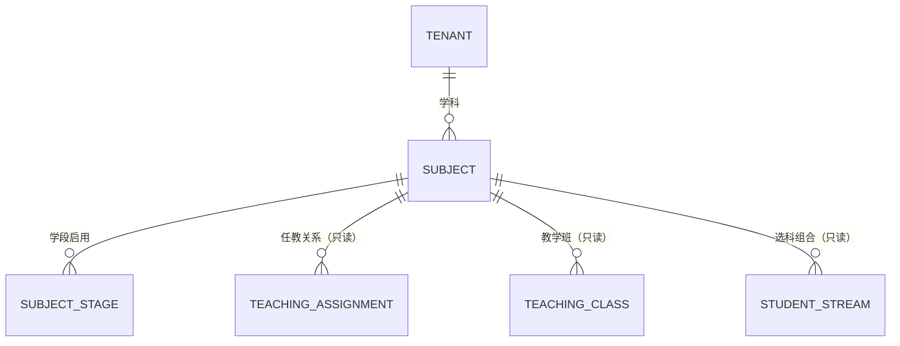

# 学科与学科配置 PRD

| 项 | 值 |
|---|---|
| 模块 | 学科与学科配置（`subject`） |
| 文档路径 | `docs/10-prd/modules/subject/PRD.md` |
| 版本 | 1.0.0-draft |
| 状态 | `frozen`（2026-09-30 冻结，见 D-045、CR-001） |
| 批次 | 1-3（按学生管理 PRD 样板结构产出） |
| 上游依赖 | 见 1.4 |

## 变更记录

| 版本 | 日期 | 变更 | 作者 |
|---|---|---|---|
| 1.0.0-draft | 2026-09-30 | 首版。结构与粒度对齐 `modules/student/PRD.md` v1.0.2 | Codex |

## 0. 怎么读这份文档

需求编号 `REQ-SUB-xxx`。公共前置的编号只引用不复制。

学科是**任教关系与选科校验的共同前提**。任教关系必须绑定学科（`BR-TEACHER-003`），
选科必须落在首选 / 再选的固定集合内（`BR-SUBJECT-003`）。学科配置错一格，
后果是选科组合算错或任教关系无法建立。

| 内容 | 归属 |
|---|---|
| 学科主体、学科编码、学科与学段的关系、选科角色标记 | 本模块 |
| 任教关系引用学科 | 教师管理模块 |
| 选科组合与选科开放期 | 3+1+2 选科与教学班模块 |
| 课程、教材、教学进度 | 首轮不做 |

---

## 1. 模块定位与范围

### 1.1 解决什么问题

学科管理要保证三件事：

1. **编码唯一**：同一租户内学科编码唯一，避免"物理"在两处定义成两个东西（`BR-SUBJECT-001`）
2. **按学段可用**：小学不开物理，高中不开思想品德课（旧编码），所以学科要能按学段启用
3. **选科角色固定**：首选只能是物理 / 历史，再选只能是化学 / 生物 / 思想政治 / 地理（`BR-SUBJECT-003`），
   这条不能由学校自由配置，否则选科校验会失效

### 1.2 范围内

| 能力 | 说明 |
|---|---|
| 学科列表与检索 | 按学段、选科角色、状态筛选 |
| 新建与编辑学科 | 编码唯一性与格式校验 |
| 选科角色配置 | 是否参与 3+1+2、首选 / 再选标记，且受固定集合约束 |
| 学段启用 | 同一学科在哪些学段开设 |
| 启停用与删除约束 | 被引用时不允许删除 |
| 排序 | 列表与下拉的展示顺序 |
| 审计 | 关键写操作留痕 |

### 1.3 范围外

| 不做 | 归属 |
|---|---|
| 选科组合的生成与校验 | 3+1+2 选科与教学班模块 |
| 学科课时、学分、考试权重 | 首轮不做 |
| 课程表与教材版本 | 首轮不做 |
| 学科教师的任教关系 | 教师管理模块 |
| 区域级统一学科目录的下发 | 首轮不做，各校自行维护 |

### 1.4 上游依赖

| 依赖 | 用途 | 缺失后果 |
|---|---|---|
| `docs/10-prd/04-business-rules.md` | `BR-SUBJECT-*`、`BR-STREAM-*` | 无法判定选科角色与引用约束 |
| `docs/10-prd/05-permission-matrix.yaml` | 功能权限 | 按钮显隐无依据 |
| `docs/10-prd/06-field-dictionary.yaml` | `subject_code` 枚举（含 `stream_role`） | 首选 / 再选集合无权威定义 |
| 学校管理模块 | 学科所属学校、开设学段 | 学段启用无依据 |
| 教师管理模块 | 任教关系引用学科，用于引用检查 | 无法判断能否删除 |

---

## 2. 角色与场景

### 2.1 涉及角色

| 角色 | 本模块数据范围 | 本模块关键限制 |
|---|---|---|
| `PER-PLATFORM-OPS` 平台运营 | 全平台（`DS-01`） | 只读，用于排查 |
| `PER-TENANT-ADMIN` 租户管理员 | 本租户组织配置（`DS-02`） | 本模块主要操作者 |
| `PER-SCHOOL-LEADER` 校领导 | 本校（`DS-04`） | 只读 |
| `PER-ACADEMIC-DIRECTOR` 教务主任 | 本校（`DS-04`） | 只读；任教关系与选科需要读取学科清单 |
| `PER-GRADE-LEADER` / `PER-HOMEROOM` / `PER-SUBJECT-TEACHER` | 各自范围 | 只读，用于筛选与展示 |

### 2.2 场景

| 场景 | 名称 | 主要角色 |
|---|---|---|
| `SCN-ORG-03` | 租户管理员维护学科 | 租户管理员（主导本模块） |
| `SCN-TEACHER-01` | 设置任教关系时选择学科 | 教务主任 |
| `SCN-STREAM-01` | 学生选科时校验首选与再选集合 | 学生、选科模块 |
| `SCN-CLASS-01` | 教学班按学科组织 | 教务主任 |
| `SCN-ORG-01` | 开通初始化向导内置默认学科清单 | 平台运营、租户管理员 |

### 2.3 场景覆盖矩阵

| 场景 | 平台运营 | 租户管理员 | 校领导 | 教务主任 | 任课教师 |
|---|---|---|---|---|---|
| SCN-ORG-03 | 查看 | 主 | 查看 | 查看 | 查看 |
| SCN-STREAM-01 | — | 配置 | 审批 | 查看 | — |

---

## 3. 术语与逻辑实体

### 3.1 术语

学科的定义见 `03-glossary.md`。首选科目、再选科目、选科组合的定义同见该文件。

本模块必须强调三个区分：

| 区分 | 说明 |
|---|---|
| 学科 vs 课程 | 学科是稳定分类（语文、数学、物理），课程是有版本与学时的教学安排。首轮只做学科 |
| 学科 vs 教学班 | 学科是"教什么"，教学班是"哪些学生一起上这门课"。一个学科可以有多个教学班 |
| 是否参与选科 vs 选科角色 | "是否参与 3+1+2"是开关，"首选 / 再选"是参与后的角色。两者独立存储、联合校验 |

### 3.2 逻辑实体

| 实体 | 含义 | 权威来源 |
|---|---|---|
| 学科 | 租户级学科主体，编码租户内唯一 | 本模块（`edu_subject`） |
| 学科与学段 | 某学科在哪些学段开设 | 本模块（`edu_subject_stage`） |

### 3.3 实体关系

---

## 4. 功能需求

### 4.1 学科列表与检索

| 编号 | 需求 | 规则依据 | 权限依据 |
|---|---|---|---|
| `REQ-SUB-001` | 提供学科列表查询，按排序号升序展示 | `FD-subject_code` | 各角色 `org.subject` 的 `read` |
| `REQ-SUB-002` | 列表列：学科编码、学科名称、学段启用情况、是否参与 3+1+2、选科角色、排序号、状态 | `BR-SUBJECT-002` | — |
| `REQ-SUB-003` | 支持按学段、选科角色、状态、关键字筛选 | — | 筛选项受数据范围约束 |
| `REQ-SUB-004` | 学段维度支持切换到某一学段查看该学段开设的学科清单 | `BR-SUBJECT-001` | — |
| `REQ-SUB-005` | 列表逐行通过数据范围过滤 | `DS-DENY-03` | — |
| `REQ-SUB-006` | "新建学科""编辑""配置学段""启停用"按钮按功能权限显示，后端二次校验 | `NFR-SEC-05` | `05-permission-matrix.yaml` |

### 4.2 新建学科

| 编号 | 需求 | 规则依据 |
|---|---|---|
| `REQ-SUB-007` | 新建学科必填：学科编码、学科名称；可选：排序号、启用的学段 | `BR-SUBJECT-001` |
| `REQ-SUB-008` | 学科编码在同一租户内唯一 | `BR-SUBJECT-001` |
| `REQ-SUB-009` | 学科编码建议使用字典中的标准编码值（如 `physics`），也允许自定义编码 | `FD-subject_code` |
| `REQ-SUB-010` | 新建时可选择"启用学段"（多选），未启用的学段不会出现在该学段的学科下拉中 | `BR-SUBJECT-001` |
| `REQ-SUB-011` | 提供"按学段批量初始化默认学科"：按学段预置标准学科清单（语文、数学、外语、物理、历史、化学、生物、思想政治、地理） | `SCN-ORG-01` |
| `REQ-SUB-012` | 新建学科写入审计日志 | `BR-AUDIT-001` |

### 4.3 编辑学科

| 编号 | 需求 | 规则依据 |
|---|---|---|
| `REQ-SUB-013` | 学科名称、排序号、启用学段可修改 | — |
| `REQ-SUB-014` | 学科编码允许修改，但需租户管理员权限并强制留审计；修改后需检查引用一致性 | `BR-SUBJECT-001` |
| `REQ-SUB-015` | 已被任教关系、教学班或选科引用的学科，修改编码前给出影响提示 | `BR-SUBJECT-004` |
| `REQ-SUB-016` | 每次编辑写入审计，含变更前后值 | `BR-AUDIT-001` |

### 4.4 选科角色配置

| 编号 | 需求 | 规则依据 |
|---|---|---|
| `REQ-SUB-017` | 学科可标记"是否参与 3+1+2 选科"，默认不参与 | `BR-SUBJECT-002` |
| `REQ-SUB-018` | 参与选科的学科必须标记角色：首选或再选 | `BR-SUBJECT-002` |
| `REQ-SUB-019` | 首选科目**只允许**物理与历史；其他学科不允许标记为首选，接口层直接拒绝 | `BR-SUBJECT-003`、`BR-STREAM-001` |
| `REQ-SUB-020` | 再选科目**只允许**化学、生物、思想政治、地理；其他学科不允许标记为再选 | `BR-SUBJECT-003`、`BR-STREAM-002` |
| `REQ-SUB-021` | 不参与选科的学科，选科角色必须为空（`none`） | `FD-subject_code` |
| `REQ-SUB-022` | 选科角色变更后，必须校验已有选科数据是否仍合法；存在不合法数据时阻止变更并给出清单 | `BR-STREAM-007` |
| `REQ-SUB-023` | 选科角色变更后立即失效选科相关缓存 | `NFR-CACHE-02` |
| `REQ-SUB-024` | 页面必须明确说明"首选 / 再选"是固定集合，不可自由配置 | `BR-SUBJECT-003` |

**选科角色固定映射**

| 学科编码 | 学科名称 | 允许的选科角色 |
|---|---|---|
| `chinese` | 语文 | `none` |
| `math` | 数学 | `none` |
| `english` | 外语 | `none` |
| `physics` | 物理 | `none` 或 `primary` |
| `history` | 历史 | `none` 或 `primary` |
| `chemistry` | 化学 | `none` 或 `secondary` |
| `biology` | 生物 | `none` 或 `secondary` |
| `politics` | 思想政治 | `none` 或 `secondary` |
| `geography` | 地理 | `none` 或 `secondary` |

### 4.5 学段启用

| 编号 | 需求 | 规则依据 |
|---|---|---|
| `REQ-SUB-025` | 每个学科可独立启用 / 停用多个学段 | `BR-SUBJECT-001` |
| `REQ-SUB-026` | 只有在学校开设的学段中才能启用学科；未开设的学段置灰 | `BR-GRADE-001` |
| `REQ-SUB-027` | 停用某学段后，该学段新建的教学班与任教关系不再可选该学科 | `BR-TEACHER-003` |
| `REQ-SUB-028` | 已被该学段的任教关系或教学班引用的学段启用记录，停用前给出影响提示并二次确认 | `BR-SUBJECT-004` |

### 4.6 启停用与删除约束

| 编号 | 需求 | 规则依据 |
|---|---|---|
| `REQ-SUB-029` | 学科支持停用；停用后不在新建任教关系、新建教学班的可选列表中 | `BR-SUBJECT-004` |
| `REQ-SUB-030` | 已被班级、任教关系或选科引用的学科**不允许删除，只允许停用** | `BR-SUBJECT-004` |
| `REQ-SUB-031` | 未被任何对象引用的学科允许逻辑删除，删除前需引用检查 | `BR-SUBJECT-004` |
| `REQ-SUB-032` | 学科禁止物理删除，数据库层不得开放删除语句 | `NFR-DATA-02`、`BR-AUDIT-003` |
| `REQ-SUB-033` | 停用、启用、删除均写入审计 | `BR-AUDIT-001` |

### 4.7 引用检查

| 编号 | 需求 | 规则依据 |
|---|---|---|
| `REQ-SUB-034` | 删除、停用、修改编码前必须检查三类引用：任教关系、教学班、学生选科 | `BR-SUBJECT-004` |
| `REQ-SUB-035` | 引用检查结果可下钻到具体对象清单 | `BR-SUBJECT-004` |
| `REQ-SUB-036` | 引用检查失败时拒绝操作并说明是哪一类引用阻止了操作 | `BR-SUBJECT-004` |

### 4.8 审计

| 编号 | 需求 | 规则依据 |
|---|---|---|
| `REQ-SUB-037` | 新建、编辑、编码修改、选科角色变更、学段启用变更、启停用、删除全部写审计 | `BR-AUDIT-001` |
| `REQ-SUB-038` | 审计记录包含操作人、角色、租户、学校、对象类型与 ID、变更前后值、时间、来源 IP | `NFR-AUDIT-01` |

---

## 5. 权限需求

### 5.1 功能权限

| 资源 | 操作 | 说明 |
|---|---|---|
| `org.subject` | read / create / update | 学科主体与选科角色 |
| `person.teaching_assignment` | read | 引用检查 |
| `org.teaching_class` | read | 引用检查 |
| `stream.selection` | read | 引用检查 |
| `audit.log` | read | 变更记录 |

### 5.2 数据范围

| 角色 | 范围编号 | 落地方式 |
|---|---|---|
| 平台运营 | `DS-01` | 全平台只读 |
| 租户管理员 | `DS-02` | 本租户学校的学科；集团租户管理员可按 `DS-10` 维护下属学校学科 |
| 校领导 / 教务主任 | `DS-04` | 本校学科只读 |
| 其他角色 | `DS-05` ~ `DS-07` | 只读 |

### 5.3 拒绝规则

严格遵守 `DS-DENY-01` ~ `DS-DENY-09`。本模块特别需要落实：

| 规则 | 落地要求 |
|---|---|
| `DS-DENY-02` | 学科是学校级资源，缺 `school_id` 且角色不是平台运营时拒绝 |
| `DS-DENY-06` | 批量化学段启用时逐条校验，任一条越权则整体拒绝 |
| `DS-DENY-08` | 引用检查的计数受数据范围约束 |

---

## 6. 界面需求（阶段 2 原型输入）

### 6.1 页面清单

| 页面 ID | 页面名 | 类型 | 主要角色 |
|---|---|---|---|
| `PAGE-SUB-LIST` | 学科列表 | 列表页 | 租户管理员、教务主任 |
| `PAGE-SUB-CREATE` | 新建学科 | 抽屉 | 租户管理员 |
| `PAGE-SUB-EDIT` | 编辑学科 | 抽屉 | 租户管理员 |
| `PAGE-SUB-STREAM` | 选科角色配置 | 弹窗（含固定集合说明） | 租户管理员 |
| `PAGE-SUB-STAGE` | 学段启用配置 | 弹窗（多选） | 租户管理员 |
| `PAGE-SUB-BATCH` | 按学段批量初始化 | 弹窗 | 租户管理员 |

### 6.2 列表页要素

1. 学段页签（小学 / 初中 / 高中 / 全部）
2. 筛选区：选科角色、状态、关键字
3. 操作栏：新建学科、按学段批量初始化
4. 表格：编码、名称、启用学段、参与选科、选科角色、排序、状态、操作
5. 支持拖拽调整排序号

### 6.3 交互与跳转

| 触发 | 结果 |
|---|---|
| 点击"选科角色" | 打开配置弹窗；不在固定集合内的选项直接不出现 |
| 尝试把语文标记为首选 | 选项不存在；直接调接口被拒绝并说明原因 |
| 修改选科角色时存在不合法选科数据 | 阻止变更并给出不合法学生清单 |
| 点击"停用" | 先做引用检查，有引用时提示"仅停用不删除" |
| 拖拽排序 | 保存排序号并提示已生效 |

### 6.4 页面状态

加载中骨架屏；空态提示"新建学科"或"按学段批量初始化"；
无权限给说明与返回；选科角色与引用冲突时给出清单而不是笼统报错。

---

## 7. 数据需求

### 7.1 逻辑实体与字段

| 实体 | 关键字段 | 唯一性要求 |
|---|---|---|
| 学科 | `tenant_id`、`school_id`、`subject_code`、`subject_name`、`sort_no`、`stream_enabled`、`stream_role`、`status` | `(tenant_id, school_id, subject_code)` 唯一（`BR-SUBJECT-001`） |
| 学科与学段 | `subject_id`、`stage_code`、`status` | `(subject_id, stage_code)` 唯一 |

**`stream_role` 取值约束**：`none` / `primary` / `secondary`；
`primary` 仅允许 `physics`、`history`；`secondary` 仅允许 `chemistry`、`biology`、`politics`、`geography`。
该约束在业务层强制，并在迁移脚本的检查 SQL 中兜底。

### 7.2 索引需求

| 查询场景 | 需要的索引前缀 |
|---|---|
| 按学校列学科 | `(school_id, status, sort_no)` |
| 按编码查学科 | `(tenant_id, school_id, subject_code)` |
| 按选科角色查 | `(school_id, stream_enabled, stream_role)` |
| 学段启用按学科查 | `(subject_id, stage_code)` |

### 7.3 审计要求

| 事件 | 记录内容 |
|---|---|
| 新建 / 编辑学科 | 操作人、时间、变更前后值 |
| 修改学科编码 | 变更前后值 + 授权角色 |
| 选科角色变更 | 原角色、新角色、影响校验结果、操作人 |
| 学段启用变更 | 原学段集合、新学段集合、操作人 |
| 启停用 / 删除 | 原因、引用检查结果摘要、操作人 |

---

## 8. 接口需求（阶段 4 概要设计输入）

| 建议 operationId | 方法 | 路径 | 说明 |
|---|---|---|---|
| `listSubject` | GET | `/edu/subject/list` | 学科列表 |
| `getSubject` | GET | `/edu/subject/{id}` | 详情 |
| `addSubject` | POST | `/edu/subject` | 新建 |
| `updateSubject` | PUT | `/edu/subject` | 编辑 |
| `batchInitSubject` | POST | `/edu/subject/batch-init` | 按学段批量初始化 |
| `saveSubjectStreamRole` | POST | `/edu/subject/{id}/stream-role` | 配置选科角色 |
| `saveSubjectStage` | POST | `/edu/subject/{id}/stage` | 配置学段启用 |
| `disableSubject` | POST | `/edu/subject/{id}/disable` | 停用 |
| `enableSubject` | POST | `/edu/subject/{id}/enable` | 启用 |
| `removeSubject` | DELETE | `/edu/subject/{id}` | 逻辑删除（校验引用） |
| `checkSubjectReference` | GET | `/edu/subject/{id}/reference` | 引用检查 |
| `listSubjectOption` | GET | `/edu/subject/option` | 供各模块使用的下拉清单（按学段过滤） |

---

## 9. 非功能需求

受公共非功能需求约束（`NFR-PERF-*`、`NFR-SEC-*`、`NFR-AUDIT-*`、`NFR-DATA-*`、
`NFR-CACHE-*`、`NFR-MQ-*`、`NFR-COMPAT-*`、`NFR-A11Y-*`、`NFR-CODE-*`、`NFR-OPS-*`）。

模块级补充：

| 编号 | 需求 | 目标 |
|---|---|---|
| `REQ-SUB-039` | 学科列表查询 P95 ≤ 1 秒 | `NFR-PERF-02` |
| `REQ-SUB-040` | 学科下拉清单接口 P95 ≤ 200 毫秒（各模块高频调用），且带缓存 | `NFR-PERF-02`、`NFR-CACHE-01` |
| `REQ-SUB-041` | 引用检查（三类计数）P95 ≤ 2 秒 | `NFR-PERF-03` |
| `REQ-SUB-042` | 学科与选科角色变更后，相关缓存失效延迟 ≤ 1 秒 | `NFR-CACHE-02` |

---

## 10. 需求追踪矩阵

| 需求组 | 场景 | 主要规则 | 验收用例 |
|---|---|---|---|
| `REQ-SUB-001` ~ `REQ-SUB-006` 列表与检索 | `SCN-ORG-03` | `BR-SUBJECT-001`、`BR-SUBJECT-002` | `AC-SUB-001` ~ `AC-SUB-006` |
| `REQ-SUB-007` ~ `REQ-SUB-012` 新建 | `SCN-ORG-03` | `BR-SUBJECT-001` | `AC-SUB-007` ~ `AC-SUB-012` |
| `REQ-SUB-013` ~ `REQ-SUB-016` 编辑 | `SCN-ORG-03` | `BR-SUBJECT-004` | `AC-SUB-013` ~ `AC-SUB-016` |
| `REQ-SUB-017` ~ `REQ-SUB-024` 选科角色 | `SCN-STREAM-01` | `BR-SUBJECT-002`、`BR-SUBJECT-003`、`BR-STREAM-001`、`BR-STREAM-002`、`BR-STREAM-007` | `AC-SUB-017` ~ `AC-SUB-024` |
| `REQ-SUB-025` ~ `REQ-SUB-028` 学段启用 | `SCN-ORG-03` | `BR-SUBJECT-001`、`BR-GRADE-001`、`BR-TEACHER-003` | `AC-SUB-025` ~ `AC-SUB-028` |
| `REQ-SUB-029` ~ `REQ-SUB-033` 启停用与删除 | `SCN-ORG-03` | `BR-SUBJECT-004`、`NFR-DATA-02` | `AC-SUB-029` ~ `AC-SUB-033` |
| `REQ-SUB-034` ~ `REQ-SUB-036` 引用检查 | `SCN-ORG-03` | `BR-SUBJECT-004` | `AC-SUB-034` ~ `AC-SUB-036` |
| `REQ-SUB-037` ~ `REQ-SUB-038` 审计 | — | `BR-AUDIT-001`、`NFR-AUDIT-01` | `AC-SUB-037` ~ `AC-SUB-038` |
| `REQ-SUB-039` ~ `REQ-SUB-042` 性能 | — | `NFR-PERF-02`、`NFR-PERF-03`、`NFR-CACHE-02` | `AC-SUB-301` ~ `AC-SUB-304` |
| 权限与数据范围 | `SCN-ORG-03` | `BR-DATA-001` ~ `BR-DATA-017`、`DS-DENY-01` ~ `DS-DENY-09` | `AC-SUB-101` ~ `AC-SUB-108` |
| 兼容与可访问性 | — | `NFR-COMPAT-01` ~ `NFR-COMPAT-03`、`NFR-A11Y-01` ~ `NFR-A11Y-04` | `AC-SUB-401` ~ `AC-SUB-404` |

---

## 11. 术语使用声明

`CTX-GOAL-*`、`PER-*`、`SCN-*`、`BR-*`、`FD-*`、`DS-*`、`NFR-*` 均为引用，不重复定义。

---

## 12. 设计选择确认

本模块未发现阻塞性缺项。以下三处属于设计选择，已于 2026-09-30 经用户整体确认：

| 序号 | 事项 | 采纳方案 | 备选 | 结论（2026-09-30） |
|---|---|---|---|---|
| 1 | 学科编码是否允许自定义（非字典标准值） | 允许，建议用标准值 | 只允许字典标准值 | **已确认**：允许自定义，建议优先用字典标准值 |
| 2 | 学科是否按学段拆成多条记录 | 一条学科主体 + 学段启用表 | 按学段拆成多条学科记录（编码不再租户内唯一） | **已确认**：一条主体 + 学段启用表 |
| 3 | 学科是否提供删除 | 未被引用时可逻辑删除 | 一律只停用，不提供删除 | **已确认**：未被引用时可逻辑删除，被引用时只能停用 |

第 2 项需要特别说明：`BR-SUBJECT-001` 要求学科编码在**同一租户内唯一**，
如果按学段拆成多条记录，同一编码会在不同学段重复，与该规则冲突。
因此当前采用"一条主体 + 学段启用表"，这是唯一能同时满足两条要求的做法。
