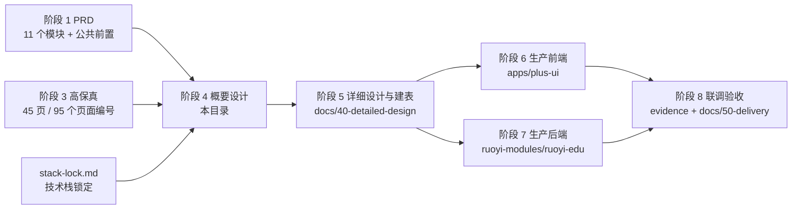

# 阶段 4 · 概要设计索引

## 0. 本阶段回答什么

阶段 1 定「做什么」（PRD），阶段 2 / 3 定「长什么样」（原型），本阶段定**「怎么搭」**：
系统边界、架构分层、模块与服务边界、技术选型、数据归属、接口清单、同步异步边界、缓存策略、数据权限落地。

本阶段的产物是阶段 5（详细设计与建表）与阶段 6 / 7（生产前后端）的直接输入。

## 1. 文档清单与阅读顺序

| # | 文件 | 回答的问题 | 上游 |
|---|---|---|---|
| 1 | [`01-system-context.md`](01-system-context.md) | 系统与谁交互、边界在哪、依赖哪些外部系统 | `01-product-context.md`、`02-personas-and-scenarios.md` |
| 2 | [`02-architecture.md`](02-architecture.md) | 逻辑 / 容器 / 部署三层架构长什么样 | 本文件、`stack-lock.md`、现有仓库结构 |
| 3 | [`03-module-division.md`](03-module-division.md) | 模块怎么分、服务边界在哪、包结构怎么放 | 11 个模块 PRD、`DP-01` |
| 4 | [`04-tech-selection.md`](04-tech-selection.md) | 用哪些技术、为什么、哪些不能动 | `stack-lock.md`、实际 `pom.xml` / `package.json` |
| 5 | [`05-data-ownership.md`](05-data-ownership.md) | 哪张表归哪个模块、谁是唯一写入入口 | 各模块 PRD 第 7 节、`10-data-permission-schema.md` |
| 6 | [`06-api-catalog.md`](06-api-catalog.md) | 有哪些接口（173 个 operationId） | 各模块 PRD 第 8 节（工具生成） |
| 7 | [`07-sync-async-boundary.md`](07-sync-async-boundary.md) | 哪些同步、哪些异步、消息怎么设计 | `NFR-MQ-*`、导入导出 PRD |
| 8 | [`08-cache-strategy.md`](08-cache-strategy.md) | Redis 键怎么设计、什么时机失效 | `NFR-CACHE-*`、`10-data-permission-schema.md` |
| 9 | [`09-permission-architecture.md`](09-permission-architecture.md) | 数据权限怎么落地（四层范围 + 集团跨租户） | `05-permission-matrix.yaml`、`08-data-scope-model.md`、`10-data-permission-schema.md` |
| 10 | [`10-mobile-and-toc-extension.md`](10-mobile-and-toc-extension.md) | 移动端与 ToC 在哪扩、首轮预留什么 | `01-product-context.md`、用户已确认口径 |
| 11 | [`diagrams/`](diagrams/) | Mermaid 图源文件（上下文 / 容器 / 部署 / 权限流程） | 本目录各文档引用 |

## 2. 与上下游的关系

## 3. 门禁对照（`stage-inputs.yaml` 的 stage4）

| 门禁 | 证据 | 结论 |
|---|---|---|
| 架构图、模块划分、技术选型、数据归属、接口清单齐备 | `02` / `03` / `04` / `05` / `06` 五份文档 + `diagrams/` 四个图源 | 见各文件「结论」小节 |
| 数据权限架构能表达校级 / 年级 / 班级 / 个人四层，且不依赖租户管理员放行 | `09-permission-architecture.md` 第 2 ~ 5 节（范围来源表 + 解析流程 + 拒绝规则 + 与 `ruoyi-common-tenant` 的关系） | 四层齐全；明确不继承租户管理员放行逻辑（`DS-DENY-05` / `DP-05`） |
| 集团跨学校租户的查询方案明确 | `09-permission-architecture.md` 第 6 节（集团自有数据 / 运营授权共享 / 平台全平台三种路径的取舍） | 集团默认**不跨租户**读下属学校教学数据；跨校读取只经「运营方数据共享授权」（限教学资源）与「平台运营 `DS-01`」两条路径 |
| 接口清单覆盖原型中每一个动作 | `06-api-catalog.md`（173 个 operationId，由 `tools/extract_api_catalog.py` 从 PRD 生成）+ 阶段 5 的 `page-action-api-map.yaml`（覆盖 403 个动作编号） | 阶段 4 交付接口全集；动作级映射在阶段 5 完成（门禁项在阶段 5 复核） |

## 4. 批次记录

| 批次 | 内容 | 状态 |
|---|---|---|
| 4-0 | 上下文 + 架构 + 模块划分 + 技术选型 + 数据归属（`01` ~ `05`） | 已产出待验收 |
| 4-1 | 接口清单 + 同步异步边界 + 缓存 + 权限架构（`06` ~ `10`） | 已产出待验收 |

> 两批一次性提交：`06`（接口清单）依赖 `05`（数据归属）的模块划分，`09`（权限架构）依赖 `07` / `08` 的运行时设计，
> 拆成两次提交会在同一批文件上来回改，反而难以按批验收。

## 5. 本阶段刻意不做的事

| 不做 | 归属 |
|---|---|
| 表结构、字段类型、索引、DDL | 阶段 5（`docs/40-detailed-design/database/`、`migrations/`） |
| OpenAPI 契约、错误码表 | 阶段 5（`docs/40-detailed-design/api/`） |
| 生产代码与目录骨架 | 阶段 6 / 7 |
| 题库 / 作业 / 考试 / 练习 / 错题 / 学情分析的具体设计 | 首轮范围外；本阶段只在 `03` / `10` 预留模块位与扩展点 |
| 移动端与 ToC 的实现 | 本阶段只定扩展位置（`10-mobile-and-toc-extension.md`） |
