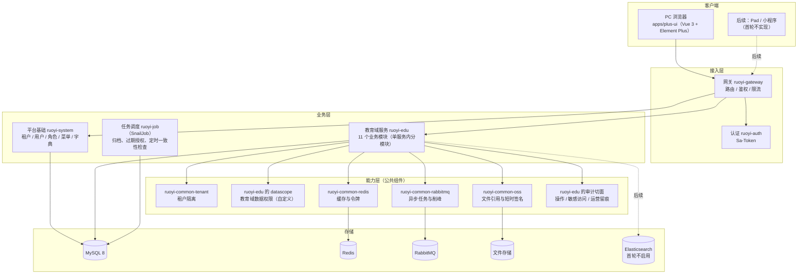
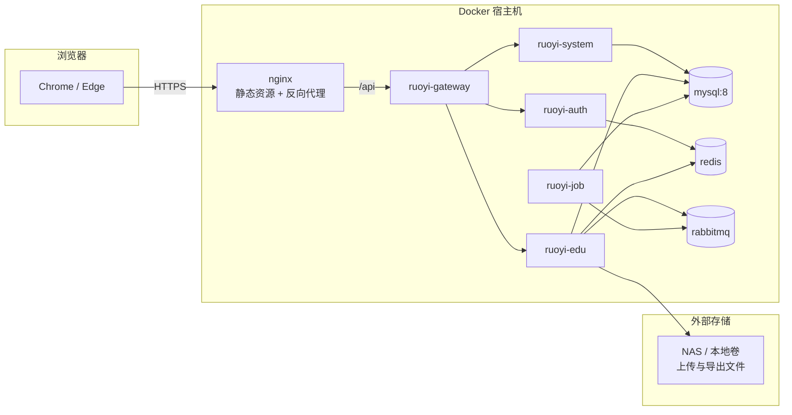
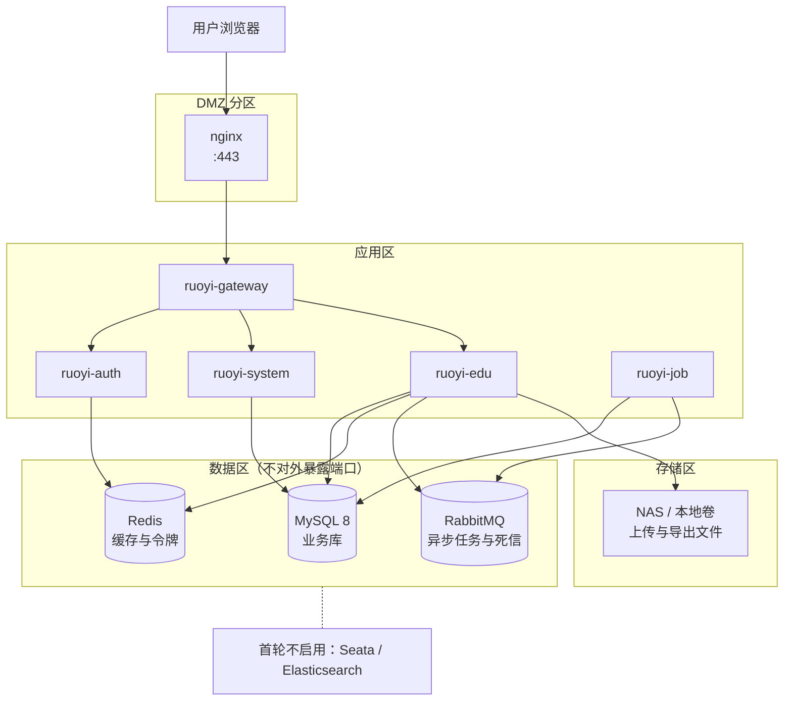

# 架构设计

## 1. 架构分层（逻辑视图）

图源：[`diagrams/logical.mmd`](diagrams/logical.mmd)。

## 2. 容器视图（部署时真实运行的进程）

图源：[`diagrams/container.mmd`](diagrams/container.mmd)。

## 3. 部署视图（拓扑与网络分区）

| 分区 | 组件 | 暴露范围 | 说明 |
|---|---|---|---|
| DMZ | nginx | 对用户开放 | 只暴露 HTTPS；静态资源本地托管，`/api` 反代到网关 |
| 应用区 | gateway / auth / system / edu / job | 只对 DMZ 与彼此开放 | 除网关外不对用户直接暴露端口 |
| 数据区 | MySQL / Redis / RabbitMQ | 只对应用区开放 | 不对宿主机外部暴露端口；凭据走环境变量（不进仓库） |
| 存储区 | NAS / 本地卷 | 只对 edu 开放 | 文件不落地应用服务器临时目录（`REQ-IMP-045`） |

图源：[`diagrams/deployment.mmd`](diagrams/deployment.mmd)。

首轮**不启用**的组件：Seata（先不做跨服务分布式事务）、Elasticsearch（题库检索未开工）。
两者在 `stack-lock.md` 已登记为"随基线 / 首轮不启用"，架构上保留位置但不引入依赖。

## 4. 关键架构决策

| # | 决策 | 理由 | 代价 |
|---|---|---|---|
| A-01 | 首轮教育业务**单服务**（`ruoyi-edu`）内分 11 个模块，不拆微服务 | 需求仍在演进，拆服务会引入分布式事务、跨服务一致性与部署复杂度；单服务内用包边界 + 模块级依赖规则约束 | 后续拆服务时需要一次迁移；用包边界与"数据归属表"降低迁移成本（`05-data-ownership.md`） |
| A-02 | 租户隔离沿用 `ruoyi-common-tenant`，但教育域**数据权限自建**（不继承租户管理员的放行逻辑） | 租户隔离只回答"哪个租户"，回答不了"校领导看本校全部、年级主任看本年级、班主任看本班、任课教师看任教班级"（`DS-04` ~ `DS-07`） | 需要自研范围解析与缓存（`09-permission-architecture.md`） |
| A-03 | 数据权限从**业务关系**推导（年级主任任职表、班级班主任字段、任教关系表），不做"管理员手工配范围" | 手工配置会与业务事实漂移；关系表本身是业务写入的唯一入口（`DP-02`） | 关系变更必须立即失效缓存（`DP-06` / `08-cache-strategy.md`） |
| A-04 | 异步只用于耗时与削峰：导入执行、导出、升班执行、教学班生成、日志归档 | 同步调用链更短、可观测性更好；把"慢"集中到任务中心统一治理 | 需要任务中心、死信与重放（`07` 第 3 节） |
| A-05 | 教学资源跨校共享走**显式只读授权**（`edu_data_grant`），业务数据不跨校 | 学生 / 班级 / 成绩跨校共享会直接冲突数据权限与合规（`BR-DATA-018`） | 运营方需为每次共享建授权并留痕 |
| A-06 | 审计不靠各模块自觉：操作日志、敏感字段访问、运营访问三类留痕走统一切面 + 统一表 | 分散实现必然漏记；审计是合规底线 | 切面需要正确识别"哪些字段属于敏感揭示" |
| A-07 | 大表（`edu_audit_log` 等）按时间分区，归档即分区切换，不做物理删除 | 保留期 ≥ 3 年且归档后仍可检索（`REQ-AUD-032` / `033`） | 需要 DBA 侧的分区维护流程（阶段 5 的 `migration-plan.md`） |

## 5. 跨模块一致性策略

| 场景 | 策略 |
|---|---|
| 同一聚合内的多表写（如班级 + 花名册成员） | 同一本地事务（`@Transactional`），禁跨聚合长事务 |
| 模块之间的强一致需求（如"编班后学生数据范围立即生效"） | 同库同事务 + 缓存失效（不跨服务，因为 A-01 单服务） |
| 耗时流程（导入 / 升班 / 教学班生成） | 入队 → 幂等键（批次号 / 任务号）→ 分批提交 → 结果与差异落表 |
| 缓存与数据库不一致 | 只缓存"解析结果"与"热点读"，写操作主动失效（`08-cache-strategy.md`） |
| 审计与业务写入不一致 | 关键写操作与日志**同事务**；异步场景走补偿 + 告警（`REQ-AUD-035` / `036`） |

## 6. 与现有仓库的对应关系

| 层 | 现有位置 | 本阶段结论 |
|---|---|---|
| 前端 | `apps/plus-ui`（Vue 3.5 + TS 5.9 + Vite 7 + Element Plus 2.13 + Pinia 3 + Vue Router 5 + UnoCSS） | 不改结构，教育模块按 `views/edu/<module>` 加页面（阶段 6） |
| 后端 | `services/RuoYi-Cloud-Plus`（RuoYi-Cloud-Plus 2.6.2 + JDK 17 + Spring Boot 3.5.15 + Spring Cloud 2025.0.3） | 教育模块新增 `ruoyi-modules/ruoyi-edu`（阶段 7），不改基线模块 |
| 网关 / 认证 / 系统 | `ruoyi-gateway` / `ruoyi-auth` / `ruoyi-system` | 复用；教育域接口在网关里挂 `/edu/**` 路由 |
| 脚本 | `script/sql` / `script/docker` | 阶段 5 的迁移脚本按 `script/sql` 的既有约定放置（前缀 `V1__edu_*`） |

> 冲突处理：任何与本文件不一致的实际情况（例如基线版本变化、目录变化），按 `stack-lock.md` 的规则
> 「实际代码优先」，并把差异登记到 `docs/00-governance/decisions.md`。

## 7. 结论

- 逻辑 / 容器 / 部署三个视图齐备，图源在 `diagrams/`，可在支持 Mermaid 的编辑器中直接渲染。
- 七条关键架构决策（A-01 ~ A-07）都有理由与代价，不是"默认这么干"。
- 首轮不引入 Seata 与 Elasticsearch，避免为不存在的需求付复杂度。
