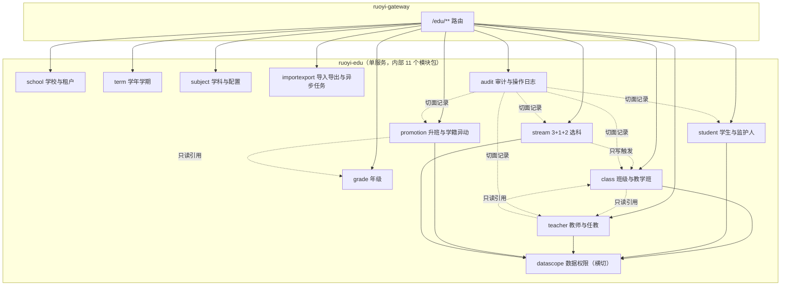

# 模块划分与服务边界

## 1. 划分依据

模块边界不是按"页面"划，而是按 `DP-01`（**每个字段只有一个写入入口**）划：
一个模块 = 一组**只有它有写权限**的字段 + 围绕这些字段的查询与流程。

依据来源：11 个模块 PRD 的「模块边界先说清楚」小节（每份 PRD 第 0 节）与
`docs/10-prd/10-data-permission-schema.md` 的权威来源表。

## 2. 服务边界（首轮单服务）



**为什么首轮不拆微服务**：见 `02-architecture.md` 的 A-01。单服务内用**包边界 + 依赖规则**替代进程边界，
并用本文件第 4 节的"跨模块只读"清单约束耦合方向，使后续拆服务时迁移面可控。

## 3. 模块职责与写入边界

| 模块 | 包 | 只有它能写的字段 / 表 | 只读消费它的模块 |
|---|---|---|---|
| 学校与租户 | `org.dromara.edu.school` | `edu_school`、`edu_campus`、租户接入配置 | 教师 / 学生 / 班级 / 年级 |
| 学年学期 | `org.dromara.edu.term` | `edu_academic_year`、`edu_term` | 除审计外的全部业务模块 |
| 学科与配置 | `org.dromara.edu.subject` | `edu_subject`、`edu_subject_stage`（含 `stream_role`） | 选科（消费角色）、任教关系、教学班 |
| 年级 | `org.dromara.edu.grade` | `edu_grade` | 班级、选科统计、升班 |
| 班级与教学班 | `org.dromara.edu.clazz` | `edu_class`（含 `head_teacher_id`）、`edu_class_member`、`edu_teaching_class`、`edu_teaching_class_member` | 学生（只读班级）、教师（只读任教班级）、选科（触发生成） |
| 学生与监护人 | `org.dromara.edu.student` | `edu_student`、`edu_student_enrollment`（学籍状态除异动流程外）、`edu_guardian`、`edu_student_guardian`、`edu_activation_code` | 班级花名册、选科、导入 |
| 教师与任教 | `org.dromara.edu.teacher` | `edu_teacher`、`edu_user_role`、`edu_grade_leader`、`edu_teaching_assignment` | 班级（只读任课教师）、年级主任范围 |
| 升班与学籍异动 | `org.dromara.edu.promotion` | `edu_promotion_task`、`edu_promotion_item`、`edu_enrollment_change`；**学籍状态的唯一流转入口** | 学生详情只读展示 |
| 3+1+2 选科 | `org.dromara.edu.stream` | `edu_stream_config`、`edu_student_stream`、`edu_stream_change_request`、`edu_stream_history` | 学生 / 班级只读；教学班生成只"触发"不写（`REQ-STR-056`） |
| 导入导出与异步 | `org.dromara.edu.importexport` | `edu_import_batch`、`edu_import_error`、`edu_async_task`、`edu_file_ref` | 各模块的数据通过它批量写入（走各模块自己的 service，不直接写表） |
| 审计与日志 | `org.dromara.edu.audit` | `edu_audit_log`、`edu_audit_change`、`edu_audit_sensitive_access`、`edu_audit_operator_access`、`edu_audit_security_event`、`edu_audit_archive_batch` | 无（只被切面写入） |

> 表格第三列是**唯一写入入口**：其他模块即使需要这些数据，也只能调用该模块的 service（单服务内）或只读查询，
> 不允许直接写它的表。这条规则与阶段 2 / 3 原型里"每个页面只有一个写入口"的写法一一对应（例如学生列表只读班级、班级页才改班级）。

## 4. 跨模块调用清单（受控的耦合面）

| 调用方 | 被调用方 | 用途 | 方向约束 |
|---|---|---|---|
| `clazz` | `teacher` | 指定班主任时校验"本校在职教师" | 只读查询，不写教师表 |
| `teacher` | `clazz` | 任教关系设置里选班级；班主任任职展示班级名 | 只读查询 |
| `promotion` | `grade` / `clazz` | 升班按年级 / 班级追加下一学年的关系 | **只读**年级与班级结构；写的是自己的 `edu_promotion_*` 与班级关系（关系写入调用 `clazz` 的 service） |
| `stream` | `clazz` | 按组合生成教学班：只触发，写入由 `clazz` 执行 | 调用方向单行，禁止反向 |
| `importexport` | 全部业务模块 | 导入按模块分发到对应 service 执行 | 禁止 importexport 直接写业务表 |
| `audit` | 全部业务模块 | 通过切面记录操作与字段级变更 | 只写自己的表 |
| 全部模块 | `datascope` | 数据范围解析（横切组件） | 只读，不写业务表 |

**依赖规则（由阶段的代码评审保证，阶段 7 会落成依赖检查）**：

1. 模块之间只允许调用对方的 `service` 接口与 `vo` / `bo`，不允许跨模块引用对方的 `mapper` 或 `domain` 实体。
2. 禁止双向依赖：需要双向时，把"被依赖方"的只读查询抽到自己的 `xxxQueryService`。
3. `clazz` 与 `teacher` 这对双向只读是允许的例外，但**禁止**任一方写对方的表。

## 5. 包结构（阶段 7 的实现骨架，本阶段先定契约）

```
ruoyi-modules/ruoyi-edu/
  src/main/java/org/dromara/edu/
    EduApplication.java
    <module>/                      # 11 个模块包，见第 3 节
      controller/                  # REST 接口（operationId → 方法名一致）
      service/ + service/impl/      # 业务接口与实现（跨模块只暴露这一层）
      mapper/                      # MyBatis-Plus Mapper
      domain/ + domain/bo + domain/vo
      enums/                       # 模块内枚举（跨模块共用的放 common）
      convert/                     # 对象转换（MapStruct 或手写）
    common/                        # 跨模块共用：枚举、常量、异常、工具
    datascope/                     # 数据权限：范围解析、拦截器、缓存
    audit/                         # 审计切面与三类留痕
    async/                         # 异步任务编排（生产者 / 消费者 / 幂等）
    config/                        # 模块配置（MyBatis 插件、MQ、OSS、线程池）
  src/main/resources/
    mapper/edu/                    # 复杂 SQL
    i18n/                          # 错误信息
  src/test/java/org/dromara/edu/   # 单元与集成测试
```

## 6. 后续业务模块的预留位（首轮不实现）

| 预留模块 | 包名建议 | 首轮状态 | 与现有模块的关系 |
|---|---|---|---|
| 题库管理 | `org.dromara.edu.question` | 不建包、不建表 | 依赖 `subject`（学科）与知识点树（未设计）；资料共享走 `edu_data_grant` 的 `question_bank_item` 资源类型 |
| 作业 / 考试 / 练习 | `org.dromara.edu.homework` / `exam` / `practice` | 不建包、不建表 | 依赖班级、学生、题库 |
| 错题 / 学情分析 | `org.dromara.edu.analysis` | 不建包、不建表 | 依赖考试与练习结果；首轮的组合分布统计（`getStreamStat`）只是它的雏形，放在 `stream` 模块内 |

预留方式：`edu_data_grant.resource_types` 已经按"可枚举的资源类型集合"设计（`question_bank_item,exam_paper`），
新增资源类型不需要改授权表结构；`ruoyi-edu` 的分包结构允许直接新增模块包，不需要调整现有模块。

## 7. 结论

- 11 个模块的写入边界明确，且与 PRD 的 `DP-01` 一致；跨模块调用收敛为 7 条受控依赖。
- 服务边界选择"单服务 + 包边界"，用依赖规则替代进程边界，为后续拆服务留出迁移面。
- 后续业务模块的预留位明确：不改现有表结构、不改现有包，直接加模块包。
