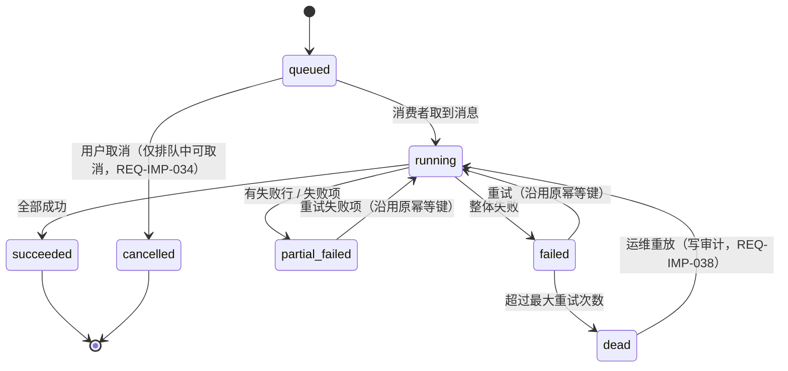

# 同步 / 异步边界与消息设计

## 1. 判定规则

一条操作走同步还是异步，只看三个问题（不按"感觉慢"决定）：

| 判定 | 同步 | 异步 |
|---|---|---|
| 用户是否必须立刻看到结果 | 是（列表 / 详情 / 单条保存 / 审批） | 否（导入 5000 行、导出 50000 行） |
| 数据量是否可控 | ≤ 5000 行或单条 | > 2000 行的导出、> 5000 行的导入（`BR-IMP-010`） |
| 是否需要跨请求重试 | 否 | 是（消息消费失败要重试并最终进死信） |

配套阈值（来自 PRD，不在本文件重新发明）：

| 阈值 | 值 | 出处 |
|---|---|---|
| 同步导入上限 | 5000 行 / 10 MB / 30 秒校验 | `IMP-Q-01` |
| 同步导出上限 | 2000 行 | 导入导出 PRD 6.3 |
| 升班预览 / 执行 | > 1 万人转异步 | `REQ-STR-067` 同口径 |
| 归档区间检索 | > 30 秒转异步 | 审计 PRD 第 9 节 |
| 同一用户导入并发 | 1 | `REQ-IMP-047` |
| 同一学校导入并发 | 3（可配置） | `REQ-IMP-048` |

## 2. 异步操作清单

| 操作 | 同步部分 | 异步部分 | 幂等键 | 结果落点 |
|---|---|---|---|---|
| 学生 / 教师 / 编班表导入 | 上传 + 结构校验（≤ 5000 行 30 秒） | 执行写库 | `batch_no`（`IMP-yyyymmdd-xxxx`） | `edu_import_batch` + `edu_import_error` |
| 各模块导出 | 参数校验 + 行数估算 | 生成文件 | `task_no` | `edu_async_task` + `edu_file_ref` |
| 升班预览 / 执行 | 任务参数校验 | 计算目标班级关系并写库 | `task_no` + 源 / 目标学期 | `edu_promotion_task` / `edu_promotion_item` |
| 按组合生成教学班 | 预览（≤ 1 万人同步） | 生成教学班与成员 | `task_no` + 学校 + 学期 + 组合 | `edu_teaching_class*`（由 `clazz` 写入） |
| 日志归档 | 批次创建 | 分区切换 / 归档落盘 | `batch_no`（`ARC-yyyy-nn`） | `edu_audit_archive_batch` |
| 死信重放 | 原因校验 + 二次确认 | 重新入队 | 原 `batch_no` / `task_no`（复用，不新建） | 原任务的执行结果 |
| 任务重试 | 状态校验 | 重新入队 | 原幂等键 | `edu_async_task` |

## 3. 消息设计

### 3.1 交换机与队列

| 交换机 | 类型 | 队列 | 用途 | 消费者 |
|---|---|---|---|---|
| `edu.task.exchange` | topic | `edu.task.import` | 导入执行 | `ruoyi-edu` 的导入消费者 |
| `edu.task.exchange` | topic | `edu.task.export` | 导出生成 | 导出消费者 |
| `edu.task.exchange` | topic | `edu.task.promotion` | 升班执行 | 升班消费者 |
| `edu.task.exchange` | topic | `edu.task.teaching-class` | 教学班生成 | 教学班消费者 |
| `edu.task.exchange` | topic | `edu.task.archive` | 日志归档 | 归档消费者 |
| `edu.task.dlx` | direct | `edu.task.dead` | 死信队列（超过最大重试次数） | 死信巡视任务 |
| `edu.audit.exchange` | topic | `edu.audit.compensate` | 异步场景的日志补偿写入 | 审计消费者 |

路由键约定：`edu.<type>.<action>`，例如 `edu.import.execute`、`edu.export.generate`、`edu.promotion.execute`。

### 3.2 消息体（统一信封）

| 字段 | 说明 |
|---|---|
| `task_no` / `batch_no` | 幂等键（与 `edu_async_task.task_no` 一致） |
| `tenant_id` / `school_id` | 消费时用于恢复上下文；消费端不得据此跳过范围校验 |
| `module` / `action` | 动作标识 |
| `payload` | 业务参数（文件引用、筛选条件、目标学期等） |
| `operator_id` / `operator_role` | 发起人（用于审计与"本人任务"过滤） |
| `retry_count` / `create_time` / `trace_id` | 重试与排障 |

### 3.3 可靠性与重试

| 项 | 取值 | 依据 |
|---|---|---|
| 最大重试次数 | 3（可配置） | `REQ-IMP-039` |
| 退避间隔 | 30s / 2m / 8m | 同上 |
| 消费幂等 | 以 `task_no` / `batch_no` 为唯一键，先查后写（唯一约束兜底） | `REQ-IMP-037` / `NFR-MQ-02` |
| 超过重试上限 | 进入 `edu.task.dead`，落 `edu_dead_letter_task`，运维在死信页查看与重放 | `REQ-IMP-038` |
| 消费者并发 | 按队列配置（导入默认 3 校并发、每校串行） | `REQ-IMP-048` |
| 消息丢失兜底 | 任务表状态 + 定时巡检把长时间 `queued` / `running` 的任务标记异常 | `NFR-MQ-01` |

## 4. 任务状态机（异步任务中心）

图源：[`diagrams/state.mmd`](diagrams/state.mmd)。

## 5. 审计与异步的关系

| 场景 | 处理 |
|---|---|
| 同步写操作的日志 | 与业务同事务提交（`REQ-AUD-035`） |
| 异步任务的日志 | 任务启动 / 阶段 / 结束各写一条；写入失败走 `edu.audit.compensate` 补偿队列，重试幂等（`REQ-AUD-036`） |
| 日志持续写失败 | 超过阈值 → 业务进入只读降级并告警（`REQ-AUD-037`），失败事件登记到告警记录（`REQ-AUD-038`） |
| 敏感字段揭示 | 同步路径立即写访问日志；导出走异步时在导出人维度记录"是否含明文"（`BR-IMP-012`） |

## 6. 与前端原型的对应

阶段 2 / 3 原型里已经按这套边界画了状态片段，本文件是它们的实现依据：

| 原型里的形态 | 对应状态 | 页面 |
|---|---|---|
| 「排队中」状态片段 + 排队位置 | `queued` | 异步任务列表、导入执行、升班执行、教学班生成 |
| 「部分失败」状态片段 + 失败明细下载 | `partial_failed` | 同上 |
| 行内「取消」只在排队中出现 | `queued → cancelled` | 异步任务列表（`ACT-TASK-025`） |
| 行内「重试」只在失败 / 部分失败出现 | `failed` / `partial_failed → running` | 异步任务列表（`ACT-TASK-024`） |
| 死信页的「重放」+ 二次确认 | `dead → running` | 死信任务（`ACT-TASK-051`） |

## 7. 结论

- 同步 / 异步边界由三条规则 + 五个阈值决定；阈值全部来自 PRD。
- 消息只有两个交换机、六个队列，统一信封 + 幂等键 + 死信重放，覆盖 `NFR-MQ-*` 与 `BR-IMP-014`。
- 审计与异步的关系明确：同步同事务、异步走补偿、持续失败进降级并告警。
