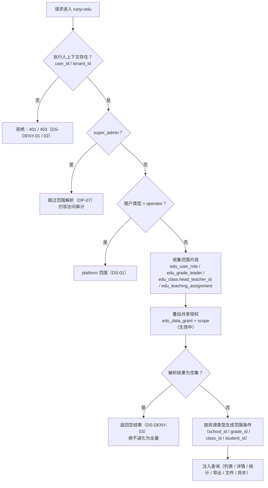

# 数据权限落地架构

## 1. 目标与硬约束

本文件把 `05-permission-matrix.yaml`（能不能做）、`08-data-scope-model.md`（能看哪些数据）、
`10-data-permission-schema.md`（表结构与解析流程）翻译成**可实现的架构**。

三条硬约束（都来自已冻结的规则，不是本文件的新主张）：

| 约束 | 出处 |
|---|---|
| 列表、详情、批量、导出、文件访问、缓存、异步任务**共用同一套判定** | `BR-DATA-007` |
| 教育数据权限**不得被现有租户管理员的放行逻辑绕过** | `BR-DATA-008` / `DS-DENY-05` / `DP-05` |
| 缺少租户、学校或执行人上下文时**拒绝执行**，不降级为全量 | `BR-DATA-006` / `BR-DATA-010` / `DS-DENY-01` / `DS-DENY-03` |

## 2. 四层范围（门禁项：校级 / 年级 / 班级 / 个人）

| 层次 | 范围编号 | 权威来源（表） | 落地方式 |
|---|---|---|---|
| 平台（超级租户） | `DS-01` | 运营方租户身份（`sys_tenant.tenant_type = operator`） | 放行全部；导出需逐次授权并留痕 |
| 租户组织 | `DS-02` / `DS-10` | 学校租户管理员角色 / 集团租户管理员 | 只覆盖组织配置（学年学期、学科、教育角色、学校与校区）；**不含教学数据** |
| 集团自有 | `DS-03` | 集团租户用户 | 只看集团自有数据；**不自动下钻下属学校** |
| **校级** | `DS-04` | `edu_user_role`（`school_leader` / `academic_director`） | 本校全部教育数据 |
| **年级级** | `DS-05` | `edu_grade_leader`（`user_id` + `grade_id` + `term_id`） | 所负责年级 |
| **班级级** | `DS-06` | `edu_class.head_teacher_id`（字段） | 所负责班级 |
| 任教班级 | `DS-07` | `edu_teaching_assignment`（含 `subject_id`） | 任教班级的必要基本资料 + **本人所授学科**数据 |
| **个人级** | `DS-08` / `DS-09` | 当前用户 ID / 家校关系 | 学生看本人；家长看子女（后续端） |
| 额外共享（叠加项） | — | `edu_data_grant` + `edu_data_grant_scope` | 把额外学校租户集合加进已有范围；**只读**，仅限教学资源（`BR-DATA-018`） |

四层（校级 / 年级 / 班级 / 个人）分别落在 `DS-04` / `DS-05` / `DS-06` / `DS-08`，
再加平台、租户组织、集团自有、任教班级、共享授权五类，共九类来源，与 `08-data-scope-model.md` 一致。
**一个用户可同时具备多个范围，取并集**（`BR-DATA-009`，例如年级主任兼任班主任）。

## 3. 解析流程（实现口径）



图源：[`diagrams/permission-flow.mmd`](diagrams/permission-flow.mmd)。

要点：

1. `super_admin` 是数据范围的**唯一例外**（`DP-07`），但仍写访问与写操作审计。
2. 解析发生在**接口入口**，注入发生在**查询构造时**；两者都必须在同一请求内完成，禁止"先在 Controller 判、SQL 里忘了带条件"。
3. 解析结果为空集时返回空列表（`DS-DENY-03`），不是拒绝也不是全量。

## 4. 实现架构

### 4.1 组件与位置

| 组件 | 位置（阶段 7 的包） | 职责 |
|---|---|---|
| `EduDataScope`（枚举） | `org.dromara.edu.datascope` | 九类范围的类型定义 |
| `DataScopeContext` | 同上 | 当前请求的范围片段（ThreadLocal / Sa-Token 的请求上下文） |
| `DataScopeResolver` | 同上 | 收集来源表 + 叠加授权 + 生成范围片段；带 Redis 缓存（`08-cache-strategy.md`） |
| `DataScopeInterceptor`（MyBatis-Plus `InnerInterceptor`） | 同上 | 在 SQL 层注入范围条件；覆盖列表 / 详情 / 统计 / 更新 / 删除 |
| `EduPermissionAspect` | `org.dromara.edu.audit` | 功能权限注解 + 写审计 + 敏感字段留痕 |
| `DataScopeCacheInvalidator` | `org.dromara.edu.datascope` | 业务写操作后删除相关缓存键（第 3 节的失效链路） |

### 4.2 为什么用 SQL 拦截器而不是"每个 Service 自己拼条件"

| 方案 | 问题 |
|---|---|
| 每个 Service 自己拼 `WHERE school_id = ?` | 平均每个模块 15+ 查询，漏一个就是越权；且"先查再判断"（`DS-DENY-07` 明确禁止）会自然出现 |
| **拦截器统一注入**（本方案） | 条件与查询绑在同一个 SQL 里，天然满足"先过滤再取数"；新增查询自动继承，不需要记规则 |
| 只在前端过滤 | 完全无效，接口层必须校验 |

补充：拦截器无法表达的范围（如"任教班级 + 本人所授学科"的字段级裁剪）在 Service 层做**二次裁剪**，
但**不允许**用 Service 层裁剪替代拦截器（可读范围与字段可读性是两件事）。

### 4.3 与 `ruoyi-common-tenant` 的关系（门禁项：不依赖租户管理员放行）

| 能力 | 归属 | 说明 |
|---|---|---|
| 租户隔离（`tenant_id` 条件、租户切换、数据源路由） | `ruoyi-common-tenant`（沿用基线） | 只回答"哪个租户"，不回答"租户内能看哪些行" |
| 教育域数据范围（校级 / 年级 / 班级 / 个人 / 任教 / 共享） | `org.dromara.edu.datascope`（自建） | 独立解析、独立缓存、独立失效 |

**不继承租户管理员放行逻辑**的具体做法：

1. 教育域的 Mapper 不注册基线的"租户管理员跳过数据权限"逻辑；教育域的范围判定入口只有一个（`DataScopeResolver`）。
2. 教育域的表统一纳入 `DataScopeInterceptor` 的处理范围（通过注解或表名前缀 `edu_` 识别），不提供"该表豁免"的后门；
   平台级实体（`edu_student` / `edu_guardian`）按 `DS-DENY-09` 走两段式，**也不是豁免**。
3. 缺少执行人 / 租户 / 学校上下文时直接拒绝（`BR-DATA-006`），不因为"当前登录人是租户管理员"而放行。
4. 教育域的功能权限注解（`@SaCheckPermission`）与数据范围判定是**两道独立闸门**，任一不通过都拒绝。

### 4.4 两段式取数（平台级实体）

`edu_student` 与 `edu_guardian` 是平台级实体（不带 `tenant_id`），读取必须经关系表：

```text
学校侧读学生：
  edu_student_enrollment（tenant_id/school_id 受范围约束）
    INNER JOIN edu_student ON student_id     ← 第二段

学校侧读监护人：
  edu_class_member（范围约束）
    → edu_student_guardian → edu_guardian     ← 第二段

家长读子女（后续端）：
  edu_student_guardian 按 guardian_user_id 过滤 → edu_student
```

禁止直接 `SELECT * FROM edu_student WHERE ...`（`DS-DENY-09`）；
两段式查询的**第一段必须能追溯到 `DS-DENY-01` ~ `08` 中的具体一条**（例如"经班级关系 + `DS-06`"）。

## 5. 拒绝规则矩阵（逐条落点）

| 规则 | 实现落点 | 触发时的用户可见结果 |
|---|---|---|
| `DS-DENY-01` 缺 `tenant_id` 拒绝 | `DataScopeResolver` 入口校验 | 401 / 403 + 说明缺上下文 |
| `DS-DENY-02` 学校级资源缺 `school_id` 且范围非 `platform` 时拒绝 | 同上 | 403 + 说明缺学校上下文 |
| `DS-DENY-03` 范围为空集返回空列表 | 拦截器注入恒假条件（`1=0`），不抛异常 | 空列表 + 页面的空态片段（不显示空白页） |
| `DS-DENY-04` 导出 / 下载 / 异步结果重新解析范围 | 导出与下载入口各自调用解析器，不复用列表页结果 | 导出文件行数可能少于列表（页面上有说明） |
| `DS-DENY-05` 不继承租户管理员放行 | 第 4.3 节四条 | — |
| `DS-DENY-06` 批量操作逐条校验，任一条越权则整体拒绝 | 批量接口先按范围过滤目标集合，再做数量比对；不一致即整体拒绝并列出越权对象 | 明确提示"哪些对象超出范围"，不做部分成功 |
| `DS-DENY-07` 按 ID 查详先前过滤再取数 | 拦截器注入条件 + 详情查询用 `WHERE id = ? AND <范围条件>` | 越权 ID 表现为"查不到"，不泄露存在性 |
| `DS-DENY-08` 计数 / 统计 / 聚合同受约束 | 拦截器同样作用于聚合 SQL（`getStreamStat` 等） | 统计与明细口径一致（`REQ-STR-050`） |
| `DS-DENY-09` 平台级实体两段式 | 第 4.4 节 | 同 `DS-DENY-03` |

## 6. 集团跨学校租户的查询方案（门禁项）

集团租户与学校租户是**平级的两个租户**（`BR-ORG-001`：租户 = 组织单元，层级 运营方 → 集团 → 学校，不超过三级），
因此"集团看下属学校"不是简单的租户树下钻，而是三种路径的取舍：

| 路径 | 能不能看下属学校教学数据 | 首轮结论 | 依据 |
|---|---|---|---|
| 租户树自动下钻（集团租户的查询自动带上下属 `tenant_id`） | 能 | **不做**。`ruoyi-common-tenant` 是"单租户上下文 + `tenant_id` 过滤"，强行下钻会让集团默认看到全校数据，与"集团不默认读下属学校教学数据"冲突 | `BR-DATA-018`、用户 2026-09-30 澄清（`D-051`） |
| 运营方数据共享授权（`edu_data_grant` + `edu_data_grant_scope`） | 只看被授权的**教学资源**（题库习题、试卷等），一律只读 | **做**（表结构已定，首轮不开放写入；题库未开工，故首轮无实际授权对象） | `BR-DATA-011` ~ `018`、`DP-03` / `DP-04` |
| 平台运营 `DS-01` 全平台范围 | 能看全平台（含教学数据），只读 + 留痕 | **做**（运营方排查用），它不是"共享"，而是平台自身的能力 | `DS-01`、`BR-DATA-018` 的例外条款 |

集团自己能看的（`DS-03` / `DS-10`）：

| 能看 | 不能看 |
|---|---|
| 集团自有组织与配置（下属学校列表、校区、学年学期模板、学科配置等**组织配置**） | 下属学校的学生、班级花名册、成绩、选科明细等**教学数据** |
| 集团自身的角色与用户 | 学校的操作日志（除经运营授权） |

**实现口径**：

1. 集团租户用户的 `DataScope` 解析结果 = `group_own`（+ 可能的 `tenant_subtree_org`，仅用于组织配置资源）；
2. 当请求的资源是**教学数据**且当前范围只有 `group_own` / `tenant_subtree_org` 时，按"空集"处理 → 返回空列表（`DS-DENY-03`），
   而不是抛 403：集团打开学校业务菜单时应看到解释性空态，而不是报错页（与阶段 2 / 3 原型一致）；
3. 若未来要给集团开通"看某校教学数据"，只能由运营方创建 `edu_data_grant`（只读），且授权的资源类型受 `BR-DATA-018` 限制
   （题库、试卷等教学资源；学生 / 班级 / 成绩类不在此列）。

## 7. 字段级权限与留痕

| 字段组 | 默认展示 | 全量条件 | 留痕 |
|---|---|---|---|
| 证件号 / 全国学籍号 | 掩码 | `person.student:read_sensitive`（仅教务主任与超管） | 揭示即写 `edu_audit_sensitive_access`（`BR-AUDIT-002` / `REQ-AUD-008`） |
| 联系电话 / 监护人手机号 | 掩码 | `person.student_contact:read_contact`（含班主任） | 同上 |
| 任课教师可见的学生字段 | 学号 + 姓名 + 性别（裁剪） | 不开放 | 不需要 |
| 平台运营访问的任何数据 | 只读 | 需逐次授权（导出） | 写 `edu_audit_operator_access`；租户侧可查（`REQ-AUD-013` ~ `017`） |

掩码展示**不记录**日志（`REQ-AUD-009`）；日志本身不含明文，只记字段名与掩码后的值（`REQ-AUD-010`）。

## 8. 与原型和需求的追溯

| 原型里的表现 | 对应的实现点 |
|---|---|
| 页头 `.scope-hint`（"数据范围：本校（DS-04）· 可写"） | 前端只展示；后端 `DataScopeResolver` 的解析结果 |
| `data-role-visible="academic_director,grade_leader"` | 功能权限（`@SaCheckPermission`）+ 数据范围两道闸门 |
| `data-role-editable`（字段级可编辑） | 字段级权限：Service 层校验 + 前端禁用（后端为准） |
| `data-col-hide-role="subject_teacher"` | 字段裁剪：任课教师不返回联系电话列（`REQ-STR-053` 同口径） |
| 无权限形态页面 | 功能权限缺失 → 403 页；数据范围为空 → 空列表 + 解释性空态 |

## 9. 结论

- 四层范围（校级 / 年级 / 班级 / 个人）分别落在 `DS-04` / `DS-05` / `DS-06` / `DS-08`，另有平台、租户组织、集团自有、任教班级、共享授权五类，共九类来源。
- 不依赖租户管理员放行：教育的范围判定入口唯一（`DataScopeResolver`），教育域表不提供豁免后门，缺上下文直接拒绝。
- 集团跨学校租户的查询方案明确：**默认不下钻**；跨校读取只有"运营授权的教学资源（只读）"与"平台运营 `DS-01`"两条路径；集团打开教学数据菜单得到解释性空态而不是报错。
- `DS-DENY-01` ~ `09` 九条拒绝规则逐条有实现落点，`DS-DENY-07`（先过滤再取数）由 SQL 拦截器天然满足。
