# Mermaid 图汇总（可直接预览）

> 本文件由 `tools/make_diagrams_doc.py` 生成，把仓库里所有 `*.mmd` 源文件嵌成 Mermaid 代码块。
> `.mmd` 是**纯文本**的图定义，不是图片，单独打开看不到图；
> 用支持 Mermaid 的 Markdown 预览器打开本文件即可看到渲染结果：
> VS Code（装 Markdown Preview Mermaid Support / Mermaid Preview 扩展）、Typora、Obsidian、
> 或把代码块内容粘到 <https://mermaid.live>。

## 概要设计 · 架构与流程

### `container.mmd`

源文件：`docs/30-architecture/diagrams/container.mmd`

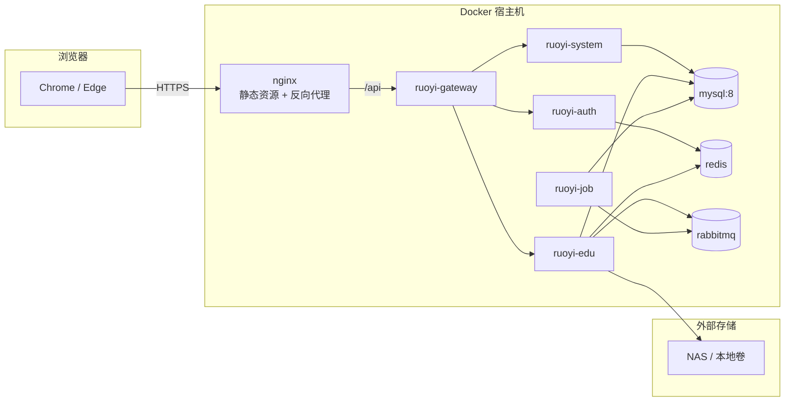
```mermaid
%% 容器视图（对应 02-architecture.md 第 2 节）
flowchart LR
  subgraph 浏览器
    B["Chrome / Edge"]
  end
  subgraph Docker 宿主机
    NX["nginx<br/>静态资源 + 反向代理"]
    GW["ruoyi-gateway"]
    AUTH["ruoyi-auth"]
    SYS["ruoyi-system"]
    EDU["ruoyi-edu"]
    JOB["ruoyi-job"]
    MYSQL[("mysql:8")]
    REDIS[("redis")]
    RMQ[("rabbitmq")]
  end
  subgraph 外部存储
    NAS["NAS / 本地卷"]
  end
  B -->|HTTPS| NX
  NX -->|/api| GW
  GW --> AUTH
  GW --> SYS
  GW --> EDU
  SYS --> MYSQL
  EDU --> MYSQL
  AUTH --> REDIS
  EDU --> REDIS
  EDU --> RMQ
  EDU --> NAS
  JOB --> MYSQL
  JOB --> RMQ
```

### `context.mmd`

源文件：`docs/30-architecture/diagrams/context.mmd`

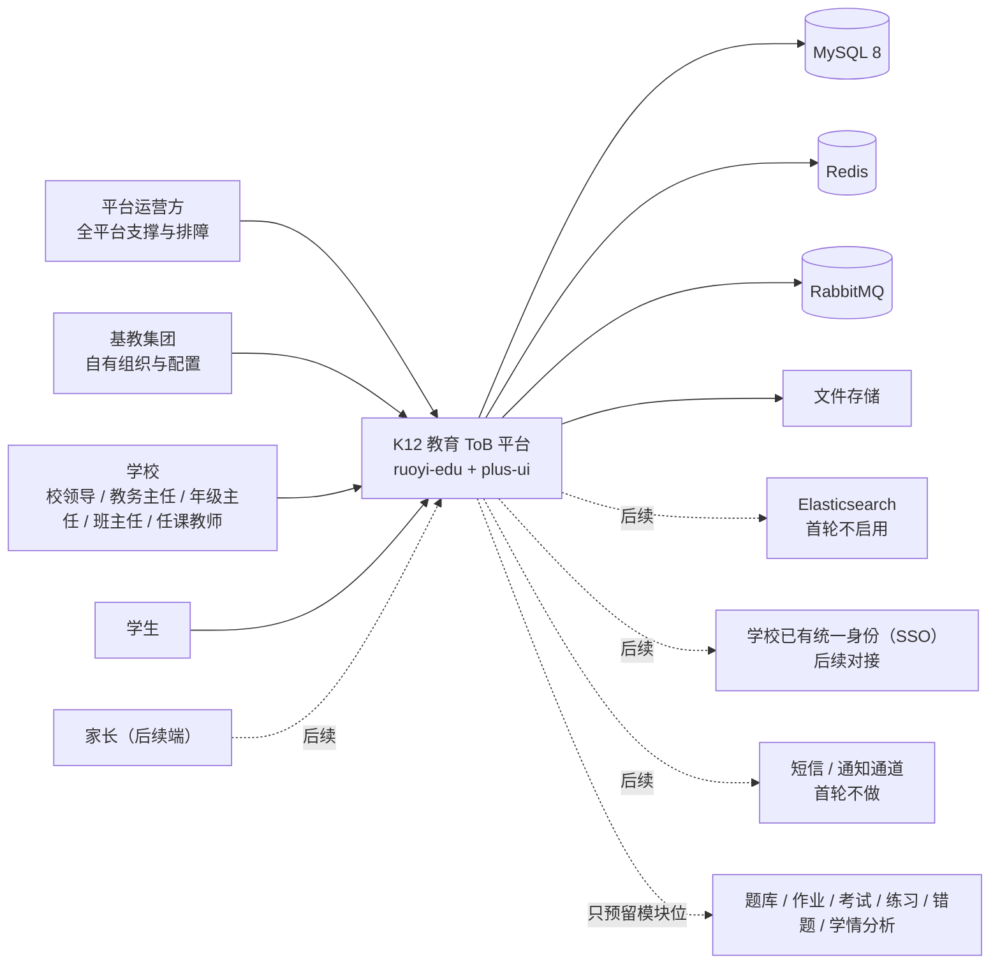
```mermaid
%% 系统上下文（对应 01-system-context.md）
flowchart LR
  OPS["平台运营方<br/>全平台支撑与排障"]
  GROUP["基教集团<br/>自有组织与配置"]
  SCHOOL["学校<br/>校领导 / 教务主任 / 年级主任 / 班主任 / 任课教师"]
  STUDENT["学生"]
  PARENT["家长（后续端）"]

  SYS["K12 教育 ToB 平台<br/>ruoyi-edu + plus-ui"]

  IDP["学校已有统一身份（SSO）<br/>后续对接"]
  SMS["短信 / 通知通道<br/>首轮不做"]
  OSS["文件存储"]
  MYSQL[("MySQL 8")]
  REDIS[("Redis")]
  RMQ[("RabbitMQ")]
  ES["Elasticsearch<br/>首轮不启用"]

  OPS --> SYS
  GROUP --> SYS
  SCHOOL --> SYS
  STUDENT --> SYS
  PARENT -. 后续 .-> SYS

  SYS --> MYSQL
  SYS --> REDIS
  SYS --> RMQ
  SYS --> OSS
  SYS -. 后续 .-> ES
  SYS -. 后续 .-> IDP
  SYS -. 后续 .-> SMS

  SYS -. 只预留模块位 .-> FUTURE["题库 / 作业 / 考试 / 练习 / 错题 / 学情分析"]
```

### `deployment.mmd`

源文件：`docs/30-architecture/diagrams/deployment.mmd`

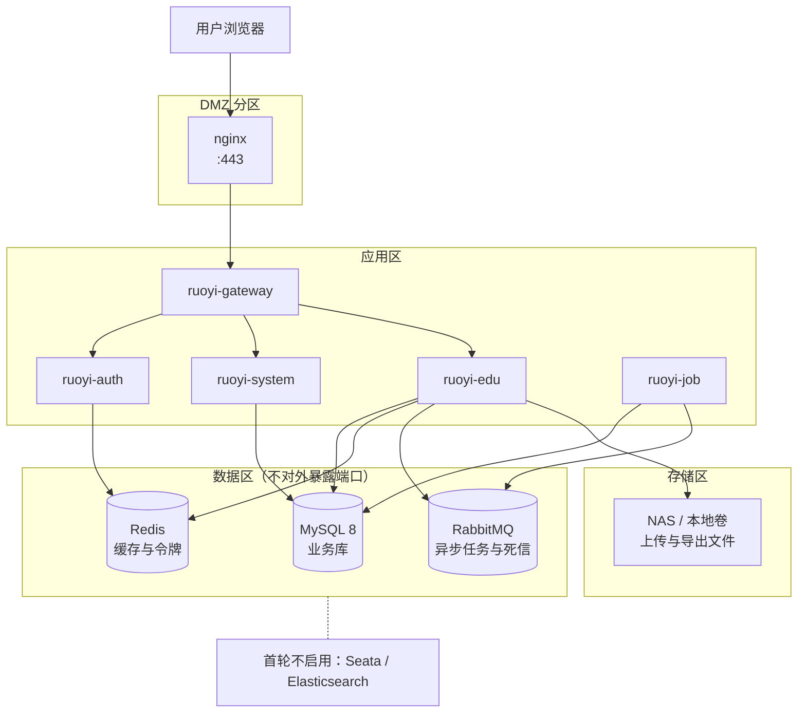
```mermaid
%% 部署视图（对应 02-architecture.md 第 3 节）
flowchart TB
  subgraph DMZ["DMZ 分区"]
    NX["nginx<br/>:443"]
  end
  subgraph APP["应用区"]
    GW["ruoyi-gateway"]
    AUTH["ruoyi-auth"]
    SYS["ruoyi-system"]
    EDU["ruoyi-edu"]
    JOB["ruoyi-job"]
  end
  subgraph DATA["数据区（不对外暴露端口）"]
    MYSQL[("MySQL 8<br/>业务库")]
    REDIS[("Redis<br/>缓存与令牌")]
    RMQ[("RabbitMQ<br/>异步任务与死信")]
  end
  subgraph STORE["存储区"]
    NAS["NAS / 本地卷<br/>上传与导出文件"]
  end
  USER["用户浏览器"] --> NX
  NX --> GW
  GW --> AUTH
  GW --> SYS
  GW --> EDU
  AUTH --> REDIS
  SYS --> MYSQL
  EDU --> MYSQL
  EDU --> REDIS
  EDU --> RMQ
  EDU --> NAS
  JOB --> MYSQL
  JOB --> RMQ
  NOTE["首轮不启用：Seata / Elasticsearch"]
  DATA -.- NOTE
```

### `logical.mmd`

源文件：`docs/30-architecture/diagrams/logical.mmd`

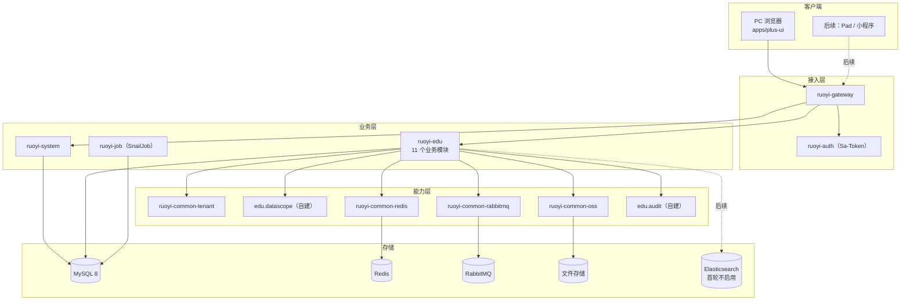
```mermaid
%% 逻辑架构（对应 02-architecture.md 第 1 节）
flowchart TB
  subgraph 客户端
    PC["PC 浏览器<br/>apps/plus-ui"]
    MOBILE["后续：Pad / 小程序"]
  end

  subgraph 接入层
    GW["ruoyi-gateway"]
    AUTH["ruoyi-auth（Sa-Token）"]
  end

  subgraph 业务层
    EDU["ruoyi-edu<br/>11 个业务模块"]
    SYS["ruoyi-system"]
    JOB["ruoyi-job（SnailJob）"]
  end

  subgraph 能力层
    TENANT["ruoyi-common-tenant"]
    DATAPERM["edu.datascope（自建）"]
    OSS["ruoyi-common-oss"]
    MQ["ruoyi-common-rabbitmq"]
    REDIS["ruoyi-common-redis"]
    AUDIT["edu.audit（自建）"]
  end

  subgraph 存储
    MYSQL[("MySQL 8")]
    REDISDB[("Redis")]
    RMQ[("RabbitMQ")]
    FILE[("文件存储")]
    ES[("Elasticsearch<br/>首轮不启用")]
  end

  PC --> GW
  MOBILE -. 后续 .-> GW
  GW --> AUTH
  GW --> EDU
  GW --> SYS
  EDU --> TENANT
  EDU --> DATAPERM
  EDU --> AUDIT
  EDU --> OSS
  EDU --> MQ
  EDU --> REDIS
  SYS --> MYSQL
  EDU --> MYSQL
  REDIS --> REDISDB
  MQ --> RMQ
  OSS --> FILE
  JOB --> MYSQL
  EDU -. 后续 .-> ES
```

### `permission-flow.mmd`

源文件：`docs/30-architecture/diagrams/permission-flow.mmd`

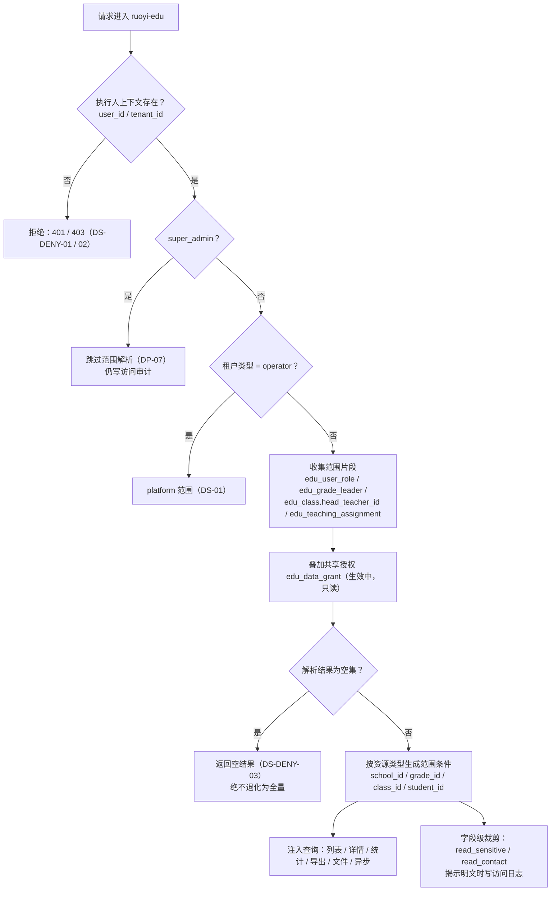
```mermaid
%% 数据权限解析流程（对应 09-permission-architecture.md 第 3 节）
flowchart TB
  A["请求进入 ruoyi-edu"] --> B{"执行人上下文存在？<br/>user_id / tenant_id"}
  B -- 否 --> R1["拒绝：401 / 403（DS-DENY-01 / 02）"]
  B -- 是 --> C{"super_admin？"}
  C -- 是 --> P1["跳过范围解析（DP-07）<br/>仍写访问审计"]
  C -- 否 --> D{"租户类型 = operator？"}
  D -- 是 --> P2["platform 范围（DS-01）"]
  D -- 否 --> E["收集范围片段<br/>edu_user_role / edu_grade_leader /<br/>edu_class.head_teacher_id / edu_teaching_assignment"]
  E --> F["叠加共享授权 edu_data_grant（生效中，只读）"]
  F --> G{"解析结果为空集？"}
  G -- 是 --> R2["返回空结果（DS-DENY-03）<br/>绝不退化为全量"]
  G -- 否 --> H["按资源类型生成范围条件<br/>school_id / grade_id / class_id / student_id"]
  H --> I["注入查询：列表 / 详情 / 统计 / 导出 / 文件 / 异步"]
  H --> J["字段级裁剪：read_sensitive / read_contact<br/>揭示明文时写访问日志"]
```

### `state.mmd`

源文件：`docs/30-architecture/diagrams/state.mmd`

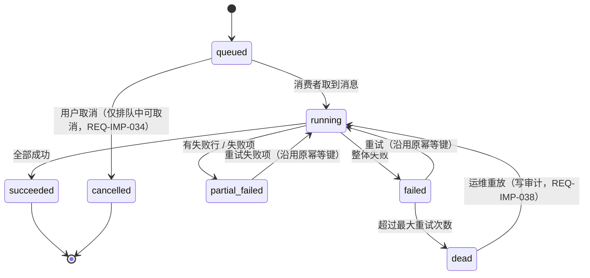
```mermaid
%% 异步任务状态机（对应 07-sync-async-boundary.md 第 4 节）
stateDiagram-v2
  [*] --> queued
  queued --> running : 消费者取到消息
  queued --> cancelled : 用户取消（仅排队中可取消，REQ-IMP-034）
  running --> succeeded : 全部成功
  running --> partial_failed : 有失败行 / 失败项
  running --> failed : 整体失败
  partial_failed --> running : 重试失败项（沿用原幂等键）
  failed --> running : 重试（沿用原幂等键）
  failed --> dead : 超过最大重试次数
  dead --> running : 运维重放（写审计，REQ-IMP-038）
  succeeded --> [*]
  cancelled --> [*]
```

## 详细设计 · ER 图

### `er-diagram.mmd`

源文件：`docs/40-detailed-design/database/er-diagram.mmd`

```mermaid
%% ER 图（仅物理外键，与 V5__edu_foreign_keys.sql 一致）
%% 生成工具 tools/gen_schema_artifacts.py；事实源 database/schema.yaml
erDiagram
  edu_academic_year {
    bigint_unsigned id
    varchar20 tenant_id
    bigint_unsigned school_id
    varchar20 academic_year_code
    date start_date
    date end_date
    varchar16 academic_year_status
    bigint_unsigned create_by
    datetime create_time
    bigint_unsigned update_by
    datetime update_time
  }
  edu_activation_code {
    bigint_unsigned id
    varchar20 tenant_id
    bigint_unsigned school_id
    bigint_unsigned student_id
    varchar64 code
    varchar20 status
    varchar32 issue_batch_no
    datetime print_time
    datetime used_time
    varchar64 used_ip
    bigint_unsigned reset_by
    datetime reset_time
  }
  edu_async_task {
    bigint_unsigned id
    varchar20 tenant_id
    bigint_unsigned school_id
    varchar32 task_no
    varchar30 task_type
    varchar20 task_status
    tinyint_unsigned progress_percent
    bigint_unsigned owner_id
    varchar30 owner_role
    json params_summary
    int total_count
    int success_count
  }
  edu_async_task_retry {
    bigint_unsigned id
    varchar20 tenant_id
    bigint_unsigned school_id
    varchar32 task_no
    tinyint_unsigned retry_no
    varchar20 result
    varchar500 error_msg
    datetime create_time
  }
  edu_audit_change {
    bigint_unsigned id
    varchar20 tenant_id
    bigint_unsigned school_id
    bigint_unsigned log_id
    varchar64 field_name
    varchar1000 before_value
    varchar1000 after_value
  }
  edu_audit_log {
    bigint_unsigned id
    varchar20 tenant_id
    bigint_unsigned school_id
    varchar30 action_type
    varchar30 module_code
    varchar50 object_type
    varchar64 object_id
    varchar200 object_name
    bigint_unsigned operator_id
    varchar30 operator_role
    varchar64 client_ip
    varchar64 request_id
  }
  edu_class {
    bigint_unsigned id
    varchar20 tenant_id
    bigint_unsigned school_id
    bigint_unsigned term_id
    bigint_unsigned grade_id
    varchar20 stage_code
    varchar100 class_name
    varchar20 class_type
    int class_capacity
    bigint_unsigned head_teacher_id
    date head_teacher_start_date
    date head_teacher_end_date
  }
  edu_class_member {
    bigint_unsigned id
    varchar20 tenant_id
    bigint_unsigned school_id
    bigint_unsigned term_id
    bigint_unsigned class_id
    varchar20 class_type
    bigint_unsigned student_id
    bigint_unsigned student_enrollment_id
    date join_date
    date leave_date
    char1 status
    char1 gender_snapshot
  }
  edu_data_grant {
    bigint_unsigned id
    varchar20 tenant_id
    varchar32 grant_no
    bigint_unsigned grantor_user_id
    varchar20 grantee_type
    varchar64 grantee_id
    varchar200 title
    varchar500 reason
    varchar200 resource_types
    json resource_scope
    datetime effective_start
    datetime effective_end
  }
  edu_data_grant_scope {
    bigint_unsigned id
    varchar20 tenant_id
    bigint_unsigned grant_id
    varchar20 scope_type
    varchar64 scope_id
    varchar64 resource_code
    varchar20 access_level
    datetime create_time
  }
  edu_enrollment_change {
    bigint_unsigned id
    varchar20 tenant_id
    bigint_unsigned school_id
    bigint_unsigned student_id
    bigint_unsigned school_record_id
    varchar30 change_type
    varchar20 before_status
    varchar20 after_status
    date effective_date
    varchar500 reason
    varchar20 approval_status
    bigint_unsigned approve_by
  }
  edu_grade {
    bigint_unsigned id
    varchar20 tenant_id
    bigint_unsigned school_id
    varchar20 stage_code
    smallint enroll_year
    tinyint grade_level
    varchar50 grade_name
    int class_count
    int student_count
    varchar20 grade_status
    bigint_unsigned create_by
    datetime create_time
  }
  edu_grade_leader {
    bigint_unsigned id
    varchar20 tenant_id
    bigint_unsigned school_id
    bigint_unsigned grade_id
    bigint_unsigned term_id
    bigint_unsigned user_id
    bigint_unsigned teacher_id
    char1 is_primary
    char1 status
    bigint_unsigned create_by
    datetime create_time
    bigint_unsigned update_by
  }
  edu_guardian {
    bigint_unsigned id
    varchar50 guardian_name
    varchar20 guardian_phone
    varchar64 id_card_no
    bigint_unsigned user_id
    char1 status
    bigint_unsigned create_by
    datetime create_time
    bigint_unsigned update_by
    datetime update_time
    char1 del_flag
  }
  edu_import_batch {
    bigint_unsigned id
    varchar20 tenant_id
    bigint_unsigned school_id
    varchar32 batch_no
    varchar30 module_code
    varchar20 template_version
    varchar32 async_task_no
    bigint_unsigned source_file_id
    bigint_unsigned result_file_id
    bigint_unsigned failed_file_id
    int row_total
    int valid_count
  }
  edu_promotion_item {
    bigint_unsigned id
    varchar20 tenant_id
    bigint_unsigned school_id
    bigint_unsigned task_id
    bigint_unsigned student_id
    bigint_unsigned source_class_id
    bigint_unsigned target_class_id
    varchar20 result_type
    varchar20 item_status
    varchar500 error_msg
    varchar20 adjust_mode
    datetime create_time
  }
  edu_promotion_task {
    bigint_unsigned id
    varchar20 tenant_id
    bigint_unsigned school_id
    varchar32 task_no
    bigint_unsigned source_term_id
    bigint_unsigned target_term_id
    varchar500 scope_note
    varchar20 task_status
    int total_count
    int success_count
    int failed_count
    int repeat_count
  }
  edu_stream_change_request {
    bigint_unsigned id
    varchar20 tenant_id
    bigint_unsigned school_id
    varchar32 request_no
    bigint_unsigned student_id
    bigint_unsigned term_id
    varchar64 before_combination
    varchar64 after_combination
    varchar20 primary_subject_code
    varchar64 secondary_subject_codes
    varchar20 request_status
    varchar500 reason
  }
  edu_stream_config {
    bigint_unsigned id
    varchar20 tenant_id
    bigint_unsigned school_id
    bigint_unsigned term_id
    datetime stream_open_from
    datetime stream_deadline
    tinyint1 overdue_requires_approval
    varchar20 config_status
    bigint_unsigned create_by
    datetime create_time
    bigint_unsigned update_by
    datetime update_time
  }
  edu_stream_history {
    bigint_unsigned id
    varchar20 tenant_id
    bigint_unsigned school_id
    bigint_unsigned student_id
    bigint_unsigned term_id
    varchar64 before_combination
    varchar64 after_combination
    varchar20 change_type
    varchar32 request_no
    varchar500 reason
    bigint_unsigned operator
    datetime operate_time
  }
  edu_student {
    bigint_unsigned id
    varchar32 student_no
    varchar64 national_student_no
    varchar50 student_name
    char1 gender
    varchar20 id_type
    varchar64 id_card_no
    date birth_date
    smallint enroll_year
    date graduation_date
    varchar255 photo_url
    varchar500 remark
  }
  edu_student_enrollment {
    bigint_unsigned id
    varchar20 tenant_id
    bigint_unsigned school_id
    bigint_unsigned student_id
    date enroll_date
    varchar20 enrollment_status
    date status_effective_date
    date leave_date
    bigint_unsigned campus_id
    bigint_unsigned entry_grade_id
    varchar500 remark
    bigint_unsigned create_by
  }
  edu_student_field_change {
    bigint_unsigned id
    varchar20 tenant_id
    bigint_unsigned school_id
    bigint_unsigned student_id
    varchar64 field_name
    varchar500 old_value
    varchar500 new_value
    bigint_unsigned apply_by_user_id
    varchar500 apply_reason
    varchar20 status
    bigint_unsigned audit_by
    datetime audit_time
  }
  edu_student_guardian {
    bigint_unsigned id
    bigint_unsigned student_id
    bigint_unsigned guardian_id
    varchar20 relation
    char1 is_primary
    varchar20 bind_status
    varchar20 source
    bigint_unsigned audit_by
    datetime audit_time
    varchar500 audit_opinion
    datetime bind_time
    datetime unbind_time
  }
  edu_student_stream {
    bigint_unsigned id
    varchar20 tenant_id
    bigint_unsigned school_id
    bigint_unsigned term_id
    bigint_unsigned student_id
    varchar20 primary_subject_code
    varchar64 secondary_subject_codes
    datetime effective_time
    varchar20 stream_status
    bigint_unsigned create_by
    datetime create_time
    bigint_unsigned update_by
  }
  edu_subject {
    bigint_unsigned id
    varchar20 tenant_id
    bigint_unsigned school_id
    varchar32 subject_code
    varchar50 subject_name
    int sort_no
    char1 stream_enabled
    varchar20 stream_role
    varchar16 subject_status
    bigint_unsigned create_by
    datetime create_time
    bigint_unsigned update_by
  }
  edu_subject_stage {
    bigint_unsigned id
    varchar20 tenant_id
    bigint_unsigned school_id
    bigint_unsigned subject_id
    varchar20 stage_code
    char1 status
    bigint_unsigned create_by
    datetime create_time
    bigint_unsigned update_by
    datetime update_time
  }
  edu_teacher {
    bigint_unsigned id
    varchar20 tenant_id
    bigint_unsigned school_id
    varchar32 teacher_no
    varchar50 teacher_name
    char1 gender
    varchar20 phone
    varchar100 email
    date hire_date
    varchar20 employment_status
    date leave_date
    bigint_unsigned user_id
  }
  edu_teaching_assignment {
    bigint_unsigned id
    varchar20 tenant_id
    bigint_unsigned school_id
    bigint_unsigned term_id
    bigint_unsigned teacher_id
    bigint_unsigned subject_id
    varchar20 class_type
    bigint_unsigned class_id
    char1 status
    bigint_unsigned create_by
    datetime create_time
    bigint_unsigned update_by
  }
  edu_teaching_class {
    bigint_unsigned id
    varchar20 tenant_id
    bigint_unsigned school_id
    bigint_unsigned term_id
    bigint_unsigned grade_id
    varchar100 class_name
    varchar64 combination
    int member_count
    varchar16 teaching_class_status
    bigint_unsigned create_by
    datetime create_time
    bigint_unsigned update_by
  }
  edu_teaching_class_member {
    bigint_unsigned id
    varchar20 tenant_id
    bigint_unsigned school_id
    bigint_unsigned teaching_class_id
    bigint_unsigned term_id
    bigint_unsigned student_id
    varchar20 source
    varchar32 generate_task_no
    date join_date
    date leave_date
    char1 status
    bigint_unsigned create_by
  }
  edu_term {
    bigint_unsigned id
    varchar20 tenant_id
    bigint_unsigned school_id
    bigint_unsigned academic_year_id
    varchar20 term_code
    varchar50 term_name
    date start_date
    date end_date
    char1 is_current
    varchar16 term_status
    bigint_unsigned create_by
    datetime create_time
  }
  edu_transfer_order {
    bigint_unsigned id
    varchar20 tenant_id
    bigint_unsigned school_id
    varchar32 transfer_no
    bigint_unsigned student_id
    varchar20 from_tenant_id
    bigint_unsigned from_school_id
    bigint_unsigned from_grade_id
    varchar20 to_tenant_id
    bigint_unsigned to_school_id
    bigint_unsigned to_grade_id
    bigint_unsigned to_class_id
  }
  edu_student ||--o{ edu_student_enrollment : "fk_enrollment_student"
  edu_student ||--o{ edu_student_guardian : "fk_sg_student"
  edu_guardian ||--o{ edu_student_guardian : "fk_sg_guardian"
  edu_student ||--o{ edu_student_field_change : "fk_sfc_student"
  edu_student ||--o{ edu_activation_code : "fk_activation_student"
  edu_grade ||--o{ edu_grade_leader : "fk_grade_leader_grade"
  edu_teacher ||--o{ edu_teaching_assignment : "fk_assignment_teacher"
  edu_subject ||--o{ edu_teaching_assignment : "fk_assignment_subject"
  edu_grade ||--o{ edu_class : "fk_class_grade"
  edu_term ||--o{ edu_class : "fk_class_term"
  edu_teacher ||--o{ edu_class : "fk_class_head_teacher"
  edu_class ||--o{ edu_class_member : "fk_member_class"
  edu_student ||--o{ edu_class_member : "fk_member_student"
  edu_term ||--o{ edu_teaching_class : "fk_tclass_term"
  edu_teaching_class ||--o{ edu_teaching_class_member : "fk_tcm_class"
  edu_student ||--o{ edu_teaching_class_member : "fk_tcm_student"
  edu_term ||--o{ edu_promotion_task : "fk_promotion_source_term"
  edu_term ||--o{ edu_promotion_task : "fk_promotion_target_term"
  edu_promotion_task ||--o{ edu_promotion_item : "fk_promotion_item_task"
  edu_student ||--o{ edu_promotion_item : "fk_promotion_item_student"
  edu_student ||--o{ edu_enrollment_change : "fk_change_student"
  edu_student ||--o{ edu_transfer_order : "fk_transfer_student"
  edu_term ||--o{ edu_stream_config : "fk_stream_config_term"
  edu_student ||--o{ edu_student_stream : "fk_student_stream_student"
  edu_student ||--o{ edu_stream_change_request : "fk_stream_request_student"
  edu_student ||--o{ edu_stream_history : "fk_stream_history_student"
  edu_subject ||--o{ edu_subject_stage : "fk_subject_stage_subject"
  edu_academic_year ||--o{ edu_term : "fk_term_year"
  edu_async_task ||--o{ edu_import_batch : "fk_import_batch_task"
  edu_async_task ||--o{ edu_async_task_retry : "fk_task_retry_task"
  edu_audit_log ||--o{ edu_audit_change : "fk_audit_change_log"
  edu_data_grant ||--o{ edu_data_grant_scope : "fk_grant_scope_grant"
```

## 详细设计 · 时序图

### `audit-archive.mmd`

源文件：`docs/40-detailed-design/diagrams/sequence/audit-archive.mmd`

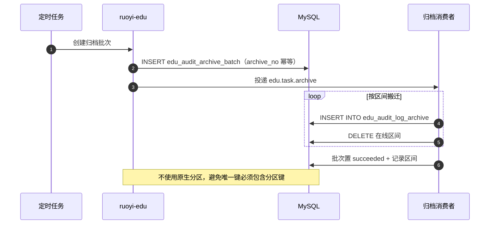
```mermaid
sequenceDiagram
  autonumber
  participant S as 定时任务
  participant API as ruoyi-edu
  participant DB as MySQL
  participant ARC as 归档消费者

  S->>API: 创建归档批次
  API->>DB: INSERT edu_audit_archive_batch（archive_no 幂等）
  API->>ARC: 投递 edu.task.archive
  loop 按区间搬迁
    ARC->>DB: INSERT INTO edu_audit_log_archive
    ARC->>DB: DELETE 在线区间
  end
  ARC->>DB: 批次置 succeeded + 记录区间
  Note over API,DB: 不使用原生分区，避免唯一键必须包含分区键
```

### `audit-write.mmd`

源文件：`docs/40-detailed-design/diagrams/sequence/audit-write.mmd`

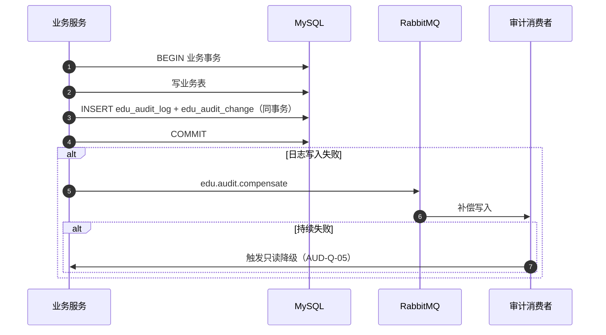
```mermaid
sequenceDiagram
  autonumber
  participant API as 业务服务
  participant DB as MySQL
  participant MQ as RabbitMQ
  participant AC as 审计消费者

  API->>DB: BEGIN 业务事务
  API->>DB: 写业务表
  API->>DB: INSERT edu_audit_log + edu_audit_change（同事务）
  API->>DB: COMMIT
  alt 日志写入失败
    API->>MQ: edu.audit.compensate
    MQ->>AC: 补偿写入
    alt 持续失败
      AC->>API: 触发只读降级（AUD-Q-05）
    end
  end
```

### `class-roster-import.mmd`

源文件：`docs/40-detailed-design/diagrams/sequence/class-roster-import.mmd`

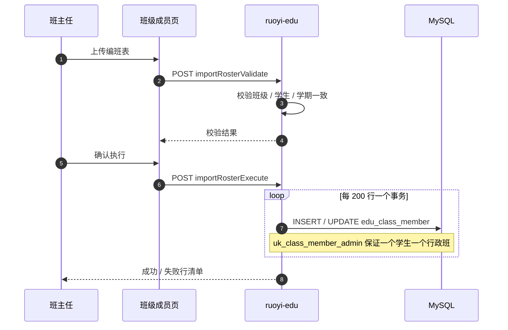
```mermaid
sequenceDiagram
  autonumber
  participant T as 班主任
  participant UI as 班级成员页
  participant API as ruoyi-edu
  participant DB as MySQL

  T->>UI: 上传编班表
  UI->>API: POST importRosterValidate
  API->>API: 校验班级 / 学生 / 学期一致
  API-->>UI: 校验结果
  T->>UI: 确认执行
  UI->>API: POST importRosterExecute
  loop 每 200 行一个事务
    API->>DB: INSERT / UPDATE edu_class_member
    Note over API,DB: uk_class_member_admin 保证一个学生一个行政班
  end
  API-->>T: 成功 / 失败行清单
```

### `class-transfer.mmd`

源文件：`docs/40-detailed-design/diagrams/sequence/class-transfer.mmd`

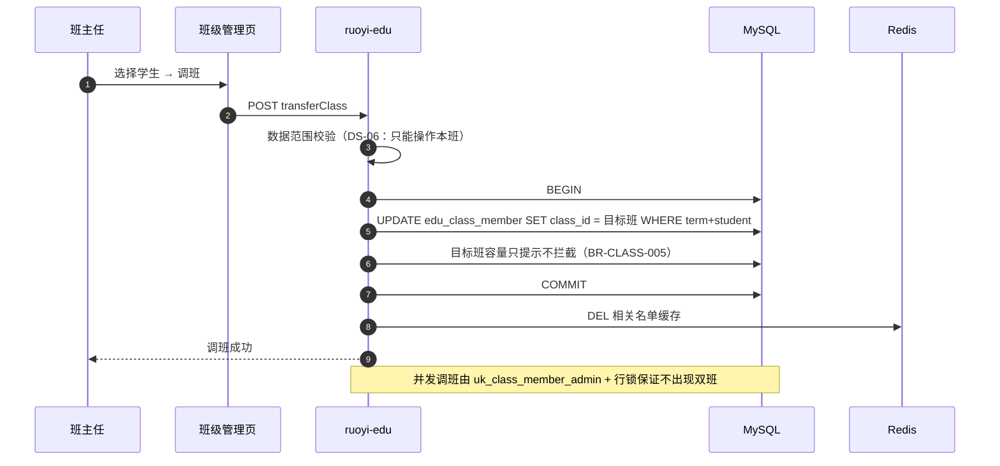
```mermaid
sequenceDiagram
  autonumber
  participant T as 班主任
  participant UI as 班级管理页
  participant API as ruoyi-edu
  participant DB as MySQL
  participant R as Redis

  T->>UI: 选择学生 → 调班
  UI->>API: POST transferClass
  API->>API: 数据范围校验（DS-06：只能操作本班）
  API->>DB: BEGIN
  API->>DB: UPDATE edu_class_member SET class_id = 目标班 WHERE term+student
  API->>DB: 目标班容量只提示不拦截（BR-CLASS-005）
  API->>DB: COMMIT
  API->>R: DEL 相关名单缓存
  API-->>T: 调班成功
  Note over API,DB: 并发调班由 uk_class_member_admin + 行锁保证不出现双班
```

### `data-grant.mmd`

源文件：`docs/40-detailed-design/diagrams/sequence/data-grant.mmd`

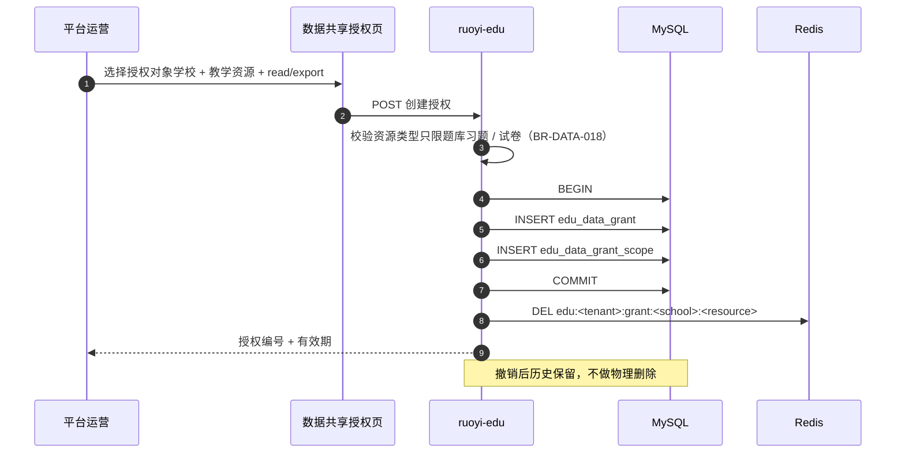
```mermaid
sequenceDiagram
  autonumber
  participant O as 平台运营
  participant UI as 数据共享授权页
  participant API as ruoyi-edu
  participant DB as MySQL
  participant R as Redis

  O->>UI: 选择授权对象学校 + 教学资源 + read/export
  UI->>API: POST 创建授权
  API->>API: 校验资源类型只限题库习题 / 试卷（BR-DATA-018）
  API->>DB: BEGIN
  API->>DB: INSERT edu_data_grant
  API->>DB: INSERT edu_data_grant_scope
  API->>DB: COMMIT
  API->>R: DEL edu:<tenant>:grant:<school>:<resource>
  API-->>O: 授权编号 + 有效期
  Note over API,DB: 撤销后历史保留，不做物理删除
```

### `export-generate.mmd`

源文件：`docs/40-detailed-design/diagrams/sequence/export-generate.mmd`

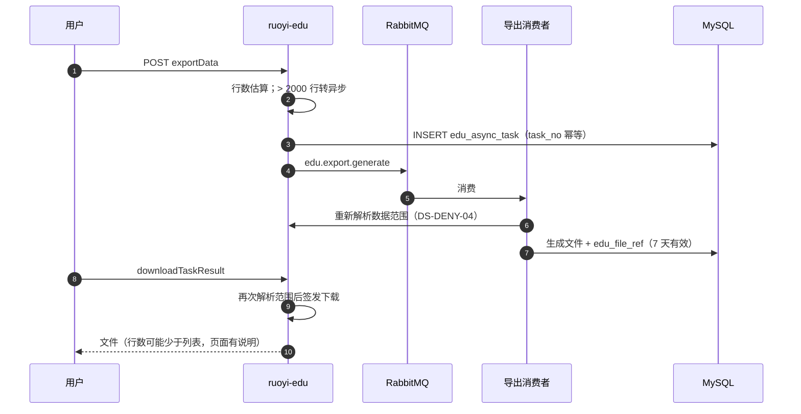
```mermaid
sequenceDiagram
  autonumber
  participant U as 用户
  participant API as ruoyi-edu
  participant MQ as RabbitMQ
  participant W as 导出消费者
  participant DB as MySQL

  U->>API: POST exportData
  API->>API: 行数估算；> 2000 行转异步
  API->>DB: INSERT edu_async_task（task_no 幂等）
  API->>MQ: edu.export.generate
  MQ->>W: 消费
  W->>API: 重新解析数据范围（DS-DENY-04）
  W->>DB: 生成文件 + edu_file_ref（7 天有效）
  U->>API: downloadTaskResult
  API->>API: 再次解析范围后签发下载
  API-->>U: 文件（行数可能少于列表，页面有说明）
```

### `import-execute.mmd`

源文件：`docs/40-detailed-design/diagrams/sequence/import-execute.mmd`

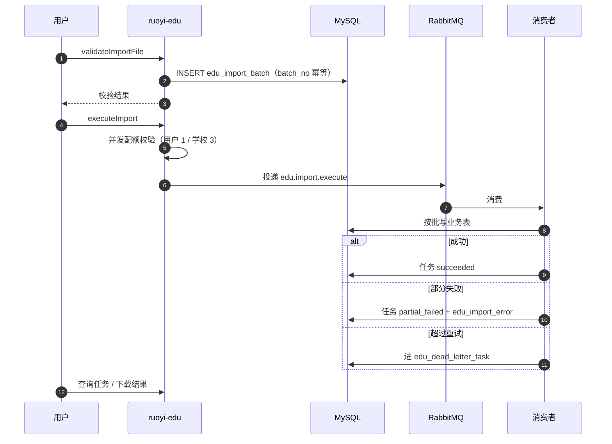
```mermaid
sequenceDiagram
  autonumber
  participant U as 用户
  participant API as ruoyi-edu
  participant DB as MySQL
  participant MQ as RabbitMQ
  participant W as 消费者

  U->>API: validateImportFile
  API->>DB: INSERT edu_import_batch（batch_no 幂等）
  API-->>U: 校验结果
  U->>API: executeImport
  API->>API: 并发配额校验（用户 1 / 学校 3）
  API->>MQ: 投递 edu.import.execute
  MQ->>W: 消费
  W->>DB: 按批写业务表
  alt 成功
    W->>DB: 任务 succeeded
  else 部分失败
    W->>DB: 任务 partial_failed + edu_import_error
  else 超过重试
    W->>DB: 进 edu_dead_letter_task
  end
  U->>API: 查询任务 / 下载结果
```

### `promotion-execute.mmd`

源文件：`docs/40-detailed-design/diagrams/sequence/promotion-execute.mmd`

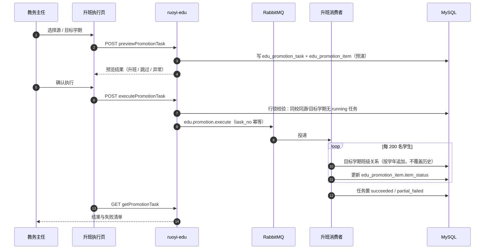
```mermaid
sequenceDiagram
  autonumber
  participant A as 教务主任
  participant UI as 升班执行页
  participant API as ruoyi-edu
  participant MQ as RabbitMQ
  participant W as 升班消费者
  participant DB as MySQL

  A->>UI: 选择源 / 目标学期
  UI->>API: POST previewPromotionTask
  API->>DB: 写 edu_promotion_task + edu_promotion_item（预演）
  API-->>UI: 预览结果（升班 / 跳过 / 异常）
  A->>UI: 确认执行
  UI->>API: POST executePromotionTask
  API->>DB: 行锁校验：同校同源/目标学期无 running 任务
  API->>MQ: edu.promotion.execute（task_no 幂等）
  MQ->>W: 投递
  loop 每 200 名学生
    W->>DB: 目标学期班级关系（按学年追加，不覆盖历史）
    W->>DB: 更新 edu_promotion_item.item_status
  end
  W->>DB: 任务置 succeeded / partial_failed
  UI->>API: GET getPromotionTask
  API-->>A: 结果与失败清单
```

### `school-baseline.mmd`

源文件：`docs/40-detailed-design/diagrams/sequence/school-baseline.mmd`

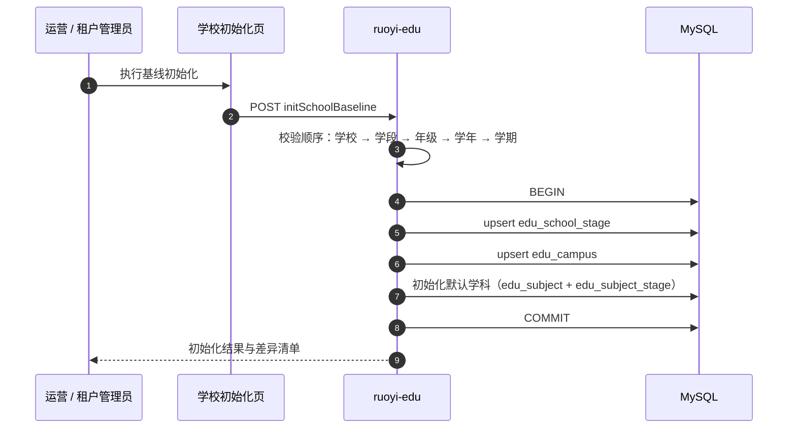
```mermaid
sequenceDiagram
  autonumber
  participant O as 运营 / 租户管理员
  participant UI as 学校初始化页
  participant API as ruoyi-edu
  participant DB as MySQL

  O->>UI: 执行基线初始化
  UI->>API: POST initSchoolBaseline
  API->>API: 校验顺序：学校 → 学段 → 年级 → 学年 → 学期
  API->>DB: BEGIN
  API->>DB: upsert edu_school_stage
  API->>DB: upsert edu_campus
  API->>DB: 初始化默认学科（edu_subject + edu_subject_stage）
  API->>DB: COMMIT
  API-->>O: 初始化结果与差异清单
```

### `stream-submit.mmd`

源文件：`docs/40-detailed-design/diagrams/sequence/stream-submit.mmd`

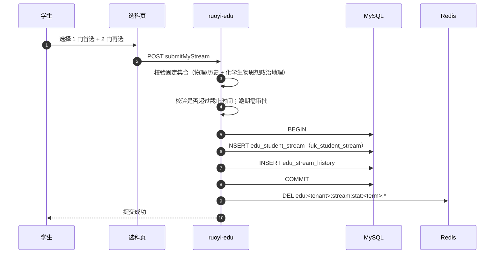
```mermaid
sequenceDiagram
  autonumber
  participant S as 学生
  participant UI as 选科页
  participant API as ruoyi-edu
  participant DB as MySQL
  participant R as Redis

  S->>UI: 选择 1 门首选 + 2 门再选
  UI->>API: POST submitMyStream
  API->>API: 校验固定集合（物理/历史 + 化学生物思想政治地理）
  API->>API: 校验是否超过截止时间；逾期需审批
  API->>DB: BEGIN
  API->>DB: INSERT edu_student_stream（uk_student_stream）
  API->>DB: INSERT edu_stream_history
  API->>DB: COMMIT
  API->>R: DEL edu:<tenant>:stream:stat:<term>:*
  API-->>S: 提交成功
```

### `student-enroll.mmd`

源文件：`docs/40-detailed-design/diagrams/sequence/student-enroll.mmd`

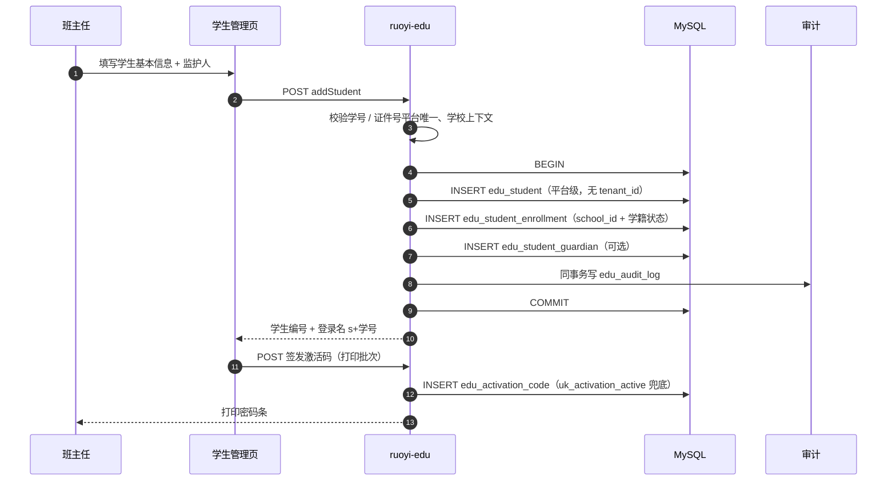
```mermaid
sequenceDiagram
  autonumber
  participant T as 班主任
  participant UI as 学生管理页
  participant API as ruoyi-edu
  participant DB as MySQL
  participant AUD as 审计

  T->>UI: 填写学生基本信息 + 监护人
  UI->>API: POST addStudent
  API->>API: 校验学号 / 证件号平台唯一、学校上下文
  API->>DB: BEGIN
  API->>DB: INSERT edu_student（平台级，无 tenant_id）
  API->>DB: INSERT edu_student_enrollment（school_id + 学籍状态）
  API->>DB: INSERT edu_student_guardian（可选）
  API->>AUD: 同事务写 edu_audit_log
  API->>DB: COMMIT
  API-->>UI: 学生编号 + 登录名 s+学号
  UI->>API: POST 签发激活码（打印批次）
  API->>DB: INSERT edu_activation_code（uk_activation_active 兜底）
  API-->>T: 打印密码条
```

### `student-import.mmd`

源文件：`docs/40-detailed-design/diagrams/sequence/student-import.mmd`

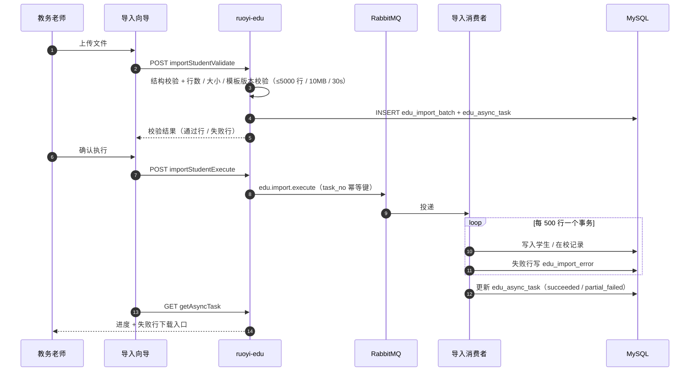
```mermaid
sequenceDiagram
  autonumber
  participant T as 教务老师
  participant UI as 导入向导
  participant API as ruoyi-edu
  participant MQ as RabbitMQ
  participant W as 导入消费者
  participant DB as MySQL

  T->>UI: 上传文件
  UI->>API: POST importStudentValidate
  API->>API: 结构校验 + 行数 / 大小 / 模板版本校验（≤5000 行 / 10MB / 30s）
  API->>DB: INSERT edu_import_batch + edu_async_task
  API-->>UI: 校验结果（通过行 / 失败行）
  T->>UI: 确认执行
  UI->>API: POST importStudentExecute
  API->>MQ: edu.import.execute（task_no 幂等键）
  MQ->>W: 投递
  loop 每 500 行一个事务
    W->>DB: 写入学生 / 在校记录
    W->>DB: 失败行写 edu_import_error
  end
  W->>DB: 更新 edu_async_task（succeeded / partial_failed）
  UI->>API: GET getAsyncTask
  API-->>T: 进度 + 失败行下载入口
```

### `teacher-assignment.mmd`

源文件：`docs/40-detailed-design/diagrams/sequence/teacher-assignment.mmd`

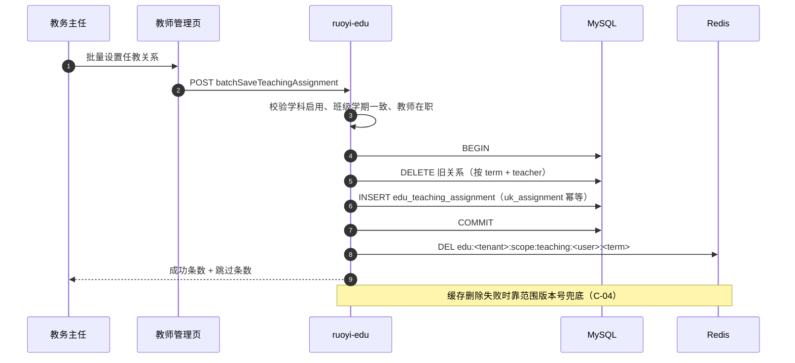
```mermaid
sequenceDiagram
  autonumber
  participant A as 教务主任
  participant UI as 教师管理页
  participant API as ruoyi-edu
  participant DB as MySQL
  participant R as Redis

  A->>UI: 批量设置任教关系
  UI->>API: POST batchSaveTeachingAssignment
  API->>API: 校验学科启用、班级学期一致、教师在职
  API->>DB: BEGIN
  API->>DB: DELETE 旧关系（按 term + teacher）
  API->>DB: INSERT edu_teaching_assignment（uk_assignment 幂等）
  API->>DB: COMMIT
  API->>R: DEL edu:<tenant>:scope:teaching:<user>:<term>
  API-->>A: 成功条数 + 跳过条数
  Note over API,R: 缓存删除失败时靠范围版本号兜底（C-04）
```

### `teaching-class-generate.mmd`

源文件：`docs/40-detailed-design/diagrams/sequence/teaching-class-generate.mmd`

```mermaid
sequenceDiagram
  autonumber
  participant A as 教务主任
  participant UI as 教学班生成页
  participant API as ruoyi-edu
  participant MQ as RabbitMQ
  participant W as 教学班消费者
  participant CLS as 班级模块
  participant DB as MySQL

  A->>UI: 选择学期 + 组合
  UI->>API: POST previewTeachingClassGenerate
  API-->>UI: 预览（组合 → 人数 → 建议班数）
  A->>UI: 确认生成
  UI->>API: POST executeTeachingClassGenerate
  API->>MQ: edu.teaching-class.generate（generate_task_no 幂等）
  MQ->>W: 投递
  W->>CLS: 调用班级模块写入接口（唯一写入入口，DP-01）
  CLS->>DB: INSERT edu_teaching_class + edu_teaching_class_member
  Note over CLS,DB: uk_class_teaching / uk_tclass_member 保证幂等
  W->>DB: 更新任务状态
  API-->>A: 生成结果
```

## 详细设计 · 状态机

### `archive-batch.mmd`

源文件：`docs/40-detailed-design/diagrams/state/archive-batch.mmd`

```mermaid
stateDiagram-v2
  [*] --> created : 创建批次
  created --> running : 开始搬迁
  running --> succeeded : 区间搬迁完成
  running --> failed : 搬迁失败
  failed --> running : 重试（已搬迁区间不重复）
  succeeded --> [*]
```

### `async-task.mmd`

源文件：`docs/40-detailed-design/diagrams/state/async-task.mmd`

```mermaid
stateDiagram-v2
  [*] --> queued
  queued --> running : 消费者取到消息
  queued --> cancelled : 用户取消
  running --> succeeded : 全部成功
  running --> partial_failed : 部分失败
  running --> failed : 整体失败
  partial_failed --> running : 重试失败项
  failed --> running : 重试
  failed --> dead : 超过 3 次（30s / 2m / 8m）
  dead --> running : 运维重放（写审计）
  succeeded --> [*]
  cancelled --> [*]
```

### `class-status.mmd`

源文件：`docs/40-detailed-design/diagrams/state/class-status.mmd`

```mermaid
stateDiagram-v2
  [*] --> active : 新建班级
  active --> disabled : 停用（有在读学生时只能停用）
  disabled --> active : 启用
  active --> [*] : 删除（仅无学生、无引用时）
  note right of disabled
    停用保留历史成员关系
  end note
```

### `guardian-bind.mmd`

源文件：`docs/40-detailed-design/diagrams/state/guardian-bind.mmd`

```mermaid
stateDiagram-v2
  [*] --> pending : 家长扫码 / 教师录入
  pending --> approved : 班主任确认
  pending --> rejected : 班主任驳回（意见必填）
  rejected --> pending : 家长修改后重提（同字段仅一条待审）
  approved --> unbinding : 发起解绑
  unbinding --> approved : 班主任驳回解绑
  unbinding --> [*] : 班主任确认解绑
  note right of approved
    绑定上限 3 人
    解绑需班主任确认
  end note
```

### `promotion-task.mmd`

源文件：`docs/40-detailed-design/diagrams/state/promotion-task.mmd`

```mermaid
stateDiagram-v2
  [*] --> draft : 创建
  draft --> previewed : 预览完成
  previewed --> queued : 提交执行
  queued --> running : 消费者取到任务
  queued --> cancelled : 取消（仅 queued）
  running --> succeeded : 全部成功
  running --> partial_failed : 有跳过 / 失败项
  running --> failed : 整体失败
  partial_failed --> running : 重试失败项（复用 task_no）
  failed --> running : 重试
  failed --> dead : 超过最大重试
  dead --> running : 运维重放
  succeeded --> [*]
  cancelled --> [*]
```

### `stream-change-request.mmd`

源文件：`docs/40-detailed-design/diagrams/state/stream-change-request.mmd`

```mermaid
stateDiagram-v2
  [*] --> pending : 学生提交变更申请
  pending --> approved : 校级管理员 / 教务主任审批通过
  pending --> rejected : 驳回（意见必填）
  pending --> cancelled : 学生撤回（仅 pending）
  rejected --> pending : 重新提交
  approved --> [*]
  cancelled --> [*]
  note right of pending
    同一学生同一学期同时只允许一条待审申请
  end note
```

### `student-enrollment-status.mmd`

源文件：`docs/40-detailed-design/diagrams/state/student-enrollment-status.mmd`

```mermaid
stateDiagram-v2
  [*] --> 转入未报到
  转入未报到 --> 在读 : 报到
  在读 --> 休学 : 休学
  休学 --> 在读 : 复学
  在读 --> 转出 : 转学（转出单办结）
  在读 --> 毕业 : 学段到顶且合格
  在读 --> 结业 : 学段到顶未达毕业条件
  在读 --> 肄业 : 未完成学业离校
  在读 --> 出国 : 出国
  在读 --> 失踪 : 失踪
  在读 --> 退学 : 退学（需审批）
  在读 --> 开除 : 开除（需审批）
  在读 --> 死亡 : 死亡
  转出 --> [*]
  毕业 --> [*]
  结业 --> [*]
  肄业 --> [*]
  出国 --> [*]
  失踪 --> [*]
  退学 --> [*]
  开除 --> [*]
  死亡 --> [*]
```

### `teacher-account-status.mmd`

源文件：`docs/40-detailed-design/diagrams/state/teacher-account-status.mmd`

```mermaid
stateDiagram-v2
  [*] --> 在职
  在职 --> 停用 : 停用账号
  停用 --> 在职 : 启用账号
  在职 --> 离职 : 离职（无未结束任职）
  离职 --> [*]
  note right of 停用
    立即失效 Sa-Token 会话
  end note
```

### `term-archive.mmd`

源文件：`docs/40-detailed-design/diagrams/state/term-archive.mmd`

```mermaid
stateDiagram-v2
  [*] --> draft : 创建学年
  draft --> active : 启用（设为当前）
  active --> archived : 归档
  archived --> active : 解除归档
  active --> [*]
  note right of archived
    归档后不可新增学期
  end note
```

## 详细设计 · 领域模型

### `audit-domain.mmd`

源文件：`docs/40-detailed-design/diagrams/class/audit-domain.mmd`

```mermaid
classDiagram
  class EduAuditLog {
    +Long id
    +String requestId
    +String objectType
    +String objectId
    +String actionType
    +DateTime logTime
  }
  class EduAuditChange {
    +Long logId
    +String fieldName
    +String oldValue
    +String newValue
  }
  class EduAuditArchiveBatch {
    +String archiveNo
    +DateTime rangeStart
    +DateTime rangeEnd
    +String archiveStatus
  }
  EduAuditLog "1" --> "n" EduAuditChange : 字段变更明细
  EduAuditArchiveBatch "1" --> "n" EduAuditLog : 归档区间
```

### `class-domain.mmd`

源文件：`docs/40-detailed-design/diagrams/class/class-domain.mmd`

```mermaid
classDiagram
  class EduClass {
    +Long id
    +Long termId
    +Long gradeId
    +String classType
    +String className
    +Long headTeacherId
    +String classStatus
  }
  class EduClassMember {
    +Long classId
    +Long studentId
    +Long termId
  }
  class EduTeachingClass {
    +Long id
    +Long termId
    +String combination
    +String className
  }
  class EduTeachingClassMember {
    +Long teachingClassId
    +Long studentId
    +String generateTaskNo
  }
  EduClass "1" --> "n" EduClassMember : 行政班成员
  EduTeachingClass "1" --> "n" EduTeachingClassMember : 教学班成员
  note for EduClass "行政班与教学班共用 edu_class，由 class_type 区分"
```

### `grade-domain.mmd`

源文件：`docs/40-detailed-design/diagrams/class/grade-domain.mmd`

```mermaid
classDiagram
  class EduGrade {
    +Long id
    +Long schoolId
    +String stageCode
    +String enrollYear
    +Integer gradeLevel
    +String gradeName
    +String gradeStatus
  }
  class EduGradeLeader {
    +Long termId
    +Long gradeId
    +Long userId
  }
  EduGrade "1" --> "n" EduGradeLeader : 年级主任
```

### `promotion-domain.mmd`

源文件：`docs/40-detailed-design/diagrams/class/promotion-domain.mmd`

```mermaid
classDiagram
  class EduPromotionTask {
    +Long id
    +String taskNo
    +Long sourceTermId
    +Long targetTermId
    +String taskStatus
  }
  class EduPromotionItem {
    +Long taskId
    +Long studentId
    +String itemStatus
  }
  class EduEnrollmentChange {
    +Long studentId
    +String changeType
    +String approvalStatus
  }
  class EduTransferOrder {
    +String transferNo
    +Long studentId
    +Long fromSchoolId
    +Long toSchoolId
    +String transferStatus
  }
  EduPromotionTask "1" --> "n" EduPromotionItem : 逐条结果
  EduEnrollmentChange "1" --> "0..1" EduTransferOrder : 跨校转学
```

### `school-domain.mmd`

源文件：`docs/40-detailed-design/diagrams/class/school-domain.mmd`

```mermaid
classDiagram
  class EduSchool {
    +Long id
    +String tenantId
    +String schoolCode
    +String schoolName
    +String schoolStatus
  }
  class EduCampus {
    +Long schoolId
    +String campusCode
    +String campusName
  }
  class EduSchoolStage {
    +Long schoolId
    +String stageCode
  }
  class EduDataGrant {
    +String grantNo
    +String granteeType
    +DateTime effectiveEnd
    +String grantStatus
  }
  class EduDataGrantScope {
    +Long grantId
    +String resourceCode
    +String accessLevel
  }
  EduSchool "1" --> "n" EduCampus : 校区
  EduSchool "1" --> "n" EduSchoolStage : 学段
  EduDataGrant "1" --> "n" EduDataGrantScope : 授权范围
```

### `stream-domain.mmd`

源文件：`docs/40-detailed-design/diagrams/class/stream-domain.mmd`

```mermaid
classDiagram
  class EduStreamConfig {
    +Long schoolId
    +Long termId
    +DateTime deadline
    +Boolean approvalOnOverdue
  }
  class EduStudentStream {
    +Long termId
    +Long studentId
    +String primarySubjectCode
    +String secondarySubjectCodes
  }
  class EduStreamChangeRequest {
    +String requestNo
    +Long studentId
    +String requestStatus
  }
  class EduStreamHistory {
    +Long studentId
    +Long termId
    +String action
  }
  EduStreamConfig "1" --> "n" EduStudentStream : 约束
  EduStudentStream "1" --> "n" EduStreamHistory : 变更历史
  EduStreamChangeRequest "1" --> "0..1" EduStudentStream : 审批后生效
```

### `student-domain.mmd`

源文件：`docs/40-detailed-design/diagrams/class/student-domain.mmd`

```mermaid
classDiagram
  class EduStudent {
    +Long id
    +String studentNo
    +String nationalStudentNo
    +String idCardNo
    +String studentName
    +String loginName
    +Date birthDate
  }
  class EduStudentEnrollment {
    +Long id
    +Long studentId
    +Long schoolId
    +String enrollmentStatus
    +Date enrollDate
  }
  class EduGuardian {
    +Long id
    +String guardianName
    +String guardianPhone
  }
  class EduStudentGuardian {
    +Long studentId
    +Long guardianId
    +String relation
    +String bindStatus
  }
  class EduStudentFieldChange {
    +Long studentId
    +String fieldName
    +String status
    +String pendingGuard
  }
  class EduActivationCode {
    +Long studentId
    +String code
    +String status
    +Long activeGuard
  }
  EduStudent "1" --> "n" EduStudentEnrollment : 在校记录
  EduStudent "1" --> "n" EduStudentGuardian : 监护人关系
  EduGuardian "1" --> "n" EduStudentGuardian : 被绑定
  EduStudent "1" --> "n" EduStudentFieldChange : 变更申请
  EduStudent "1" --> "n" EduActivationCode : 激活码
```

### `subject-domain.mmd`

源文件：`docs/40-detailed-design/diagrams/class/subject-domain.mmd`

```mermaid
classDiagram
  class EduSubject {
    +Long id
    +String subjectCode
    +String subjectName
    +Boolean streamEnabled
    +String streamRole
  }
  class EduSubjectStage {
    +Long subjectId
    +String stageCode
  }
  EduSubject "1" --> "n" EduSubjectStage : 学段启用
  note for EduSubject "一条主体 + 学段启用表（RV-SUB-04）"
```

### `task-domain.mmd`

源文件：`docs/40-detailed-design/diagrams/class/task-domain.mmd`

```mermaid
classDiagram
  class EduAsyncTask {
    +String taskNo
    +String taskType
    +String taskStatus
    +Long ownerId
  }
  class EduAsyncTaskRetry {
    +String taskNo
    +Integer retryNo
  }
  class EduDeadLetterTask {
    +String taskNo
    +String replayStatus
  }
  class EduFileRef {
    +String fileId
    +String bizType
    +DateTime expireTime
  }
  class EduImportBatch {
    +String batchNo
    +String importStatus
  }
  class EduImportError {
    +String batchNo
    +Integer rowNo
    +String result
  }
  EduAsyncTask "1" --> "n" EduAsyncTaskRetry : 重试记录
  EduAsyncTask "1" --> "0..1" EduDeadLetterTask : 进死信
  EduImportBatch "1" --> "n" EduImportError : 错误行
  EduImportBatch "1" --> "1" EduAsyncTask : 执行任务
```

### `teacher-domain.mmd`

源文件：`docs/40-detailed-design/diagrams/class/teacher-domain.mmd`

```mermaid
classDiagram
  class EduTeacher {
    +Long id
    +String tenantId
    +Long schoolId
    +String teacherNo
    +String teacherName
    +Long userId
    +String teacherStatus
  }
  class EduUserRole {
    +Long userId
    +String eduRole
    +String status
  }
  class EduGradeLeader {
    +Long termId
    +Long gradeId
    +Long userId
  }
  class EduTeachingAssignment {
    +Long termId
    +Long teacherId
    +Long subjectId
    +String classType
    +Long classId
  }
  EduTeacher "1" --> "n" EduUserRole : 教育角色
  EduTeacher "1" --> "n" EduGradeLeader : 年级主任任职
  EduTeacher "1" --> "n" EduTeachingAssignment : 任教关系
```

### `term-domain.mmd`

源文件：`docs/40-detailed-design/diagrams/class/term-domain.mmd`

```mermaid
classDiagram
  class EduAcademicYear {
    +Long id
    +String academicYearCode
    +Date startDate
    +Date endDate
    +String yearStatus
  }
  class EduTerm {
    +Long id
    +Long academicYearId
    +String termCode
    +Boolean isCurrent
  }
  EduAcademicYear "1" --> "n" EduTerm : 学期
```

---

共 41 张图。
